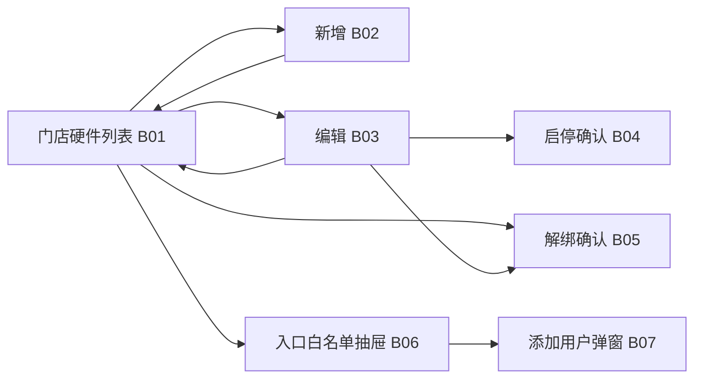

# 透明车间 — 后台管理端功能设计文档

## 1. 模块：透明车间（后台管理端）

### 1.1 基础信息

| 项目 | 内容 |
| --- | --- |
| 模块名称 | 透明车间 — 硬件与监测位置配置（后台） |
| 端口类型 | Web 后台管理端（与门店运营后台或总部后台同域，具体以项目菜单挂载为准） |
| 目标用户 | 平台运营、区域督导、门店店长/主管等具备「门店硬件配置」权限的角色 |
| 业务场景 | 在硬件层已完成对接的前提下，按门店维护已接入设备（以摄像头为主）的基础信息、启用状态及**监测位置**；监测位置标签将写入**新产生**轨迹点的展示快照，供微信小程序时间线等端展示「拍到车辆的区域/工位语义」。 |
| 上游入口 | 后台「透明车间」或「门店设备 / 摄像头管理」菜单；可从门店档案「关联能力」入口跳转并带 `storeId`。 |
| 下游影响 | 轨迹采集解析服务：新上报事件按当前配置写入 `locationLabel`、设备名等快照；微信小程序 P01/P02 展示与**按门店查询轨迹**规则见《01_透明车间_微信小程序.md》及本文 **1.9.2**。**小程序「透明车间」功能入口**是否展示由本文 **1.7.5 / 1.9.3** 白名单控制，与门店硬件配置相互独立。 |
| 关联文档 | `01_透明车间_微信小程序.md`（轨迹列表、时间线字段、异常口径、历史不回写约束） |
| 关联模块 | 门店档案、账号权限、轨迹采集/落库服务、对象存储（抓拍与本文档无直接配置项）、**平台用户主数据**（白名单按平台用户维度维护） |

### 1.2 功能目标

- **用户目标**：在后台快速完成「选门店 → 看清已接入设备 → 补全/修正展示用位置与名称 → 启停设备」闭环；多门店场景下权限清晰、误操作可预期。
- **平台目标**：客户端展示的「监测位置」「设备名」与业务语言一致，减少车间沟通成本与客诉；与小程序文档中的**落库快照**机制一致，避免对历史数据产生错误预期。
- **成功结果**：门店维度设备列表准确、配置变更新轨迹立即生效、旧轨迹展示不变；设备解绑改绑后，小程序按**门店 + 设备**查询时不串显他店历史；权限与操作可追溯。

### 1.3 范围与边界

#### 1.3.1 本期包含

- 按**门店**维度的硬件设备管理：列表、筛选、**新增**、**编辑**、**启用/停用**（或等价状态）、**解绑**（解绑后可由其他门店再次绑定，见 1.5、1.7.2、1.9.2）。
- **监测位置**配置：用于解析/写入新轨迹点时的 `locationLabel`；**本期为字符串输入框维护**，不做预设位置字典。
- **设备展示名称**（设备名）：与监测位置**分列**配置、分列展示；对应小程序时间线中的**设备名**字段，与 `locationLabel`（**设备位置 / 监测位置**）语义独立（见 1.8.2）；小程序侧展示口径**保持不变**。
- 列表展示与硬件对接层关联所需的**只读标识**（如平台 `deviceId`、厂商设备编号等），供排障与唯一性校验；**不对接协议、拉流地址、鉴权密钥等产品化配置**（默认硬件层已完成，研发内部配置不在本文展开）。
- **小程序入口白名单（平台用户）**：维护可看见微信小程序内「透明车间」功能入口的**平台用户**集合；**未**列入白名单的平台用户在小程序各入口（如首页金刚区、个人中心等，具体挂载点以小程序设计为准）**不展示**该入口。

#### 1.3.2 本期不包含

- 小程序内设备配置（明确不做，与小程序文档一致）。
- 后台侧**实时视频预览、录像回放、云台控制**（与小程序「无视频直播」边界一致；若后续单独立项再扩）。
- 非车牌类算法参数、画线布防等视觉 AI 配置。
- 修改历史已落库轨迹点快照（**禁止**作为默认能力；与小程序 1.9.1「历史不回写」一致）。

#### 1.3.3 与小程序功能的对应关系

| 小程序侧（摘自小程序文档） | 后台侧职责 |
| --- | --- |
| P02 时间线「监测位置 / 设备位置」`locationLabel` | 后台配置监测位置字符串，新轨迹写入该快照 |
| P02 时间线「设备名」 | 后台配置设备展示名称，新轨迹写入该快照；与 `locationLabel` **分列**，不与位置合并为一字段 |
| 列表「位置摘要」`locationSummary` | 由会话内轨迹点聚合，后台通过正确配置位置标签间接影响新数据的语义 |
| 异常判定、订单匹配 | 后台设备配置**不参与**判定逻辑，仅影响展示类快照 |

### 1.4 用户角色与权限

| 角色 | 使用场景 | 可见范围 | 可操作功能 | 权限限制 |
| --- | --- | --- | --- | --- |
| 平台运营 / 总部管理员 | 新店开通、批量巡检 | 可配置为多门店或全部门店（以项目 RBAC 为准） | 查看/新增/编辑/启停 | 敏感字段只读或脱敏策略与项目一致 |
| 平台运营 / 总部管理员（或独立「透明车间运营」角色） | 入口灰度放量 | **全局**（不按门店） | 白名单查看/添加/移除（自 B01 进入 B06/B07） | 与门店数据权限无关；须具备「透明车间」模块下**入口白名单**操作权限（可与「门店硬件配置」分权，以项目 RBAC 为准） |
| 区域督导 | 片区门店巡检 | 所辖区域门店 | 查看/编辑（是否可新增由策略定） | 不可改他区门店；**默认不可**维护白名单（若需下放由项目定） |
| 门店店长/主管 | 本店工位调整、摄像头更换后更新 | **本门店** | 查看/新增/编辑/启停 | 不可跨店；**不可**维护白名单 |

补充说明：

- 所有写操作须记录**操作人、时间、门店、变更摘要**（见 1.12）。
- 接口与页面均须校验对 `storeId` 的数据权限，与小程序「门店隔离」一致。

### 1.5 用户场景与前置条件

| 场景 | 触发条件 | 前置条件 | 用户目标 | 系统结果 |
| --- | --- | --- | --- | --- |
| 查看门店已接入设备 | 进入某门店设备列表 | 有门店权限；硬件层已上报或已注册设备 | 一眼看到全部摄像头及状态 | 列表展示，支持状态/位置筛选 |
| 新店绑定摄像头 | 硬件已在线，平台侧已有设备主数据或待认领记录 | 同上 | 将设备归属到门店并补全位置 | 新增成功；新轨迹带正确 `locationLabel` |
| 工位改名/调整语义 | 业务改名「精洗工位」→「美容工位」 | 设备已存在 | 客户端展示与车间叫法一致 | **仅新轨迹点**使用新标签 |
| 临时停用摄像头 | 维修、遮挡 | — | **停止采集写入**（该路不再产生新的业务轨迹事件） | 停用后无新写入；已落库历史仍按原快照展示规则不变（见 1.9.1） |
| 设备改绑其他门店 | 误绑或门店调整 | 有解绑/绑定的相应权限 | 先**解绑**再于他店**新增绑定** | 见 **1.9.2**：小程序按门店查询时**不得**查出该设备在**非当前门店**归属期间产生的历史数据 |

### 1.6 信息架构与页面清单

#### 1.6.1 页面/弹窗清单

| 编号 | 类型 | 名称 | 页面标识 | 主要用途 | 入口 | 出口 |
| --- | --- | --- | --- | --- | --- | --- |
| B01 | 页面 | 透明车间-门店硬件列表 | admin-transparency-devices | 按门店查看/筛选已接入设备；工具栏可打开**小程序入口白名单**（B06） | 菜单；门店档案 | B02/B03/B06 |
| B02 | 页面/抽屉 | 新增硬件 | admin-transparency-device-create | 绑定新设备到门店并配置位置 | B01「新增」 | 保存回 B01 |
| B03 | 页面/抽屉 | 编辑硬件 | admin-transparency-device-edit | 修改名称、位置、启用状态等 | B01 行操作 | 保存回 B01 |
| B04 | 弹窗 | 启停确认 | admin-transparency-device-toggle-confirm | 防止误触停用；文案明确**停止采集写入** | B01/B03 | 确认后刷新列表 |
| B05 | 弹窗 | 解绑确认 | admin-transparency-device-unbind-confirm | 解绑后设备可被他店绑定；本店列表移除该绑定 | B01/B03 | 确认后刷新列表；设备进入待绑定池 |
| B06 | 抽屉 | 透明车间-小程序入口白名单 | admin-transparency-miniprogram-entry-whitelist | 按**平台用户**维护可在小程序看到「透明车间」入口的名单（列表、筛选） | B01 工具栏「小程序入口白名单」 | 关闭抽屉或操作后列表刷新；小程序端以接口为准实时或短缓存生效 |
| B07 | 弹窗 | 添加白名单用户 | admin-transparency-entry-whitelist-add | 录入/检索后添加平台用户至白名单 | B06 内「添加用户」 | 确定后关闭弹窗并刷新 B06 列表；取消关闭无写入 |

> **监测位置**不做字典页；B02/B03 使用**单行输入框**维护字符串，见 1.8.3。

#### 1.6.2 页面流转

B06 从 **B01 工具栏按钮**打开，与硬件新增/编辑抽屉**互斥**（打开其一时应关闭另一抽屉，避免双遮罩）。移除名单行仍使用**确认弹窗**（可与 B04/B05 复用同一套弹窗组件）。

### 1.7 页面结构与交互设计

#### 1.7.1 B01 门店硬件列表

**页面定位**

- 以**当前选中门店**为作用域，展示该门店下已接入硬件（默认 Tab：**摄像头**；若未来扩展道闸、屏显等，可用 Tab 或类型筛选区分）。
- 支持运营快速判断：是否已配置位置、是否启用、最近变更时间。

**页面结构**

- 顶部：**门店选择器**（必选；单门店角色默认当前店且可禁用切换）。
- 工具栏：「**小程序入口白名单**」（打开 B06 抽屉）、「新增硬件」、关键字搜索（设备名/编号）、筛选（启用状态、是否已配置监测位置、设备类型）。
- 表格列建议：`设备展示名称`、`设备类型`、`监测位置`、`启用状态`、`平台设备ID`（只读）、`厂商/对接侧设备编号`（只读，有则展示）、`最近更新时间`、`操作`。
- 行操作：编辑、启停（或合并至编辑页）、**解绑**（需二次确认，见 B05）。
- **与 B06 互斥**：用户打开「新增/编辑硬件」抽屉时，若再点「小程序入口白名单」，应先关闭硬件抽屉再打开 B06；反之亦然（实现上保证单一抽屉层 + 弹窗叠在上方）。

**关键交互**

- 切换门店：清空列表并重新请求；保留列宽与用户筛选习惯可按项目规范做本地缓存。
- 空列表：区分「该门店暂无接入设备」与「无权限」。
- 加载/错误态：表格骨架、失败重试。

#### 1.7.2 B02 新增硬件 / B03 编辑硬件

**表单字段**（详见 1.8；以下为交互要点）

- **绑定门店**：B02 默认当前 B01 所选门店，有权限时可改（总部）；B03 **不可直接修改门店**。**改绑其他门店**须：在 A 店对设备执行**解绑（B05）** → 设备进入**待绑定**状态 → 在 B 店通过 B02 **新增绑定**同一 `deviceId`。
- **选择已有设备记录**：B02 可提供「从待绑定设备列表选取」与「手动录入平台设备 ID」两种模式（由研发根据对接实现二选一或并存）；选中后带出只读字段。
- **监测位置（设备位置）**：必填；**单行输入框**维护字符串；长度上限与非法字符过滤（不做枚举/字典）。
- **设备展示名称（设备名）**：必填（或与业务约定「未命名」占位二选一，推荐必填）；与监测位置**分列**，含义与小程序时间线一致。
- **启用状态**：开关；关闭时弹出 B04，明确为**停止采集写入**。

**校验与提示**

- 同一门店下「对接侧唯一标识 + 类型」不可重复绑定（与研发对齐唯一键）。
- 保存成功 toast，返回列表并定位到该行（可选）。

#### 1.7.3 B04 启停确认

- 停用：文案固定为 **「停用后该设备将停止采集写入，不再产生新的轨迹事件」**（已确认策略）。
- 启用：可无需二次确认或轻确认；启用后恢复按当前配置采集写入。

#### 1.7.4 B05 解绑确认

- 明确提示：解绑后本门店不再管理该设备；设备可被其他门店绑定；**本店用户在小程序中查询轨迹时，不得再看到该设备在非本店归属下产生的数据**（实现口径见 1.9.2）。
- 解绑**不删除**历史落库数据；隔离依赖查询条件（门店 + 设备归属时段或等价字段）。

#### 1.7.5 B06 小程序入口白名单（抽屉）/ B07 添加用户（弹窗）

**入口与形态**

- 从 **B01 门店硬件列表** 工具栏点击「**小程序入口白名单**」打开 **B06 抽屉**（右侧滑出，与 B02/B03 硬件抽屉同一交互范式）。
- **B06 抽屉内**：顶部固定说明文案；**关键字** + 查询/重置；白名单**表格**（列同 1.8.4）；底部 **关闭** 按钮（与右上角关闭等效）。
- **添加用户**：点击 B06 内「添加用户」打开 **B07 弹窗**（表单：平台用户 ID 或手机号输入；正式环境应先走检索接口再确认写入，见 1.13）。
- **移除**：表格行「移除」使用**确认弹窗**（可与 B04/B05 共用组件；二次确认文案须明确移除后小程序不再展示入口）。

**页面定位（业务）**

- 控制微信小程序内「透明车间」**功能入口是否对当前登录用户展示**；与门店、设备、轨迹数据权限**解耦**（用户即使能看到入口，仍须满足小程序侧门店会话等既有规则）。
- 名单对象为 **平台用户**（与车管家统一账号体系中的 C 端/平台用户标识一致，字段名以研发为准，如 `platformUserId` / `memberId`）。

**业务规则（1.9.3 摘要）**

- **仅在白名单内的平台用户**：小程序展示透明车间入口。
- **不在白名单内**：不展示入口（隐藏或不下发菜单项，避免深链误开由小程序路由兜底提示「无权限」或 404，与项目统一无权限交互一致）。
- **白名单为空**：默认 **任何平台用户均不展示**该入口（最严灰度）；全量开放时由运营填满或另立「关闭白名单校验」总开关（若立项），本文默认 **始终启用白名单校验**。

**添加用户（B07）与列表刷新**

- B07 确定写入成功后关闭弹窗，**刷新 B06 表格**（无需关闭抽屉）。
- 已存在名单中则提示重复，不关闭弹窗或清空输入由交互规范统一。

**校验与提示**

- B07 检索无匹配用户：明确「未找到平台用户」。
- 权限：无白名单操作权限时 **B01 上不展示**「小程序入口白名单」按钮，或点击后 403 toast（与项目一致）。

### 1.8 字段、控件与数据口径

#### 1.8.1 列表字段（B01）

| 字段名称 | 字段标识 | 类型 | 展示规则 | 空值 | 说明 |
| --- | --- | --- | --- | --- | --- |
| 设备展示名称 | deviceDisplayName | 文本 | 列表主标题 | 「未命名」 | 对应小程序时间线**设备名**（与位置分列） |
| 设备类型 | deviceType | 枚举 | 默认 CAMERA | — | 预留道闸等 |
| 监测位置 | locationLabel | 文本 | 与小程序 `locationLabel` 同源配置值 | 「未配置」高亮 | 新轨迹快照来源 |
| 启用状态 | enabled | 布尔/枚举 | 标签「启用/停用」 | — | 影响新事件 |
| 平台设备 ID | deviceId | 文本 | 等宽字体、可复制 | — | 排障 |
| 对接侧设备编号 | externalDeviceKey | 文本 | 只读 | 「—」 | 厂商/通道等 |
| 最近更新时间 | updatedAt | 时间 | — | — | — |

#### 1.8.2 与小程序时间线展示对齐（已确认）

- 小程序侧**保持现有设计**：**设备名**与**设备位置（监测位置）**为**两个独立字段**展示与落库；不因后台文档调整而合并为一列语义。
- 时间线字段仍见《01_透明车间_微信小程序.md》1.8.3：`locationLabel` 表示**监测位置 / 设备位置**；设备名单独字段与后台 `deviceDisplayName` 对应（若小程序文档以别名字段引用，研发对齐字段名即可）。
- 二者均为**落库快照**；后台配置变更**不反向改写**历史点。

#### 1.8.3 新增/编辑表单字段（B02/B03）

| 字段名称 | 字段标识 | 控件 | 必填 | 校验规则 |
| --- | --- | --- | --- | --- |
| 门店 | storeId | 选择器 | B02 必填 | 权限内门店 |
| 绑定设备 | deviceId / 待选记录 | 搜索选择 | 是 | 未被其他门店占用（或占用时提示） |
| 设备展示名称 | deviceDisplayName | 输入 | 必填（推荐） | 长度上限，如 1～32；与位置语义独立 |
| 监测位置（设备位置） | locationLabel | **单行输入框** | 是 | 长度上限；非法字符过滤；**不做字典** |
| 启用状态 | enabled | 开关 | 是 | — |
| 备注 | remark | 多行文本 | 否 | 仅后台可见，不进小程序 |

#### 1.8.4 白名单列表字段（B06 抽屉内表格）

| 字段名称 | 字段标识 | 类型 | 展示规则 | 说明 |
| --- | --- | --- | --- | --- |
| 平台用户 ID | platformUserId | 文本 | 等宽、可复制 | 与小程序会话用户一致，用于服务端校验 |
| 昵称 | nickname | 文本 | — | 只读快照，便于运营识别 |
| 手机号 | mobileMasked | 文本 | 脱敏，如 138****8000 | 只读 |
| 添加时间 | createdAt | 时间 | — | 写入名单时间 |
| 操作人 | operatorName | 文本 | — | 后台账号展示名 |

### 1.9 核心规则：配置变更、历史数据与改绑查询

#### 1.9.1 配置变更与历史不回写

- 与小程序文档 **1.9.1** 一致：**后台修改设备名、监测位置、启用状态后，已落库的历史轨迹点不随配置变更而改写**。
- **新上报事件**使用**当前生效配置**解析，写入新的 `locationLabel`、设备名等快照。

#### 1.9.2 解绑、改绑与小程序查询隔离（已确认）

- **改绑方式**：设备通过 **解绑** 解除与门店 A 的绑定关系后，可由门店 B 再次 **新增绑定**（同一 `deviceId`）；不在 B03 提供「直接改门店」字段。
- **停用策略**：停用设备 = **停止采集写入**，不再产生新的轨迹事件（见 1.7.3）。
- **小程序查询口径**：列表、详情及时间线等查询均为 **当前所选门店** 上下文。对**设备**相关展示与统计，须满足：**仅返回「归属当前门店」期间产生的数据**；若该 `deviceId` 存在**不属于当前门店**的历史轨迹（例如曾绑定他店或已解绑前归属他店期间写入的数据），在**当前门店**查询时 **不得查询/展示出来**。
- **实现建议（产品对研发的约束）**：轨迹事件或轨迹点落库时须带 **`storeId`（或等价门店归属）** 且与绑定关系一致；解绑、改绑仅影响**后续**新数据归属；历史数据保留原 `storeId`，由查询条件 `storeId` + 时间线/会话聚合规则过滤，从而自然排除他店历史。**禁止**依赖「仅按 deviceId 拉全量再前端过滤」作为最终安全边界，须在服务端查询层收口。

#### 1.9.3 小程序透明车间入口与白名单（已确认）

- **判定时机**：小程序在渲染首页/金刚区/相关 Tab 等**入口组件前**（或拉取菜单配置时），根据当前登录用户的 **平台用户 ID** 请求服务端（或读取带签名的缓存配置）：**仅在白名单内**则下发或展示「透明车间」入口。
- **服务端为准**：客户端不得仅依赖本地写死开关绕过校验；深链进入透明车间子路径时须同样校验，未在白名单则拦截或引导无权限页。
- **与 B01 关系**：门店下无绑定设备、用户不在白名单等组合场景下，入口与内容页行为由小程序统一产品规则收口（例如无设备门店是否仍展示入口属小程序文档范围）；后台白名单只解决「是否具备看见入口的资格」。

### 1.10 状态机与状态流转

| 对象 | 状态 | 说明 |
| --- | --- | --- |
| 设备与门店绑定 | 已绑定 / 待绑定（解绑后） | 已绑定：参与采集与查询；待绑定：仅可被 B02 领取，不产生本店新轨迹 |
| 硬件设备门店配置 | 启用 / 停用 | 停用 = **停止采集写入** |
| 监测位置 | 用户输入字符串 | 不做字典；变更仅影响**新**轨迹点快照 |

### 1.11 异常、边界与降级

| 场景 | 系统表现 | 用户操作 |
| --- | --- | --- |
| 设备在对接层离线/异常 | 列表可展示「对接状态」只读灯（若本期无此数据则不做） | 联系运维；后台仍可否编辑配置由研发定 |
| 未配置监测位置 | 列表高亮「未配置」；保存新建设备时阻止提交 | 补全后保存 |
| 保存冲突（并发编辑） | 提示刷新后重试 | 刷新列表 |
| 无门店权限 | 403 或空态 | — |

### 1.12 模块联动与审计

| 关联模块 | 联动说明 |
| --- | --- |
| 门店档案 | 门店选择、权限范围 |
| 轨迹采集服务 | 读取设备-门店-位置-启用的生效配置，写入新轨迹快照；**停用则不写入** |
| 微信小程序 | 会话列表、详情与时间线查询须带 `storeId`，并排除非本店归属的设备历史（见 1.9.2）；入口展示受白名单约束（见 1.9.3） |
| 操作审计 | 记录新增/编辑/启停/改绑；支持按门店、时间、操作人筛选导出（若项目有统一审计中心则对接）；**白名单添加/移除**须记审计 |

### 1.13 接口与数据建议（产品级）

| 接口用途 | 说明 |
| --- | --- |
| 分页查询门店设备 | 入参：`storeId`、类型、启用状态、关键字；出参：1.8.1 列 |
| 新增门店设备绑定 | 入参：门店、deviceId、locationLabel、deviceDisplayName、enabled |
| 更新绑定配置 | 入参：绑定记录 id + 可改字段；**不含**历史轨迹迁移；**不可单独改门店**（改绑走解绑 + 新店新增） |
| 启停 | 入参：绑定记录 id、enabled；`enabled=false` 触发**停止采集写入** |
| 解绑 | 入参：绑定记录 id；效果：本店绑定解除，设备待绑定；**不删除**历史轨迹数据 |
| 待绑定设备池（可选） | 供 B02 搜索选择；含已解绑未占用设备 |
| 分页查询入口白名单 | 入参：关键字；出参：1.8.4 列 |
| 检索平台用户（添加前） | 入参：platformUserId 或 mobile；出参：候选用户简要信息；用于 **B07** 选择待添加用户 |
| 添加白名单 | 入参：platformUserId；校验重复与主体类型；由 **B07** 提交 |
| 移除白名单 | 入参：白名单记录 id 或 platformUserId |

**一致性**：保存后采集服务应在可接受延迟内生效；产品验收以「新轨迹点快照」为准。白名单变更后小程序应在**可接受延迟**内生效（建议 ≤ 60s 或下次会话建立，与研发对齐）。

### 1.14 埋点与指标（后台）

| 事件 | 说明 |
| --- | --- |
| admin_transparency_device_list_view | 列表曝光 |
| admin_transparency_device_create_submit | 新增提交成功 |
| admin_transparency_device_update_submit | 编辑提交成功 |
| admin_transparency_device_toggle | 启停成功 |
| admin_transparency_device_unbind | 解绑成功 |
| admin_transparency_entry_whitelist_view | 白名单列表曝光 |
| admin_transparency_entry_whitelist_add | 添加成功 |
| admin_transparency_entry_whitelist_remove | 移除成功 |

### 1.15 验收标准

| 编号 | 场景 | 操作步骤 | 预期结果 |
| --- | --- | --- | --- |
| BAC01 | 列表按门店隔离 | 切换门店 | 仅展示该门店设备 |
| BAC02 | 新增并配置位置 | B02 完整保存 | B01 可见；**新产生**轨迹点时间线展示新 `locationLabel` |
| BAC03 | 修改监测位置 | B03 修改保存 | **旧日期**已落库时间线不变；新轨迹点为新文案 |
| BAC04 | 停用设备 | 停用后触发采集侧逻辑 | **停止采集写入**，无新轨迹事件 |
| BAC05 | 权限 | 无权限用户访问 | 拦截或无数据 |
| BAC06 | 审计 | 任意写操作 | 审计记录可追溯 |
| BAC07 | 解绑后改绑 | 设备在 A 店产生轨迹后解绑，改绑 B 店 | A 店小程序查询**不得**出现该设备绑定 B 店后的数据；B 店查询**不得**出现该设备在 A 店归属期间的数据（均须 `storeId` 或等价隔离） |
| BAC08 | 解绑未重绑 | 设备解绑后 | 待绑定池可见；**任何门店**小程序均不应把该设备在他店的历史串到本店（若尚未绑回则本店无该设备） |
| BAC09 | 白名单内用户 | B01 打开 B06 → B07 将用户 A 加入名单 | 用户 A 在小程序可见透明车间入口 |
| BAC10 | 白名单外用户 | 用户 B 不在白名单 | 用户 B 在小程序**不可见**透明车间入口；深链访问须被服务端/路由策略拦截 |
| BAC11 | 白名单为空 | 清空名单 | 所有平台用户均不可见入口（与 1.7.5 默认策略一致） |
| BAC12 | 移除即时性 | 将用户 A 移除 | 新会话或约定延迟后用户 A 不再看到入口；审计可追溯 |

### 1.16 已确认事项（原待确认收口）

| 编号 | 事项 | 结论 |
| --- | --- | --- |
| C01 | 小程序时间线设备名与设备位置 | **分列**：设备名为设备名，设备位置（监测位置）为 `locationLabel`；小程序内容保持不变 |
| C02 | 停用设备 | **停止采集写入** |
| C03 | 改绑门店 | **解绑后**由他店 **新增绑定**；小程序按 **门店 + 设备归属** 查询，**不展示**非当前门店归属下的该设备历史数据 |
| C04 | 监测位置维护方式 | **输入框字符串**，不做字典 |
| C05 | 小程序透明车间入口 | **仅白名单内平台用户**可见入口；白名单为空默认全员不可见；服务端校验为准（见 1.9.3） |

### 1.17 变更记录

| 日期 | 版本 | 变更内容 | 变更人 |
| --- | --- | --- | --- |
| 2026-05-07 | v1.0 | 初版：门店维度硬件管理、监测位置配置、与小程序联动与历史不回写对齐 | 产品 |
| 2026-05-07 | v1.1 | 已确认：名/位分列；停用=停止写入；解绑改绑与小程序 store 查询隔离；监测位置无字典；B05 改为解绑确认 | 产品 |
| 2026-05-11 | v1.2 | 新增 B06「小程序入口白名单」：仅白名单内**平台用户**在小程序可见透明车间入口；默认空名单全员不可见；补充 1.7.5、1.8.4、1.9.3、接口与验收 BAC09～BAC12、埋点 | 产品 |
| 2026-05-11 | v1.3 | 白名单入口并入 **B01**：工具栏按钮打开 **B06 抽屉**（列表/筛选），「添加用户」走 **B07 弹窗**；与硬件抽屉互斥；拆分 B07 页面清单与流程图 | 产品 |
