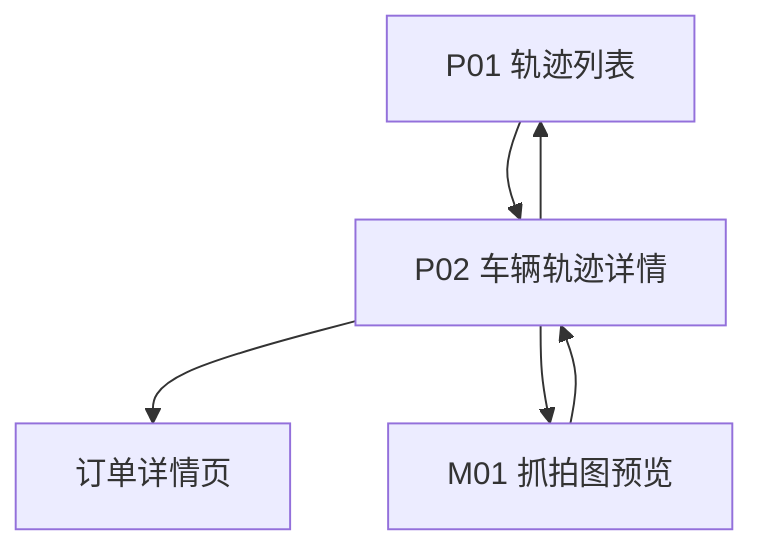

# 透明车间 — 功能设计文档

## 1. 模块：透明车间

### 1.1 基础信息

| 项目 | 内容 |
| --- | --- |
| 模块名称 | 透明车间 |
| 端口类型 | 微信小程序（设备与摄像头配置在**后台管理端**维护，见 1.3） |
| 目标用户 | 门店店长/主管、前台接待、车间调度等已授权店员（以门店账号登录小程序） |
| 业务场景 | 在小程序中查看所选日期的进店车辆轨迹摘要；按「订单服务时段是否覆盖该日 + 车牌是否一致」动态判断是否正常；未识别车牌一律异常。 |
| 上游入口 | 小程序工作台/门店运营相关入口（如「透明车间」菜单或图标）；可从订单详情跳转至该车在所选日期的轨迹（若本期实现跳转）。 |
| 下游去向 | 订单详情（可多个）、客户/车辆档案（若已有小程序页） |
| 设计系统 | 项目指定视觉规范 + `DESIGN/微信小程序页面结构约束规范.md`（结构与安全区、胶囊避让等强制遵循） |
| 关联模块 | 门店档案、订单（服务单，含开始/结束时间与唯一车牌）、客户/车辆档案、车辆轨迹数据（由平台采集落库；硬件对接不在本文档展开） |

### 1.2 功能目标

- **用户目标**：在手机上快速查看「车牌—位置—时间—关联客户（如有）」；对**无匹配订单（按时间口径）**或**未识别车牌**的车辆一眼识别异常；在时间线上对照**抓拍图**核实到店瞬间。
- **平台目标**：到店轨迹与订单**服务起止时间**对齐，减少漏单与纠纷。
- **业务价值**：规则可解释（不依赖订单状态枚举）；同一车多订单仍属正常，且可在详情中查看全部匹配订单。
- **成功结果**：列表与详情与「门店 + 判定日 + 订单时间覆盖」及车牌集合联动计算；下拉刷新或再次进入后标记与订单时间变化同步。

### 1.3 范围与边界

#### 1.3.1 本期包含（微信小程序）

- **轨迹列表**、**车辆轨迹详情（时间线）**；筛选日期、门店（若用户绑定多门店）、车牌关键词、仅看异常车辆。
- 车辆轨迹数据展示：**车牌**（识别失败展示「未识别」）、**轨迹点**（位置 + 时间 + **抓拍图**）、会话级**首次/末次出现时间**、**关联客户**（能匹配则展示）。
- **轨迹抓拍图**：每个轨迹点**必须**关联一条抓拍记录（见 1.8.3）；时间线展示**缩略图**，用户**点击后预览大图**（实现方式见 1.7.2，推荐微信原生能力）。
- **异常标记**：按 **1.8.4** 动态计算。
- **硬件对接**：本期不在产品文档展开，由研发另行输出技术方案。

#### 1.3.2 本期包含（后台管理端，非小程序）

- **摄像头与监测位置等设备配置**：维护设备与门店、监测位置标签、启用状态等；配置仅影响**新产生**轨迹点的解析快照，**历史轨迹数据不回写**（见 1.9.1）。

#### 1.3.3 本期不包含（可后续迭代）

- 小程序内设备/摄像头配置入口（明确不做）。
- 小程序内**视频直播**、**录像回放播放器**（与单帧**抓拍图预览**不同；抓拍图为静态图）。
- 非车牌维度的车辆识别、复杂遮挡场景还原。
- 车主 C 端实时推送「车辆到达某区域」。
- 跨门店总部看板（除非单独立项）。

#### 1.3.4 边界说明

- **与订单模块**：是否正常由 **门店 + 所选判定日 `bizDate` + 订单开始/结束时间是否覆盖该日 + 订单唯一车牌与轨迹车牌是否一致** 决定（见 1.8.4）。**不再按订单状态（如进行中）匹配。**
- **与客户/车辆档案**：关联客户展示可通过车牌匹配档案；**异常标记不依赖**是否匹配到客户。
- **与轨迹原始数据**：轨迹点展示字段以**落库快照**为准；后台修改设备配置不反向改写历史轨迹；**抓拍图 URL / 媒资引用**与文字快照一致，历史点不回写。

### 1.4 用户角色与权限

| 角色 | 使用场景 | 可见范围 | 可操作功能 | 权限限制 |
| --- | --- | --- | --- | --- |
| 门店店长/主管 | 盯店、处理异常到店 | 本门店 | 小程序：查看列表/详情、筛选、下拉刷新、**轨迹抓拍预览** | 设备配置在后台，不在小程序 |
| 前台/接待 | 查车是否到店 | 本门店 | 同上 | 默认不可看他店 |
| 店员（通用） | 协作查看 | 本门店 | 同上 | 由企业分配 |

补充说明：

- 数据按**门店**隔离；接口须校验用户对该 `storeId` 的权限。
- 车牌为敏感信息，分享、截图提示若后续开放需单独评审；**抓拍图含车辆外观**，权限与轨迹列表一致，下载/转发策略与项目安全规范对齐（见 Q03）。

### 1.5 用户场景与前置条件

| 场景 | 触发条件 | 前置条件 | 用户目标 | 系统结果 |
| --- | --- | --- | --- | --- |
| 查看某日到店轨迹 | 打开小程序透明车间页 | 已登录、有门店权限 | 按日期/车牌找到车辆 | 展示卡片列表，含异常标记、时间摘要 |
| 订单时段覆盖后变正常 | 订单开始/结束时间调整后，在判定日上存在覆盖且车牌一致 | — | — | 用户**下拉刷新**后异常标记消失（动态） |
| 查看时间线 | 点击某一车辆 | 会话存在 | 看各摄像头位置与时间 | 时间线展示；**多个匹配订单时可列表查看并分别进入订单详情** |
| **预览轨迹抓拍图** | 在时间线中点击某点的**缩略图** | 该点已落库抓拍地址 | 放大查看抓拍 | 打开预览（全屏/系统预览层，见 1.7.2） |
| 维护摄像头位置 | 管理员在**后台**维护 | 后台权限 | 绑定「大门」等标签 | 仅影响**新产生**轨迹点快照；历史不改 |

### 1.6 信息架构与页面清单

#### 1.6.1 页面/弹窗/组件清单（小程序）

| 编号 | 类型 | 名称 | 页面标识 | 主要用途 | 入口 | 出口 |
| --- | --- | --- | --- | --- | --- | --- |
| P01 | 页面 | 透明车间-轨迹列表 | workshop-transparency-list | 查询、筛选、识别异常到店 | 小程序菜单 | 详情 P02 |
| P02 | 页面 | 透明车间-车辆轨迹详情 | workshop-transparency-detail | 单车当日时间线 + 匹配订单 | 列表点击 | 返回列表；跳转**多个**订单详情 |
| M01 | 弹层/全屏 | 轨迹抓拍图预览 | trace-capture-preview | 查看单点抓拍大图 | 时间线缩略图点击 | 关闭返回时间线 |
| C01 | 组件 | 异常标记（无匹配订单-时间口径） | tag-no-matching-order | 列表与详情高亮 | P01、P02 | 仅展示 |
| C02 | 组件 | 轨迹时间线 | trajectory-timeline | 详情多点展示（含抓拍缩略图） | P02 | 打开 M01 |
| C03 | 组件 | 关联订单列表 | related-orders-list | 展示 0～N 条匹配订单摘要 | P02 | 点击行进入订单详情 |

> 设备配置、设备编辑等页面归属**后台管理端**，不在小程序信息架构中展开；后台文档可单独引用本节数据规则与「历史不回写」约束。

#### 1.6.2 页面流转

流转说明：

- P01 → P02 携带：`storeId`、`bizDate`、`sessionId` 或 `plateNumber + bizDate`（以后端为准）。
- 返回 P01 时保留筛选与滚动位置。
- P02 内多条订单：C03 列出多条，每条跳转对应 `orderId` 的订单详情页。
- P02 时间线缩略图 → M01；关闭 M01 回到 P02（不改变滚动位置为宜）。

### 1.7 页面结构与交互设计

> 结构层强制遵循 `DESIGN/微信小程序页面结构约束规范.md`：状态栏与胶囊避让、主内容滚动区、底部安全区、加载/空/错状态齐全。

#### 1.7.1 P01 透明车间-轨迹列表

**页面定位**

- 页面目标：掌握所选**判定日**的到店车辆，以及相对**订单服务时段覆盖 + 车牌**是否异常。
- 页面类型：列表页（卡片列表）。
- 适用角色：授权店员。

**页面结构**

- 自定义导航栏：标题「透明车间」（**无**设备管理入口）。
- 筛选区：门店（多门店时）、日期（默认当日）、车牌搜索、开关「仅看异常车辆」。
- 内容区：车辆卡片（车牌、首次/末次时间、位置摘要、关联客户、异常标记）。
- 交互：**下拉刷新**（强制：重算与订单时间、车牌的匹配结果）。

**关键交互**

- 进入页面：请求列表；默认按首次捕获时间倒序。
- 下拉刷新：重新拉取列表并重算异常标记。
- 切换日期/门店：重新请求。

**状态覆盖**

- 加载态：骨架屏或列表内 loading。
- 空态：无轨迹时说明文案；区分「无数据」与「无权限」。
- 错误态：网络失败可重试。

#### 1.7.2 P02 车辆轨迹详情

**页面定位**

- 页面目标：展示该车在**所选 `bizDate` 当天**的轨迹时间线；展示与列表一致的异常标记；展示**全部**在判定日有效的匹配订单（0～N 条）。

**页面结构**

- 顶部信息区：车牌、关联客户、首次/末次时间、**异常标记**。
- **关联订单区（C03）**：若存在匹配订单，以列表展示多条（订单号/服务摘要/时段等按设计系统排版）；**无匹配时**配合异常说明文案。
- 时间线（C02）：每条记录包含 — **捕获时间**、**监测位置**（+ 可选设备名）、**抓拍缩略图**（固定槽位，与文字左对齐或栅格按设计系统）；缩略图建议圆角矩形，尺寸兼顾列表密度与可点击性（触达 ≥40px 高度区域，见小程序结构约束）。

**关键交互**

- 下拉刷新：同步最新匹配订单列表与异常标记；时间线含最新抓拍地址时同步更新。
- 点击某条关联订单：进入该订单的**小程序订单详情页**。
- **点击某条时间线上的抓拍缩略图**：进入 **M01 抓拍图预览**（推荐调用 `wx.previewImage` 传入当前会话时间线全部可预览 URL 列表，当前索引为所点图片，便于左右滑动查看相邻抓拍；若产品要求仅单张预览，可只传当前 URL，见 Q04）。

**状态覆盖**

- **未识别车牌**：标题区显示「未识别」；**一律展示异常标记**（见 1.8.4）。
- **抓拍图加载中**：缩略图位展示骨架或占位 icon。
- **抓拍图缺失**（历史数据无图、存储失败等）：展示统一占位，**不可预览**或点击 toast 说明（见 1.11）。

### 1.8 字段、控件与数据口径

#### 1.8.1 列表卡片字段（P01）

| 字段名称 | 字段标识 | 字段类型 | 展示规则 | 空值规则 | 数据来源 | 权限规则 |
| --- | --- | --- | --- | --- | --- | --- |
| 车牌号 | plateNumber | 文本 | 标准格式；未识别灰色「未识别」 | 「未识别」 | 采集 | 门店权限 |
| 首次/末次时间 | firstSeenAt / lastSeenAt | 时间 | 建议 `MM-dd HH:mm` 或完整格式 | — | 聚合 | 同上 |
| 位置摘要 | locationSummary | 文本 | 去重顺序拼接 | — | 聚合 | 同上 |
| 关联客户 | customerName | 文本 | 脱敏按项目规范 | 「—」 | 档案匹配 | 同上 |
| 订单匹配状态 | orderMatchStatus | 标签 | **正常**：不展示异常标或展示「已关联订单」；**异常**：醒目「无匹配订单」 | — | **动态规则计算** | 同上 |

#### 1.8.2 筛选项字段（P01）

| 字段名称 | 字段标识 | 控件类型 | 默认值 | 说明 |
| --- | --- | --- | --- | --- |
| 门店 | storeId | 下拉/ picker | 当前门店 | 多门店账号可选 |
| 日期 | bizDate | 日期 | 当日 | 不可选未来；该日即为**判定日** |
| 车牌关键词 | plateKeyword | 输入 | 空 | 模糊 |
| 仅异常 | onlyUnmatched | 开关 | 关 | 只显示异常车辆（含未识别、无匹配订单） |

#### 1.8.3 详情时间线字段（P02）

| 字段名称 | 字段标识 | 字段类型 | 展示规则 | 空值规则 | 数据来源 | 权限规则 |
| --- | --- | --- | --- | --- | --- | --- |
| 捕获时间 | capturedAt | 时间 | 精确到秒或按设计缩短 | — | 采集落库 | 门店权限 |
| 监测位置 | locationLabel | 文本 | **历史点以落库快照为准** | 「—」 | 快照 | 同上 |
| 抓拍图-原图 | captureImageUrl | URL / 媒资 ID | 用于 M01 预览；须带鉴权或临时签名（见 Q03） | 无图见 1.11 | 采集落库 | 同上 |
| 抓拍图-缩略 | captureThumbUrl | URL / 媒资 ID | 时间线列表展示；可与原图为同一地址加参数 | 无则回退占位 | 采集或 CDN 生成 | 同上 |

**规则说明**

- 每个轨迹点**业务上均应对应有抓拍**；若采集失败，该点仍展示时间与位置，图片字段为空走 1.11。
- 图片字段与 `locationLabel` 一样，属**落库快照**；后台改设备名/位置标签**不反向改写**历史点图片关联（除非业务另行规定覆盖策略）。

#### 1.8.4 「异常 / 正常」判定口径（已确认）

以下规则在**每次列表/详情加载及用户下拉刷新**时，基于**当前订单数据**重新计算（**动态**）。

**判定日**：用户所选 `bizDate` 对应自然日，记区间 \[`dayStart`, `dayEnd`\]（含边界，具体时区与订单模块日界一致）。

**1）未识别车牌**

- 若当前车辆会话为**未识别车牌**（无有效规范化车牌）：**一律视为异常**，展示异常标记；不参与后续订单车牌集合匹配。

**2）已识别车牌**

- **订单集合**：查询 **所选 `storeId`** 下，满足「订单服务时段**覆盖判定日**」的全部订单。  
  **覆盖定义**（与「开始时间等于或早于当日、结束时间等于或晚于当日」等价推广到任意判定日）：  
  - `order.startTime <= dayEnd`  
  - 且 `order.endTime >= dayStart`  
  其中 `startTime`、`endTime` 为订单上的服务开始、结束时间（或业务等价字段）。  
  **说明**：用户查看「当日」时，`bizDate` 为今天，上述即口语中的「开始不晚于今日结束、结束不早于今日开始」，即时段与「今日」有交集。
- **结束时间为空的处理**：若业务上未结束订单无结束时间，**与订单模块约定**：例如将 `endTime` 视为「无限晚」或取当前时间参与比较；**以前端/后端与订单域一致为准**（见待确认 Q01）。

**3）订单车牌（唯一）**

- 每条订单**有且仅有一个**用于比对的车牌字段（`orderPlate`），做与轨迹一致的**规范化**。
- **多订单**：同一车牌在判定日上可对应 **0～N** 条有效订单；**只要存在至少一条**订单其 `orderPlate` 与轨迹车牌 `TrackPlate` 一致，则该车**正常**。
- **正常**：已识别且 `TrackPlate` 等于某条有效订单的 `orderPlate`（一条或多条均可）→ **不展示异常标记**（或展示「已关联订单」，UI 统一即可）。
- **异常**：已识别但**没有任何**有效订单的车牌与 `TrackPlate` 一致 → 展示 **「无匹配订单」** 类标记。

**4）详情展示**

- 匹配到的订单**全部**在 P02 的 C03 中列出；用户可分别进入各订单详情。

**特殊标记展示**

- 异常文案建议：**「无匹配订单」**；未识别可并列或统一归入异常筛选（「仅看异常」包含未识别）。
- 须**文字 + 样式**，不得仅靠颜色（见微信小程序规范第 9 节）。

### 1.9 核心功能说明

#### 1.9.1 轨迹数据与后台配置变更（历史不改）

- 轨迹点落库时写入**监测位置等展示字段快照**及**抓拍图存储引用**（`captureThumbUrl` / `captureImageUrl` 或等价媒资 ID）；**后台**修改摄像头/设备配置后，**已落库历史轨迹点不随配置变更而改写**。
- 新上报事件使用**当前后台配置**解析并写入新快照（含新抓拍）。

#### 1.9.2 列表与详情查询

- 入口：P01、P02。
- **下拉刷新**为关键交互，保证与订单时间、车牌变化同步。

### 1.10 状态机与状态流转

| 对象 | 说明 |
| --- | --- |
| 车辆到店会话 | 按门店 + 自然日 + 车牌（或未识别会话 ID）聚合 |
| 订单匹配展示 | 无独立持久状态；随订单起止时间、车牌与用户刷新在「异常/正常」间变化 |
| 抓拍预览 M01 | 临时态；关闭即销毁，不写入业务状态 |

### 1.11 异常、边界与降级处理

| 异常场景 | 页面表现 | 用户操作 |
| --- | --- | --- |
| 网络失败 | toast + 重试 | 下拉刷新 |
| 订单接口超时 | 可仅展示轨迹；匹配状态提示「暂时无法校验订单」 | 刷新 |
| 未识别车牌 | 展示「未识别」+ **异常标记** | 无（业务可后续考虑人工关联，非本期必做） |
| **抓拍图地址为空** | 缩略图位展示占位（如相机灰块 +「无图」文案）；**不进入预览**或点击提示「暂无抓拍」 | — |
| **缩略图加载失败** | 占位 + 可点「重试」或自动重试一次 | 下拉刷新 |
| **预览大图 403/过期** | toast「图片已失效，请下拉刷新」 | 下拉刷新会话详情 |

### 1.12 模块联动与数据影响

| 关联模块 | 联动说明 |
| --- | --- |
| 订单 | 匹配依赖订单 `startTime`/`endTime` 是否覆盖 `bizDate` 及订单唯一车牌；**多订单**均在详情列出 |
| 客户/车辆档案 | 仅影响「关联客户」展示 |
| 轨迹采集服务 | 提供事件与会话聚合数据；**含抓拍文件上传/关联**；设备**停用**时为**停止采集写入**（无新事件），与后台 `01_透明车间_后台管理端.md` 一致 |
| 后台设备配置 | 仅影响新轨迹解析，不改历史；解绑/改绑、监测位置字符串等见 `01_透明车间_后台管理端.md` |
| 门店与轨迹归属 | 列表/详情/时间线仅展示 **当前请求 `storeId` 下归属成立** 的轨迹数据；设备曾在**其他门店**绑定期间产生的数据**不得**在本店结果中出现（服务端按事件/点携带的门店归属过滤，与后台 **1.9.2** 对齐） |
| 对象存储 / CDN | 存证抓拍；URL 签名与过期策略与 Q03 对齐 |

### 1.13 数据模型与接口建议

| 接口用途 | 说明 |
| --- | --- |
| 会话列表 | 入参：storeId、bizDate、筛选；出参：含 `orderMatchStatus`、可选 `matchedOrderCount` |
| 会话详情 | 时间线数组：每项含 `capturedAt`、`locationLabel`、**`captureThumbUrl`、`captureImageUrl`**（及可选 `mediaId`）；另含 **`matchedOrders` 数组**（0～N，含 orderId、摘要、时段等） |

**一致性**：匹配结果建议**服务端**计算，保证列表与详情、与订单域口径一致；**缩略图 URL 建议服务端拼好签名**，避免客户端拼参不一致。**门店隔离**：会话与时间线聚合须带 **`storeId`（或轨迹点/事件等价门店归属字段）** 条件，**禁止**仅按 `deviceId` 跨店拉取历史，以免设备解绑改绑后串店展示。

### 1.14 埋点与指标

| 事件 | 说明 |
| --- | --- |
| transparency_list_view | 列表曝光 |
| transparency_pull_refresh | 下拉刷新 |
| transparency_detail_view | 详情曝光 |
| transparency_related_order_click | 点击关联订单 |
| **transparency_timeline_capture_preview** | 点击时间线抓拍并进入预览 |

### 1.15 高保真交互原型生成要求

- 微信小程序结构约束必遵循 `DESIGN/微信小程序页面结构约束规范.md`。
- 须覆盖：P01（异常/正常、未识别、下拉刷新）、P02（时间线、**每条记录含可点击缩略图**、**M01 预览关闭**、**多条关联订单**、0 订单异常态）。
- **不包含**小程序内设备配置页。

### 1.16 开发实现补充说明

#### 1.16.1 权限与安全

- 门店维度鉴权；小程序无设备配置能力。
- 抓拍图访问与轨迹接口同级鉴权；**禁止**未签名裸链长期暴露（策略见 Q03）。

#### 1.16.2 性能

- 列表分页；详情时间线条数上限保护；关联订单列表条数合理上限（如 ≤20，超出折叠「查看更多」由设计定）。
- 时间线缩略图懒加载、渐进显示；大图预览使用系统能力减少内存压力。

#### 1.16.3 兼容与适配

- 微信小程序基础库与机型适配；遵循项目小程序结构约束规范。
- `wx.previewImage` 基础库版本要求需在研发说明中注明。

### 1.17 验收标准

| 编号 | 场景 | 操作步骤 | 预期结果 |
| --- | --- | --- | --- |
| AC01 | 有轨迹无匹配订单 | 判定日有轨迹；无覆盖该日的订单含该车牌 | 异常标记 |
| AC02 | 有轨迹有单条匹配订单 | 存在覆盖判定日且车牌一致的订单 | 正常；详情 C03 可进该单 |
| AC03 | 多订单同车 | 同一车牌多条订单均覆盖判定日 | 正常；详情 C03 **列出多条**，均可跳转 |
| AC04 | 动态-订单变可匹配 | 先无覆盖订单，后订单时段调整覆盖判定日且车牌一致，刷新 | 变正常 |
| AC05 | 动态-订单不再覆盖 | 先正常，后订单结束时间早于 dayStart 等，刷新 | 变异常 |
| AC06 | 未识别车牌 | 会话为未识别 | **一律异常** |
| AC07 | 详情时间线 | 进入 P02 | 时间线与快照一致 |
| AC08 | 后台改设备位置 | 后台修改配置 | 旧轨迹不变；新轨迹用新位置（研发联调） |
| AC09 | 权限 | 无门店权限 | 无数据或拦截 |
| **AC10** | **抓拍预览** | 时间线某点有 `captureThumbUrl` | 展示缩略图；**点击可预览大图**；关闭回到时间线 |

### 1.18 待确认问题

| 编号 | 问题 | 状态 |
| --- | --- | --- |
| Q01 | 订单「结束时间」在未完结单据中为空时的匹配约定（视为无限晚 / 当前时间 / 其他） | 待与订单模块对齐 |
| Q02 | `startTime`/`endTime` 与时区、`bizDate` 日界是否与订单列表完全一致 | 待研发对齐 |
| **Q03** | **抓拍图存储形态**（OSS+签名 URL / 媒资 ID+独立下载接口）、有效期与防盗链 | 待研发与安全对齐 |
| **Q04** | **预览交互**：`wx.previewImage` 是否传入**整条时间线** URL 列表以支持左右滑动，还是仅单张 | 待产品拍板 |

### 1.19 变更记录

| 日期 | 版本 | 变更内容 | 变更人 |
| --- | --- | --- | --- |
| 2026-05-07 | v1.0 | 初版（后台管理端口径） | 产品 |
| 2026-05-07 | v1.1 | 改为微信小程序；状态口径订单匹配；历史不回写；硬件不展开 | 产品 |
| 2026-05-07 | v1.2 | 订单匹配改为**开始/结束时间覆盖判定日**；订单唯一车牌、多订单展示；**未识别一律异常**；**设备配置仅后台**，小程序移除 P03/D01 | 产品 |
| **2026-05-07** | **v1.3** | **时间线每点必含抓拍**；缩略图展示 + **点击预览（M01，与 v1.2 已移除的设备端 D01 无关）**；字段与接口补充 `captureThumbUrl`/`captureImageUrl`；埋点 AC10；待确认 Q03/Q04；与「视频直播」边界区分 | 产品 |
| 2026-05-07 | v1.4 | 与后台管理端对齐：**门店 + 归属** 查询隔离（设备改绑不串店）、停用=停止写入；**页面与字段**（设备名与监测位置分列）不变 | 产品 |
