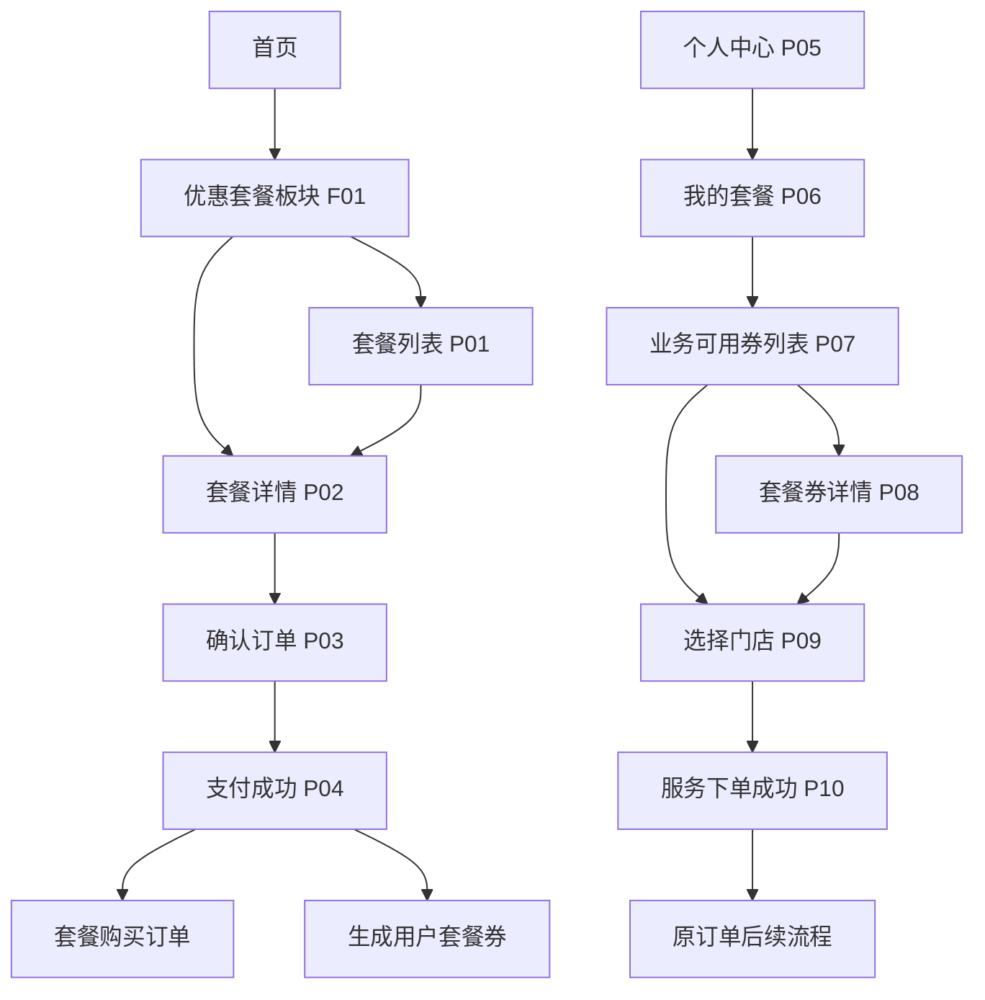
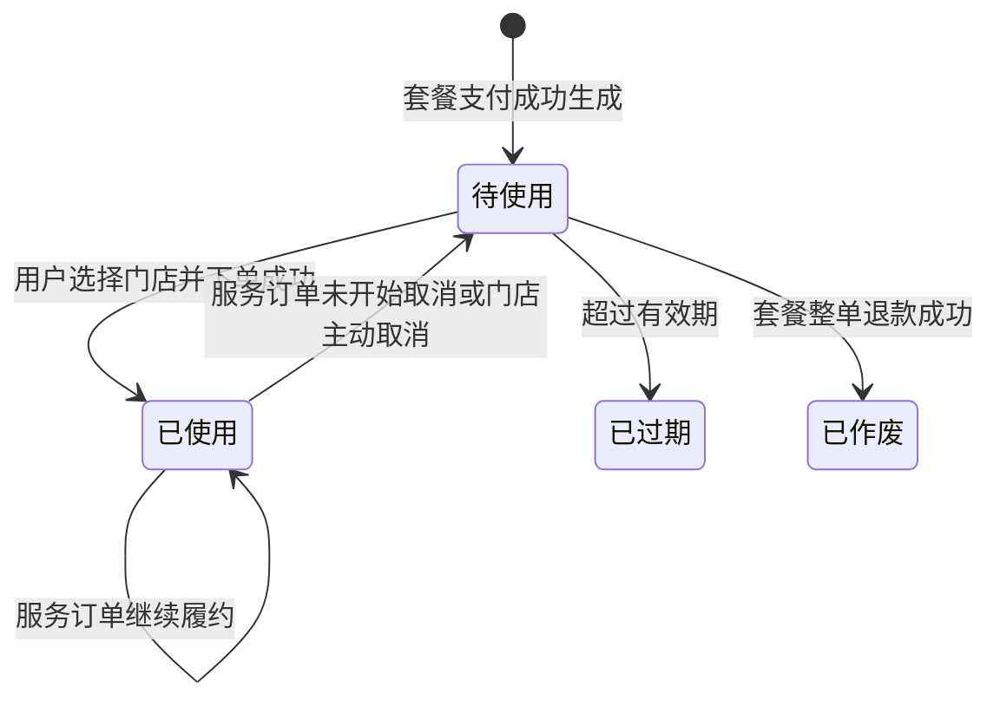

# 优惠套餐 — 功能设计文档

## 1. 模块：优惠套餐

### 1.1 基础信息

| 项目 | 内容 |
| --- | --- |
| 模块名称 | 优惠套餐 |
| 端口类型 | 微信小程序 + 后台管理端 |
| 目标用户 | C 端车主用户、平台运营、门店/后台订单处理人员 |
| 业务场景 | 平台在后台配置套餐商品，用户在小程序首页购买套餐；购买后套餐权益进入“我的套餐”，用户按业务选择套餐券并到适用门店下单使用。 |
| 上游入口 | 小程序首页“优惠套餐”板块、套餐列表、套餐详情、“我的”钱包区“可用套餐”入口、后台套餐管理菜单 |
| 下游去向 | 套餐下单支付、套餐券使用、门店选择、服务订单、订单管理、套餐券使用记录 |
| 设计系统 | 项目微信小程序现有首页样式；**C 端交互以高保真 HTML 原型 `01_优惠套餐_客户端.html` 为准**（含顶栏/安全区/全屏子页结构）；后台设计规范仍按项目既有规范 |
| 关联模块 | 首页、商品/服务管理、门店管理、订单管理、支付、退款、我的钱包、用户订单 |

### 1.2 功能目标

- **用户目标**：在首页快速发现优惠套餐，查看套餐包含的服务内容、有效期、适用门店与退款规则；购买后可在“我的套餐”中按业务使用套餐内服务。
- **平台目标**：通过后台配置可售卖的套餐商品，将多个已有商品/服务组合销售，并通过分担金额支撑套餐券使用后的订单金额、核销、统计与结算口径。
- **业务价值**：提升服务组合售卖能力和用户复购频次，同时保持套餐购买订单、套餐券使用订单与原订单管理流程一致。
- **成功结果**：用户可完成「查看套餐 → 购买套餐（确认订单/支付成功）→ 查看可用券 → 使用券选择门店 → 服务下单成功」的闭环；后台可配置套餐商品并在订单管理中查看套餐购买订单和套餐券使用订单。

### 1.3 范围与边界

#### 1.3.1 本期包含

- 后台管理端配置套餐商品：套餐基础信息、套餐售价、绑定已有商品/服务、适用业务、适用门店、服务次数、分担金额、有效期、上下架状态。
- 小程序首页在金刚区和首推服务之间新增“优惠套餐”板块。
- 小程序套餐列表、套餐详情、**确认订单（结算）**、**支付成功页**、支付购买。
- “我的”页面钱包区新增 **「可用套餐」** 入口：上方展示可使用券数量（单位 **张**），下方文案为「可用套餐」（与原型一致，不单独使用「套餐」二字作为钱包项标题）。
- 我的套餐页按业务展示可用套餐权益，业务包括：维保、洗车美容、检测（原型另含「救援」占位行：无可用券时「去使用」禁用，用于展示扩展业务线的空态，是否上线以实际配置为准）。
- 业务可用券列表、套餐券详情/使用入口、选择门店、使用套餐券生成服务订单。
- 套餐券状态与使用记录：待使用、已使用、已过期；记录使用、取消使用等操作，并关联展示该券使用的订单。
- 订单管理展示套餐购买订单和套餐券使用产生的服务订单。
- 套餐退款规则：套餐内容完全未使用时可申请退款；任意内容已使用则不可退款，并提示“套餐已使用，不支持退款”。

#### 1.3.2 本期不包含

- 后台直接赠送套餐给用户。
- 非购买型套餐权益发放、兑换码兑换、营销活动自动发放。
- 套餐跨用户转赠、共享、拆分转售。
- 套餐券单独退款；套餐券使用产生的服务订单不支持申请退款。
- 套餐库存、限购规则暂不设计。
- 复杂结算规则、分账规则、财务报表不在本文展开，仅定义订单金额口径。

#### 1.3.3 边界说明

- **与商品/服务管理**：套餐内服务必须绑定已有商品/服务，不单独新建服务商品。套餐配置保存商品快照，至少包括商品名称、业务类型、分担金额、服务次数、适用门店。
- **与订单管理**：套餐购买订单和套餐券使用服务订单均进入原订单管理模块展示，但退款规则不同。
- **与支付模块**：用户购买套餐时以 **套餐标价** 为基准，**实付金额**在结算页按优惠券、余额、组合支付等试算；使用套餐券生成服务订单时用户无需再次支付。
- **与退款模块**：仅套餐购买订单在满足“全部未使用”时可申请退款；套餐券使用服务订单不允许退款。
- **与门店管理**：套餐配置时指定适用门店；用户使用券时只能选择该券适用且当前可服务的门店。

### 1.4 用户角色与权限

| 角色 | 使用场景 | 可见范围 | 可操作功能 | 权限限制 |
| --- | --- | --- | --- | --- |
| C 端车主用户 | 购买和使用套餐 | 本人购买的套餐与套餐券 | 查看套餐、购买套餐、使用套餐券、查看使用记录、申请退款 | 未登录不可购买和查看个人套餐；已使用套餐不可退款 |
| 平台运营 | 配置套餐商品 | 权限范围内全部套餐 | 新增、编辑、上下架、查看订单与使用记录 | 已售套餐涉及用户权益时，配置变更不得影响已购买套餐快照 |
| 门店/后台订单处理人员 | 查看订单与服务履约 | 权限范围内门店订单 | 查看套餐购买订单、套餐券使用服务订单 | 无权修改套餐券状态，除订单取消等系统流程触发 |

补充说明：

- 用户端数据按登录用户隔离。
- 后台套餐配置、上下架、编辑须记录操作日志。
- 门店人员查看服务订单时按原订单管理数据权限执行。

### 1.5 用户场景与前置条件

| 场景 | 触发条件 | 前置条件 | 用户目标 | 系统结果 |
| --- | --- | --- | --- | --- |
| 首页发现套餐 | 用户打开首页 | 后台存在已上架套餐 | 浏览优惠套餐 | 首页展示套餐卡片 |
| 查看套餐详情 | 点击套餐卡片 | 套餐未删除且允许展示 | 了解套餐内容和规则 | 进入套餐详情页 |
| 购买套餐 | 点击「立即购买」 | 用户已登录，套餐可售 | 支付结算页「实际支付」金额 | 生成套餐购买订单，支付成功后生成套餐券 |
| 查看可用套餐数量 | 进入「我的」页 | 用户已登录 | 查看可用套餐资产 | 钱包区「可用套餐」显示可使用券数量合计（张） |
| 按业务使用套餐 | 点击「可用套餐」入口 | 用户存在待使用且未过期套餐券 | 按业务查找可用服务 | 我的套餐 P06 展示各业务可用数量（原型含救援占位） |
| 使用某张券 | 在业务券列表点击券或「使用」 | 券待使用、未过期、有适用门店 | 选择门店并下单 | 经 P08/P09 生成服务订单，券状态变为已使用 |
| 申请套餐退款 | 套餐购买订单中点击退款 | 套餐内全部券均未使用 | 申请退回套餐支付金额 | 进入原退款流程 |
| 已使用后申请退款 | 套餐任意券已使用 | — | 尝试退款 | 阻断并提示“套餐已使用，不支持退款” |

### 1.6 信息架构与页面清单

#### 1.6.1 页面/弹窗/组件清单

> **说明**：下列「原型页」列与客户端 HTML 原型控制台中的 **P01–P10** 编号一致，便于设计/评审对照；逻辑标识（`package-list` 等）仍可用于研发命名。

| 编号 | 类型 | 名称 | 页面标识 | 原型页 | 主要用途 | 入口 | 出口 |
| --- | --- | --- | --- | --- | --- | --- | --- |
| F01 | 组件 | 首页-优惠套餐板块 | home-package-section | — | 首页展示套餐卡片 | 首页金刚区下方 | 套餐详情 P02、套餐列表 P01 |
| P01 | 页面 | 套餐列表 | package-list | P01 | 查看全部可购买套餐 | F01「更多」 | P02（点文案区）或 **P03**（点「立即购买」） |
| P02 | 页面 | 套餐详情 | package-detail | P02 | 查看套餐内容、适用门店、有效期、退款说明 | F01/P01 卡片/列表 | P03 |
| P03 | 页面 | 确认订单（套餐结算） | package-checkout | P03 | 选择车辆、优惠与支付方式并完成支付 | P02「立即购买」 | P04 |
| P04 | 页面 | 支付成功 | package-pay-success | P04 | 支付结果与订单摘要、引导查看资产 | P03 支付成功 | P06「我的套餐」等 |
| P05 | 页面 | 个人中心（节选） | mine-profile | P05 | 展示「我的钱包」含可用套餐入口 | 底栏「我的」 | P06 |
| P06 | 页面 | 我的套餐 | my-package | P06 | 按业务展示权益；「使用记录」Tab | P05 钱包「可用套餐」 | P07 |
| P07 | 页面 | 业务可用券列表 | package-coupon-list | P07 | 某业务下券列表与状态筛选 | P06「去使用」 | P08 / P09 |
| P08 | 页面 | 套餐券详情 | package-coupon-detail | P08 | 券基础信息与权益信息 | P07 券卡片 | P09 |
| P09 | 页面 | 选择门店 | package-store-select | P09 | 选择适用门店并下单 | P07/P08「使用」 | P10 |
| P10 | 页面 | 服务下单成功 | package-service-success | P10 | 服务订单创建结果 | P09 确认下单 | 订单详情（正式版） |
| O01 | 页面 | 订单管理-套餐购买订单 | order-package-purchase | *原型未展开* | 展示套餐购买订单及退款入口 | 原订单管理 | 订单详情、退款 |
| O02 | 页面 | 订单管理-套餐券服务订单 | order-package-service | *原型未展开* | 展示使用套餐券生成的服务订单 | 原订单管理 | 原服务订单后续流程 |
| B01 | 页面 | 后台-套餐商品列表 | admin-package-list | — | 管理套餐商品 | 后台菜单 | B02/B03 |
| B02 | 页面/抽屉 | 后台-新增/编辑套餐商品 | admin-package-edit | — | 配置套餐基础信息和套餐内容 | B01 | B01 |
| B03 | 页面 | 后台-套餐详情/数据概览 | admin-package-detail | — | 查看套餐配置、销售与使用汇总 | B01 | B01 |

**客户端原型范围说明**：`01_优惠套餐_客户端.html` 为购买与用券主链路高保真稿；**订单中心、套餐购买订单页、套餐券服务订单页**等在原型中未承载（相关 DOM 已注释），正式版接入既有订单模块；个人中心内订单快捷入口点击后为占位提示，不代表最终交互。

#### 1.6.2 页面流转

流转说明：

- 首页优惠套餐卡片点击进入对应套餐详情，携带 `packageId`。
- 首页优惠套餐「更多」进入套餐列表 P01；**列表页右侧「立即购买」可直接进入 P03**（不经过 P02）。
- 套餐详情点击「立即购买」进入确认订单 P03；支付成功后进入支付成功页 P04，并生成套餐购买订单与用户套餐券。
- 个人中心 P05 钱包区「可用套餐」进入我的套餐 P06，展示业务分组；**「使用记录」** 在同一页 Tab 切换查看。
- 业务分组点击「去使用」进入业务可用券列表 P07，导航标题为「{业务名称}可用套餐」，携带 `businessType`。
- 套餐券点击「使用」进入选择门店 P09；门店页点击「确认使用并下单」后进入服务下单成功 P10。

### 1.7 页面结构与交互设计

#### 1.7.1 F01 首页-优惠套餐板块

**页面定位：**

- 在首页金刚区和「首推服务」之间新增「优惠套餐」板块，承接套餐曝光与转化。
- **布局**：**2 列网格**（`grid-template-columns: repeat(2, 1fr)`），每张卡片为**上图下文**（头图 + 文案区），与首推服务的卡片信息密度接近但版式为网格套餐卡，而非首推的横向双列商品卡。

**页面结构：**

- 标题区：标题「优惠套餐」，右侧「更多 >」（`#pkg-link-more`）。
- 内容区：默认最多展示 **4** 个套餐卡片，数据来自已上架套餐。
- 单卡字段：套餐名称、卖点副标题、**标签行**（服务摘要 + 有效期等文案）、售价、划线原价、**立省金额**（如「立省 ¥299」）。

**关键交互：**

- 点击整张套餐卡：进入套餐详情 **P02**，携带 `packageId`。
- 点击「更多」：进入套餐列表 **P01**。
- 套餐卡片默认按销量降序排列，不提供后台人工排序配置。
- **空态文案（原型）**：`当前城市暂无上架套餐，请稍后再试。`（是否整块隐藏仍可由运营策略决定。）

#### 1.7.2 P01 套餐列表

**页面定位：**

- 全屏列表页，供用户从首页「更多」进入后浏览全部可购套餐。

**页面结构：**

- 顶栏导航标题：「优惠套餐」。
- **筛选区**：Chip — **全部 / 维保 / 洗车美容 / 检测**（默认「全部」）。
- **列表行**：左缩略图 + 中间文案区（标题、副标题、售价、划线价）点击 → **P02 套餐详情**；右侧 **「立即购买」** 按钮点击 → **跳过详情，直接进入 P03 确认订单**（与 `01_优惠套餐_客户端.html` 脚本行为一致）。
- **状态覆盖（原型控制台可切换）**：
  - **加载态**：骨架屏；
  - **空态**：`暂无可售套餐，请稍后再来。`；
  - **错误态**：`网络异常，请检查网络后重试。` + 「重新加载」。

**关键交互：**

- 进入页面默认展示已上架且当前可售的套餐；筛选变更时刷新列表。
- 套餐已下架或不可售时不在列表展示；若从历史链接进入详情，按详情异常规则处理（见 P02 下架提示）。

#### 1.7.3 P02 套餐详情

**页面定位：**

- 帮助用户明确套餐内容、价格、适用门店、有效期、退款规则后完成购买决策。

**页面结构：**

- **头图区**：主图 + 套餐名称 + 售价/划线价 + 卖点副标题。
- **套餐内容**面板：多行「服务名 · 业务类型 · 次数」；**适用门店**一行可带「查看全部」链接；**有效期**单独一行。
- **购买须知**面板：过期作废说明；退款规则文案中强调 **「未使用任何」** 套餐内容时可申请退款，使用过任意内容后不支持退款。
- **底部固定栏**：主按钮文案为 **「立即购买」**（非「立即抢购」）。

**下架/不可购（原型）：**

- 详情内展示：`该套餐已下架，暂不可购买。` 主按钮应不可用（置灰或隐藏按实现）。

**关键交互：**

- 点击「立即购买」：未登录先登录；已登录进入 **P03 确认订单**。
- 当套餐已使用后用户尝试退款，系统提示：「套餐已使用，不支持退款」。

#### 1.7.4 P03 确认订单（套餐结算）

**页面定位：**

- 核对套餐、车辆、优惠与支付方式，完成支付前确认。

**页面结构：**

- 顶栏标题：**「确认订单」**。
- **套餐卡片**：缩略图、名称、内容摘要、售价、划线价。
- **订单信息**区：
  - **车辆信息**：下拉选择绑定车辆；
  - **优惠券**：下拉选择平台优惠券（含「不使用优惠券」）；
  - **支付方式**：单选 — **微信支付 / 余额支付 / 组合支付**（展示可用余额文案）。
- **购买须知**：与 P02 一致的退款与过期说明（纯文本展示）。
- **协议**：勾选「已阅读并同意《优惠套餐购买规则及退改说明》」；未勾选提交时 **Toast 阻断**（原型行为）。
- **底部支付条**：
  - 展示「实际支付」金额（可因满减券等低于套餐标价）；
  - 「明细」可展开：套餐售价、优惠券抵扣、（若有）余额抵扣、**应付合计**；
  - 主按钮：**「确认下单」**。

**关键交互：**

- 提交前校验套餐可售、协议已勾选；**实付金额以服务端试算为准**，前端展示与 P03 明细一致。
- 支付成功后进入 **P04 支付成功**，并生成套餐购买订单与用户套餐券；券按内容数量拆分规则不变。
- 支付失败或取消：待支付/取消规则同原订单模块。

#### 1.7.5 P04 支付成功

**页面定位：**

- 明确支付结果，引导用户前往资产页查看券。

**页面结构：**

- 顶栏标题：「支付成功」。
- 结果区：成功标签 + 说明文案：**「购买成功，您可在「我的-我的钱包-可用套餐」中查看使用相应服务。」**
- **订单摘要**：实付金额、**生成券数量**（如「共 16 张」）。
- 次要按钮：**「查看我的套餐资产」** → 打开 **P06 我的套餐**。

#### 1.7.6 个人中心 P05 — 钱包区「可用套餐」

**页面定位：**

- 在「我的钱包」网格中提供套餐资产入口（个人中心其余订单入口在原型中为占位，正式版接订单中心）。

**页面结构：**

- 与账户余额、优惠券、可开票等并列单元格样式一致。
- 上方：**数值 + 单位「张」**（如 `18 张`）。
- 下方文案：**「可用套餐」**（入口名称不用单独「套餐」二字）。

**统计口径：**

- 统计范围：当前用户名下 **待使用且未过期** 的套餐券。
- 统计单位：**张**（券张数合计，不是券种数）。
- 示例：多业务多券张数相加为钱包展示数字。

#### 1.7.7 P06 我的套餐

**页面定位：**

- 按业务聚合展示可用权益，并提供 **使用记录** 聚合视图。

**页面结构：**

- 顶栏标题：「我的套餐」。
- **Tab**：**「我的套餐」** | **「使用记录」**。
- **我的套餐 Tab**：
  - 业务卡片：维保、洗车美容、检测；**原型另含「救援」示例行**（0 张时「去使用」**禁用**，样式弱化）。
  - 每行：业务名、可用券张数文案（含「即将过期」提示若适用）、**「去使用」**。
- **使用记录 Tab（原型展示粒度）**：
  - 列表项：券名称、状态标签（如 **已使用 / 已取消**）、一行摘要（时间 · 门店 · 关联服务订单号或取消说明）。

**关键交互：**

- 「去使用」→ **P07**，并设置导航标题为「{业务}可用套餐」。
- 无可用券时数量置 0，按钮禁用或空态（与救援行一致）。

#### 1.7.8 P07 业务可用券列表

**页面定位：**

- 展示某一业务下的套餐券，支持按券状态筛选。

**页面结构：**

- 顶栏标题：**「{业务名称}可用套餐」**（随入口业务变化）。
- **筛选 Chip**：**待使用 / 已使用 / 已过期**。
- **券卡片**：券名、状态标签、所属套餐、剩余次数、有效期、**适用门店摘要**；待使用卡上展示 **「使用」** 标签/操作区。

**关键交互：**

- 点击卡片 → **P08 套餐券详情**；在列表上亦可直接理解「使用」含义（原型为整卡可点进详情）。
- 已过期、已使用券仅展示与查看，不可发起使用。

#### 1.7.9 P08 套餐券详情

**页面定位：**

- 展示单张券的基础信息与核心权益（**原型未放完整「使用记录」时间轴**，详细流水以服务端/订单为准，**聚合使用记录见 P06 Tab**）。

**页面结构：**

- 券名称 + 状态标签。
- 摘要：所属套餐、业务类型、商品/服务名称。
- **权益信息**面板：**剩余次数**、**有效期**（适用门店若在列表已展示，详情可不再重复，或实现时与列表保持一致）。
- 底部固定按钮：待使用且未过期时 **「使用」** → **P09**。

**数据要求（与系统一致，不限于本页展示）：**

- 使用记录字段、操作类型（生成、使用、取消使用、过期、退款作废）及与服务订单关联规则 **仍按 1.9.4 / 1.13** 执行；本页为高保真裁剪展示。

#### 1.7.10 P09 选择门店

**页面定位：**

- 用户选择适用门店并确认生成服务订单。

**页面结构：**

- 顶栏标题：「选择门店」。
- 说明文案：**「当前券：{券名} · {服务名}」**。
- 门店列表项：门店名、地址与距离、营业状态、是否可预约等。
- 底部主按钮：**「确认使用并下单」**。

**关键交互：**

- 仅展示该券适用门店；单选门店后下单。
- 服务端二次校验券状态、有效期、门店与商品可用性；成功后进入 **P10**，券置为已使用并记使用记录。

#### 1.7.11 P10 服务下单成功

**页面定位：**

- 告知服务订单已创建，衔接原订单流程。

**页面结构：**

- 顶栏标题：「下单成功」。
- 提示：服务订单已创建；**「下单成功！不要忘记提前致电预约哦！」**
- **订单信息**：订单号、来源（套餐券）、门店等。
- 底部 **「查看订单」**：正式版进入订单详情；**原型内为占位提示**（不展开订单详情页）。

### 1.8 字段、控件与数据口径

#### 1.8.1 后台套餐商品列表字段

| 字段名称 | 字段标识 | 类型 | 展示规则 | 数据来源 |
| --- | --- | --- | --- | --- |
| 套餐名称 | packageName | 文本 | 列表主标题 | 后台配置 |
| 套餐售价 | salePrice | 金额 | 保留 2 位小数 | 后台配置 |
| 业务覆盖 | businessTypes | 枚举集合 | 维保/洗车美容/检测 | 套餐内容聚合 |
| 套餐状态 | packageStatus | 枚举 | 草稿/已上架/已下架 | 后台配置 |
| 有效期规则 | validityRule | 文本 | 固定日期或购买后 N 天 | 后台配置 |
| 适用门店 | storeScope | 文本 | 全部门店/部分门店/数量 | 后台配置 |
| 销量 | salesCount | 数字 | 已支付购买数量 | 订单统计 |
| 最近更新时间 | updatedAt | 时间 | 年月日时分 | 系统 |

#### 1.8.2 后台套餐配置字段

| 字段名称 | 字段标识 | 控件 | 必填 | 校验规则 |
| --- | --- | --- | --- | --- |
| 套餐名称 | packageName | 输入框 | 是 | 1-40 字 |
| 套餐主图 | coverImage | 图片上传 | 建议必填 | 格式与大小按项目上传规范 |
| 套餐卖点 | sellingPoint | 输入框 | 否 | 首页卡片摘要展示 |
| 套餐售价 | salePrice | 金额输入 | 是 | 大于 0 |
| 原价/划线价 | originalPrice | 金额输入 | 否 | 不小于套餐售价 |
| 有效期类型 | validityType | 单选 | 是 | 固定日期 / 购买后 N 天 |
| 有效期值 | validityValue | 日期/数字 | 是 | 根据有效期类型校验 |
| 适用门店 | applicableStoreIds | 多选 | 是 | 至少选择 1 家门店 |
| 套餐内容 | packageItems | 商品选择表格 | 是 | 至少绑定 1 个已有商品/服务 |
| 上下架状态 | packageStatus | 开关/按钮 | 是 | 上架前校验必填项 |
| 购买须知 | purchaseNotice | 富文本/文本 | 是 | 需包含退款与过期规则 |

#### 1.8.3 套餐内容明细字段

| 字段名称 | 字段标识 | 类型 | 展示规则 | 说明 |
| --- | --- | --- | --- | --- |
| 绑定商品 | productId | 商品 ID | 展示商品名称 | 必须为已有商品/服务 |
| 业务类型 | businessType | 枚举 | 维保/洗车美容/检测 | 可由商品带出或配置 |
| 服务次数 | quantity | 数字 | 正整数 | 购买后按数量生成独立套餐券 |
| 分担金额 | allocatedAmount | 金额 | 保留 2 位小数 | 使用券生成服务订单时的实付金额 |
| 适用门店 | applicableStoreIds | 门店集合 | 默认继承套餐门店，可缩小范围 | 不得超出套餐适用门店 |
| 使用说明 | usageDesc | 文本 | 券详情展示 | 可选 |

#### 1.8.4 小程序套餐卡片字段

| 组件 | 字段名称 | 展示位置 | 展示规则 | 点击/操作行为 |
| --- | --- | --- | --- | --- |
| 首页套餐卡片（2 列网格） | 头图 | 卡片顶部 | 固定高度封面图 | 点击整卡进 **P02**（首页无「立即购买」分流，与列表页不同） |
| 首页套餐卡片 | 套餐名称 | 主标题 | 最多 2 行省略 | 同上 |
| 首页套餐卡片 | 套餐卖点 | 副标题 | 1 行省略 | — |
| 首页套餐卡片 | 服务摘要+有效期 | 标签行 | 业务次数与效期组合文案 | — |
| 首页套餐卡片 | 套餐售价 / 划线价 | 价格行 | 售价高亮；原价删除线 | — |
| 首页套餐卡片 | 立省金额 | 价格行 | 醒目色文案，如「立省 ¥299」 | — |
| 套餐列表行 P01 | 缩略图+文案+售价 | 行内 | 与首页信息一致性强 | 文案区 → **P02**；**「立即购买」** → **P03** |
| 业务券卡片 P07 | 剩余数量 | 主信息 | 按券次数/张数展示 | 点击进 P08；待使用可再发起使用 |
| 业务券卡片 | 适用门店摘要 | 辅助行 | 如「全城 N 家门店」 | — |
| 业务券卡片 | 有效期 | 辅助信息 | 过期前可提示 | — |

#### 1.8.5 金额口径

| 场景 | 金额字段 | 口径 |
| --- | --- | --- |
| 套餐商品标价 | 套餐售价（标价） | 后台 `salePrice`，为结算展示与优惠计算基准 |
| 套餐购买订单 | 用户实付金额 | **支付成功后的实际扣款总额**（可低于标价：叠加平台优惠券满减、余额抵扣、组合支付等，以服务端为准） |
| 套餐购买订单 | 优惠明细 | 记录优惠券抵扣、余额抵扣等分项，与 P03「明细」一致 |
| 套餐券使用服务订单 | 用户需支付金额 | 0 元，用户无需再次支付 |
| 套餐券使用服务订单 | 订单实付金额 | 后台套餐内容中为该绑定商品配置的分担金额 |
| 退款金额 | 套餐购买订单退款金额 | 满足退款条件时，按**该笔套餐购买订单实际已支付金额**进入退款流程 |

### 1.9 核心功能说明

#### 1.9.1 后台配置套餐商品

**功能入口：**

- 后台管理端新增“优惠套餐/套餐商品管理”菜单，或挂载在商品/营销相关菜单下。

**操作流程：**

1. 运营点击“新增套餐”。
2. 系统展示套餐配置表单。
3. 运营填写套餐基础信息、售价、有效期、适用门店。
4. 运营选择已有商品/服务，配置服务次数和分担金额。
5. 系统校验配置完整性。
6. 保存为草稿或上架。
7. 上架后小程序首页、套餐列表可展示。

**业务规则：**

- 套餐必须绑定已有商品/服务。
- 套餐内容中每一项必须配置分担金额。
- 分担金额用于套餐券使用生成服务订单的实付金额；**用户购买套餐时的实付金额**以结算页试算为准（可为套餐标价减去平台优惠券、余额抵扣等），套餐 `salePrice` 为标价基准。
- 套餐上架后若已有用户购买，已购买用户权益以购买时快照为准；后续后台编辑不应影响已生成券的服务内容、有效期、门店范围、分担金额。
- 套餐下架后不再对新用户展示和购买，已购买用户仍可在有效期内使用。
- 本期不设计库存和限购；套餐是否可购买仅受上下架、有效期、支付和商品/门店可用性等规则影响。

#### 1.9.2 用户购买套餐

**操作流程：**

1. 用户从首页 F01 / 套餐列表 P01 进入套餐详情 P02。
2. 用户点击 **「立即购买」**。
3. 系统进入 **确认订单 P03**，展示套餐信息、**车辆选择**、**平台优惠券**、**支付方式**（微信 / 余额 / 组合）、购买须知与**协议勾选**。
4. 用户确认「实际支付」金额（可展开明细），勾选协议后点击 **「确认下单」** 并完成支付。
5. 支付成功后进入 **支付成功 P04**，并生成套餐购买订单。
6. 系统按照套餐内容生成用户套餐券。

**业务规则：**

- 套餐购买订单进入原订单管理模块展示。
- **订单实付金额**为用户实际扣款额，**可小于套餐标价**（受平台优惠券、余额等影响）；标价仍以套餐 `salePrice` 为基准展示与对账。
- 未支付订单不生成可使用套餐券。
- 支付成功后按套餐内容数量生成独立券：一个内容项配置 `quantity = N` 时，生成 N 张状态为待使用的套餐券。
- 示例：套餐包含 A 商品 x3、B 商品 x5，则支付成功后一共生成 8 张券。
- 支付成功生成券时，须保存购买快照，包括套餐名称、商品名称、服务次数、分担金额、有效期、适用门店。

#### 1.9.3 我的套餐统计与展示

**操作流程：**

1. 用户进入「我的」**P05**。
2. 系统统计当前用户待使用且未过期的套餐券数量合计（**张**）。
3. 用户点击钱包 **「可用套餐」** 进入 **我的套餐 P06**。
4. 系统按业务类型聚合展示可用数量；用户可切换到 **「使用记录」** Tab 查看聚合流水。

**业务规则：**

- 统计对象为「券张数」，不是券种数量。
- 只统计待使用且未过期的券。
- 已使用、已过期、退款作废的券不计入钱包可用统计。

#### 1.9.4 使用套餐券生成服务订单

**操作流程：**

1. 用户在 **P06** 选择业务并点击「去使用」。
2. 系统展示 **P07** 该业务下可用券列表（可按待使用/已使用/已过期筛选）。
3. 用户进入 **P08** 查看券详情后点击「使用」，或从列表进入详情再使用。
4. 系统展示 **P09** 该券适用门店列表。
5. 用户选择门店并点击 **「确认使用并下单」**。
6. 系统校验券状态、有效期、适用门店和商品可用性。
7. 校验通过后生成服务订单，进入 **P10** 成功页。
8. 系统将套餐券状态更新为已使用，写入使用记录并关联服务订单。

**业务规则：**

- 套餐券使用时用户无需再次支付。
- 套餐券使用产生的服务订单进入原订单管理模块展示。
- 服务订单实付金额取套餐配置时该商品/服务的分担金额。
- 服务订单后续流程与用户直接下单商品形成的订单一致。
- 套餐券使用产生的服务订单不允许申请退款。
- 套餐券对应服务订单处于未开始状态时，用户可自行取消订单；取消成功后写入取消使用记录，套餐券恢复为待使用。
- 门店主动取消套餐券服务订单时，也需写入取消使用记录，套餐券恢复为待使用。
- 服务订单已开始或进入后续不可取消状态时，是否允许取消按原订单流程执行；若不允许取消，套餐券保持已使用。

#### 1.9.5 套餐退款

**适用对象：**

- 仅适用于套餐购买订单。

**退款规则：**

- 套餐中所有券当前均为未使用状态时，可申请退款，进入原退款流程。
- 使用过套餐内任意一项内容且未取消恢复时，不可申请退款。
- 用户在已使用套餐上点击申请退款时，系统提示：“套餐已使用，不支持退款”。
- 套餐券使用产生的服务订单不允许申请退款，退款入口隐藏或置灰。

**数据判断口径：**

- 退款判断以套餐下所有券的当前可退款状态为准：所有券均处于待使用且未过期、未作废时，视为套餐未使用，可申请退款。
- 曾经使用过但因用户在服务订单未开始时自行取消、或门店主动取消订单而恢复为待使用的券，按未使用处理，不影响套餐退款资格。
- 若套餐下任意券当前为已使用，或存在未取消恢复的有效使用订单，视为套餐已使用，不可退款。

### 1.10 状态机与状态流转

#### 1.10.1 套餐商品状态

| 状态 | 状态标识 | 状态含义 | 可执行操作 | 不可执行操作 |
| --- | --- | --- | --- | --- |
| 草稿 | draft | 后台已保存但未上架 | 编辑、上架、删除 | 用户端展示、购买 |
| 已上架 | online | 用户端可展示和购买 | 下架、查看、有限编辑 | 删除已售套餐 |
| 已下架 | offline | 不再对新用户售卖 | 编辑、重新上架 | 新用户购买 |

#### 1.10.2 套餐购买订单状态

| 状态 | 状态标识 | 状态含义 | 可执行操作 | 说明 |
| --- | --- | --- | --- | --- |
| 待支付 | pending_pay | 用户已提交但未支付 | 支付、取消 | 不生成可用券 |
| 已支付 | paid | 支付成功 | 查看、按规则申请退款 | 支付成功后生成券 |
| 退款中 | refunding | 已提交退款申请 | 查看进度 | 原退款流程 |
| 已退款 | refunded | 退款完成 | 查看 | 套餐券作废 |
| 已关闭 | closed | 超时或用户取消 | 查看 | 不生成券 |

#### 1.10.3 套餐券状态

| 状态 | 状态标识 | 状态含义 | 可执行操作 | 不可执行操作 |
| --- | --- | --- | --- | --- |
| 待使用 | unused | 已购买且未使用，仍在有效期内 | 使用、查看详情 | 退款入口不在券上提供 |
| 已使用 | used | 已使用并关联服务订单 | 查看使用记录、查看订单；服务订单未开始时可取消恢复 | 再次使用、申请退款 |
| 已过期 | expired | 超过有效期未使用 | 查看 | 使用、退款 |
| 已作废 | voided | 套餐退款或异常处理后作废 | 查看 | 使用 |

#### 1.10.4 套餐券状态流转

流转说明：

- 待使用到已使用：必须生成服务订单成功后才更新券状态。
- 待使用到已过期：可由定时任务处理，也可在查询时动态判定并回写。
- 已使用到待使用：服务订单处于未开始状态时，用户自行取消订单后触发；门店主动取消订单后也触发。两种场景均需写入取消使用记录。
- 已作废为终态，不允许再次使用。

### 1.11 异常、边界与降级处理

| 异常场景 | 触发条件 | 页面表现 | 系统处理 | 用户可操作 |
| --- | --- | --- | --- | --- |
| 未登录购买套餐 | 点击立即购买 | 跳转登录或弹出登录提示 | 登录成功后回到当前套餐详情 | 登录 |
| 套餐已下架 | 进入详情或提交订单时 | 展示“套餐已下架” | 阻断购买 | 返回列表 |
| 套餐信息变化 | 下单前套餐状态或价格变化 | 提示刷新后重试 | 重新拉取套餐快照 | 刷新 |
| 支付失败 | 支付接口失败或用户取消 | 展示支付失败/待支付 | 保留待支付订单 | 重新支付或取消 |
| 套餐券过期 | 用户进入券列表或点击使用 | 标记已过期，按钮不可用 | 更新券状态 | 查看记录 |
| 商品下架或不可服务 | 使用券下单时绑定商品不可用 | 提示“服务暂不可用” | 阻断下单，记录异常 | 更换其他券或返回 |
| 门店不适用 | 门店不在券适用范围内 | 不展示该门店或提示不可用 | 阻断下单 | 选择其他门店 |
| 重复点击使用 | 用户重复提交 | 按钮 loading/禁用 | 服务端幂等校验 | 等待结果 |
| 已使用套餐申请退款 | 套餐任意内容已使用 | 提示“套餐已使用，不支持退款” | 阻断退款申请 | 查看订单 |
| 套餐券服务订单申请退款 | 用户在服务订单触发退款 | 隐藏或置灰退款入口 | 阻断退款 | 按原订单流程继续 |
| 用户取消未开始订单 | 套餐券服务订单状态为未开始 | 二次确认后取消 | 写入取消使用记录，券恢复待使用 | 返回券列表 |
| 门店主动取消订单 | 门店取消套餐券服务订单 | 用户端展示订单取消结果 | 写入取消使用记录，券恢复待使用 | 查看记录 |
| 订单取消恢复券失败 | 服务订单取消后券状态更新失败 | 提示处理中或联系客服 | 后台补偿任务/人工处理 | 查看状态 |

### 1.12 模块联动与数据影响

| 关联模块 | 联动方向 | 联动场景 | 传递数据 | 影响结果 |
| --- | --- | --- | --- | --- |
| 首页 | 套餐影响首页 | 后台套餐上架 | 套餐卡片数据 | 首页优惠套餐板块展示 |
| 商品/服务管理 | 商品影响套餐 | 套餐绑定已有商品 | productId、商品名称、业务类型 | 生成套餐内容快照 |
| 门店管理 | 门店影响套餐 | 配置和使用适用门店 | storeId、门店状态 | 控制可售/可用门店 |
| 支付 | 套餐影响支付 | 购买套餐 | 套餐购买订单、应付金额 | 支付成功后生成券 |
| 订单管理 | 双向 | 套餐购买、券使用、退款、取消 | orderId、orderType、couponId | 订单展示、退款判断、券状态变更 |
| 我的钱包 | 套餐影响我的页 | 用户查看资产 | 可用券数量 | 钱包区“可用套餐”统计 |
| 退款 | 订单影响套餐 | 用户申请退款 | 套餐使用状态、支付金额 | 决定是否可退款 |

补充说明：

- 套餐购买订单与套餐券服务订单均需在订单管理中可查询。
- 套餐券服务订单应携带 `sourceType = package_coupon` 或等价来源标识，便于订单管理控制退款入口。
- 套餐购买订单应携带套餐使用状态摘要，便于退款前判断是否可退。

### 1.13 数据模型与接口建议

#### 1.13.1 核心数据对象

| 对象名称 | 对象说明 | 关键字段 | 备注 |
| --- | --- | --- | --- |
| 套餐商品 | 后台配置的可售卖套餐 | packageId、packageName、salePrice、status、validityRule | 上架后前台展示 |
| 套餐内容项 | 套餐内绑定的商品/服务 | itemId、packageId、productId、businessType、quantity、allocatedAmount、storeIds | 生成券和服务订单金额依据 |
| 套餐购买订单 | 用户购买套餐产生的订单 | orderId、packageId、userId、payAmount、payStatus、refundStatus | 进入订单管理 |
| 用户套餐 | 用户购买后形成的套餐资产 | userPackageId、packageId、userId、validFrom、validTo、status | 可作为券集合归属对象 |
| 套餐券 | 用户可使用的单项权益 | couponId、userPackageId、productId、businessType、status、validTo、allocatedAmount | 按套餐内容数量拆分生成独立券 |
| 套餐券使用记录 | 记录券状态变化和订单关联 | recordId、couponId、actionType、orderId、storeId、beforeStatus、afterStatus、createdAt | 支持使用、取消、过期、作废 |
| 服务订单 | 使用套餐券生成的订单 | orderId、sourceType、couponId、productId、storeId、paidAmount | 原订单流程展示 |

#### 1.13.2 接口清单建议

| 接口用途 | 请求方式 | 路径建议 | 入参 | 出参 | 备注 |
| --- | --- | --- | --- | --- | --- |
| 查询首页套餐 | GET | /api/packages/home | city/store/context | 套餐卡片列表 | 仅返回上架可售 |
| 查询套餐列表 | GET | /api/packages | businessType、page | 套餐分页列表 | 小程序 |
| 查询套餐详情 | GET | /api/packages/{packageId} | packageId | 套餐详情 | 含购买须知 |
| 创建套餐购买订单 | POST | /api/package-orders | packageId | orderId、payAmount | 提交前校验状态 |
| 查询我的套餐统计 | GET | /api/user-packages/summary | userId | totalAvailable、businessSummary | 我的钱包/我的套餐 |
| 查询业务可用券 | GET | /api/user-package-coupons | businessType、status | 券列表 | 支持分页 |
| 查询券详情 | GET | /api/user-package-coupons/{couponId} | couponId | 券详情与记录 | 用户权限校验 |
| 查询券适用门店 | GET | /api/user-package-coupons/{couponId}/stores | couponId | 门店列表 | 过滤不可用门店 |
| 使用套餐券下单 | POST | /api/package-coupons/{couponId}/use | couponId、storeId | serviceOrderId | 需幂等 |
| 取消使用套餐券 | POST | /api/package-coupons/{couponId}/cancel-use | couponId、orderId | 状态结果 | 由订单取消流程触发 |
| 后台保存套餐 | POST/PUT | /admin/packages | 套餐配置 | packageId | 后台 |
| 后台上下架套餐 | POST | /admin/packages/{packageId}/status | status | 结果 | 后台 |

#### 1.13.3 数据一致性要求

- 套餐购买支付成功后生成券必须具备事务一致性；如异步生成，需有补偿任务。
- 使用套餐券下单必须服务端幂等，防止重复生成服务订单。
- 使用券时必须二次校验券状态、有效期、商品、门店、用户归属。
- 订单取消导致券恢复时，订单状态、券状态、使用记录必须一致。
- 套餐退款成功后，套餐下所有未使用券需作废，且不可再使用。
- 后台套餐配置变更必须记录操作日志；已售套餐权益按购买快照执行。

### 1.14 埋点与指标

| 指标/事件 | 触发时机 | 事件参数 | 用途 |
| --- | --- | --- | --- |
| 首页优惠套餐曝光 | 首页展示板块 | packageIds、userId、city | 评估曝光 |
| 套餐卡片点击 | 点击首页/列表套餐 | packageId、source | 评估点击转化 |
| 套餐详情曝光 | 进入详情 | packageId | 评估购买意向 |
| 立即购买点击 | 点击详情「立即购买」 | packageId、salePrice | 评估下单转化 |
| 确认下单点击 | 点击 P03「确认下单」 | packageId、payChannel | 评估提单 |
| 套餐支付成功 | 支付完成 | packageOrderId、packageId、payAmount（实付） | 统计销售 |
| 可用套餐入口点击 | 点击钱包「可用套餐」 | availableCount | 评估使用入口 |
| 套餐券使用点击 | 点击券使用 | couponId、businessType | 评估使用意愿 |
| 套餐券下单成功 | 服务订单生成 | couponId、serviceOrderId、storeId、allocatedAmount | 评估履约 |
| 套餐退款申请 | 点击退款 | packageOrderId、usedFlag | 评估退款 |
| 退款阻断 | 已使用套餐申请退款 | packageOrderId | 监控争议点 |

### 1.15 高保真交互原型（已与本文档对齐）

**客户端 C 端 HTML 原型文件**：`功能模块设计包/02_优惠套餐/01_优惠套餐_客户端.html`。

当前原型已覆盖：

- **P01–P10 主链路**：套餐列表（含加载/空/错）、套餐详情（含下架样例）、确认订单（车辆/优惠券/支付方式/协议/明细）、支付成功、个人中心钱包「可用套餐」、我的套餐（含「使用记录」Tab）、业务券列表（状态筛选）、券详情、选择门店、服务下单成功。
- **F01 首页板块**：2 列套餐网格、立省标签、空态文案。
- **原型专用**：右侧「原型控制台」（页面跳转、列表态切换、模拟下拉刷新）；**不展示**完整订单中心及套餐订单演示页（代码中已注释，正式版接订单模块）。

后台管理端与订单管理端的界面清单仍以本文档 **B01–B03、O01–O02** 为准；后台 HTML 可在其他交付物中实现。

**状态覆盖建议（评审）**：无套餐、套餐下架、列表异常、券待使用/已使用/已过期、服务下单成功；订单退款阻断等以订单模块接入后验证。

### 1.16 开发实现补充说明

#### 1.16.1 权限与安全

- 用户端所有套餐、券、订单查询必须校验 `userId` 归属。
- 后台套餐配置按角色权限控制新增、编辑、上下架。
- 金额字段以服务端为准，前端不得自行计算最终支付金额或分担金额。
- 套餐券使用记录不可由前端直接改写，只能由服务端业务动作产生。

#### 1.16.2 性能与分页

- 套餐列表、业务券列表、使用记录列表需要分页。
- 我的钱包可用套餐数量建议由汇总接口返回，避免前端遍历券明细。
- 首页套餐板块建议支持缓存，但提交订单前必须实时校验套餐状态与价格。

#### 1.16.3 兼容与适配

- 首页新增板块后需保证金刚区与首推服务原有布局不被破坏。
- 旧订单管理需兼容新增订单来源和退款限制。
- 订单列表筛选如已有订单类型，应增加或映射套餐购买订单、套餐券服务订单来源。

### 1.17 验收标准

| 编号 | 场景 | 前置条件 | 操作步骤 | 预期结果 |
| --- | --- | --- | --- | --- |
| AC01 | 首页展示优惠套餐 | 后台存在已上架套餐 | 用户进入首页 | 金刚区与首推服务之间展示优惠套餐板块 |
| AC02 | 点击套餐卡片进入详情 | 首页有套餐卡片 | 点击套餐卡片 | 进入对应套餐详情 |
| AC03 | 更多进入套餐列表 | 首页有优惠套餐板块 | 点击「更多」 | 进入套餐列表 P01 |
| AC03b | 列表快捷下单 | 在 P01 | 点击某一行的「立即购买」 | 进入确认订单 P03（可不经过详情 P02） |
| AC04 | 用户购买套餐 | 套餐可售，用户已登录 | 详情点击「立即购买」→ P03 勾选协议并支付 | 生成套餐购买订单和用户套餐券；可进入 P04 |
| AC05 | 钱包统计可用套餐 | 用户有待使用券 | 进入我的页 P05 | 「可用套餐」格内上方为可使用券合计（单位张），下方文案为「可用套餐」 |
| AC06 | 按业务查看可用券 | 用户有洗车美容券 | 进入我的套餐 P06 并点击洗车美容「去使用」 | 进入 P07，标题为「洗车美容可用套餐」，展示多种券 |
| AC07 | 使用套餐券下单 | 券待使用且未过期 | P08/P09：选择门店并「确认使用并下单」 | 生成服务订单，用户无需支付，券变为已使用；进入 P10 |
| AC08 | 服务订单金额口径 | 使用套餐券下单成功 | 查看订单管理中的服务订单 | 订单实付金额等于套餐配置的该商品分担金额 |
| AC09 | 套餐购买订单展示 | 用户购买套餐成功 | 进入订单管理 | 可查询到套餐购买订单 |
| AC10 | 套餐服务订单展示 | 用户使用套餐券成功 | 进入订单管理 | 可查询到套餐券使用产生的服务订单 |
| AC11 | 未使用套餐可退款 | 套餐内所有券当前均为未使用；包含曾使用但已取消恢复的券 | 在套餐购买订单申请退款 | 进入原退款流程 |
| AC12 | 已使用套餐不可退款 | 套餐任意券已使用 | 在套餐购买订单申请退款 | 阻断并提示“套餐已使用，不支持退款” |
| AC13 | 套餐服务订单不可退款 | 使用券生成服务订单 | 查看服务订单 | 不展示退款入口或置灰不可申请退款 |
| AC14 | 套餐券过期 | 券超过有效期 | 进入券列表或详情 | 券状态为已过期，不可使用 |
| AC15 | 后台配置分担金额 | 新增套餐 | 未配置内容分担金额时上架 | 阻断上架并提示补全 |
| AC16 | 支付后按数量生成券 | 套餐包含 A 商品 x3、B 商品 x5 | 用户支付成功 | 生成 8 张套餐券 |
| AC17 | 未开始订单取消恢复券 | 套餐券服务订单状态为未开始 | 用户取消或门店主动取消订单 | 写入取消使用记录，套餐券恢复待使用 |

### 1.18 已确认规则

| 编号 | 规则 | 影响范围 | 状态 |
| --- | --- | --- | --- |
| R01 | 套餐内容按数量拆分为独立券，例如 A 商品 x3、B 商品 x5，一共生成 8 张券。 | 券列表、统计、使用记录 | 已确认 |
| R02 | 套餐券服务订单状态为未开始时，用户可自行取消；门店也可主动取消。取消成功后写入取消使用记录，套餐券恢复待使用。 | 订单取消、券状态 | 已确认 |
| R03 | 套餐退款判断以所有券当前是否未使用为准；曾使用但已取消恢复为待使用的券，按未使用处理。 | 退款规则 | 已确认 |
| R04 | 首页优惠套餐板块默认最多展示 4 个套餐，按销量降序排列，不做后台人工配置。 | 首页运营 | 已确认 |
| R05 | 本期暂不做库存和限购。 | 购买下单 | 已确认 |

### 1.19 输出前质量检查清单

- [x] 本文档只处理优惠套餐功能模块。
- [x] 端口类型已明确为微信小程序 + 后台管理端。
- [x] 覆盖首页优惠套餐、套餐列表、详情、确认订单与支付成功、我的套餐（含使用记录 Tab）、券列表/详情、门店选择、服务下单成功。
- [x] 覆盖后台套餐配置、绑定已有商品、适用门店、分担金额。
- [x] 覆盖套餐购买订单和套餐券服务订单在订单管理中的展示。
- [x] 覆盖套餐退款规则和提示文案。
- [x] 覆盖套餐券状态、使用记录、取消使用记录。
- [x] 覆盖金额口径、数据对象、接口建议、异常边界和验收标准。

### 1.20 变更记录

| 日期 | 版本 | 变更内容 | 变更人 |
| --- | --- | --- | --- |
| 2026-05-08 | v1.0 | 新增优惠套餐功能设计文档，覆盖套餐配置、购买、使用、订单管理与退款规则。 | AI 助手 |
| 2026-05-08 | v1.1 | 明确套餐券按数量拆分、未开始订单取消恢复券、退款判断、首页展示排序及暂不做库存限购。 | AI 助手 |
| 2026-05-08 | v1.2 | 与 `01_优惠套餐_客户端.html` 对齐：页面编号 P01–P10、确认订单/支付成功/个人中心、结算页车辆与优惠券与组合支付、首页 2 列网格与立省、列表态与文案、我的套餐 Tab、券列表筛选、金额实付口径、原型范围说明。 | AI 助手 |
