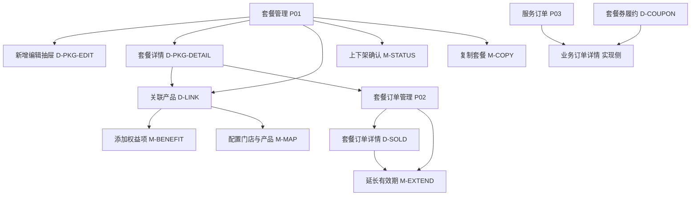
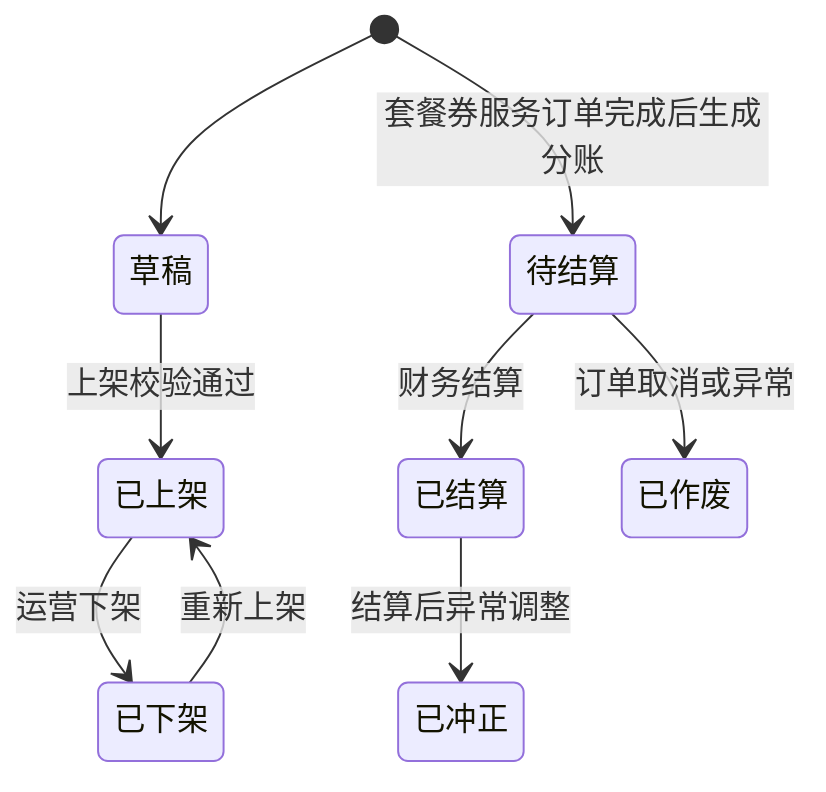

# 优惠套餐 — 后台管理端功能设计文档

## 1. 模块：优惠套餐（后台管理端）

### 1.1 基础信息

| 项目 | 内容 |
| --- | --- |
| 模块名称 | 优惠套餐 — 后台管理端 |
| 端口类型 | Web 后台管理端 |
| 目标用户 | 平台运营、商品运营、财务人员、订单客服、门店/服务订单处理人员、系统管理员 |
| 业务场景 | 平台通过后台配置多个套餐产品，将不同业务类型的已有商品/服务按数量组合售卖；用户购买后生成套餐权益，后续使用权益产生服务履约订单。后台需要支撑套餐配置、已售套餐查询、券履约追踪、退款资格判断、有效期延长、财务统计、订单兼容和分账结算。 |
| 上游入口 | 后台「套餐运营」「订单与财务」侧栏（见原型）、商品/服务管理、订单管理、财务管理、数据统计 |
| 下游影响 | 微信小程序优惠套餐展示与购买、用户套餐券资产、服务订单履约、套餐整单退款、财务对账、门店结算、业务数据统计 |
| 关联文档 | `01_优惠套餐_功能设计文档.md`、`01_优惠套餐_客户端.html`、`01_优惠套餐_后台管理端.html`（交互原型） |
| 关联模块 | 商品/服务管理、门店管理、订单管理、支付、财务结算、数据统计、操作审计、权限管理 |

### 1.2 功能目标

- **运营目标**：可独立配置多个套餐产品；支持多业务类型；通过「权益项」配置服务次数与单次分担金额，通过「门店与产品映射」将同一权益在各门店落地为具体可核销商品/服务；配置有效期、购买须知与上下架状态。
- **订单目标**：已售套餐可查询、可追踪、可判断整单退款资格，并支持单笔已售套餐延长有效期；套餐券使用产生的服务订单可回溯到套餐购买订单和具体券。
- **财务目标**：财务与数据统计能识别套餐销售模式，分别统计套餐销售收入、套餐退款、套餐权益履约、套餐券服务订单分担金额、门店结算与分账金额。
- **业务兼容目标**：各业务模块订单管理可兼容来源为套餐券的订单，订单履约流程基本沿用原业务订单，但退款、支付、分账、统计口径按套餐模式单独处理。
- **成功结果**：形成「套餐配置 → 客户端售卖 → 支付生成权益 → 使用权益生成服务订单 → 履约/取消/有效期延长 → 财务分账与统计」的后台闭环。

### 1.3 范围与边界

#### 1.3.1 本期包含（与 `01_优惠套餐_后台管理端.html` 原型一致部分）

- **套餐管理**（列表 + 抽屉）：新增/编辑套餐基础信息与购买须知；套餐详情（含经营概览指标）；**关联产品**抽屉维护套餐权益项及门店与产品映射；上下架确认、复制为草稿、列表查询与分页。
- **套餐订单管理**（列表 + 抽屉）：按条件查询用户套餐购买订单；订单详情（概要、使用记录流水）；单笔延长有效期（含原因）。
- **服务订单**（列表）：查看由套餐券产生的服务订单关键字段；导出（原型预留入口）。
- **套餐券履约详情**（抽屉）：单张券基础信息、状态流水、关联服务订单与结算状态摘要。
- 订单兼容、套餐分账与财务口径：仍以本文档「业务规则 / 数据口径」为准；**独立「套餐财务统计 / 分账结算明细 / 数据分析」后台页在原型中未单独落地**，可由财务管理、订单中心等既有模块承接或后续迭代补页。

#### 1.3.1b 原型已体现的后台信息架构

- 侧栏一级：**套餐运营**（套餐管理、套餐订单管理）、**订单与财务**（服务订单）。
- 面包屑示例：`产品管理 > 套餐管理` / `产品管理 > 套餐订单管理` / `订单与财务 > 服务订单`。

#### 1.3.2 本期不包含

- 后台手动赠送套餐、兑换码兑换、营销活动自动发放套餐。
- 套餐库存、限购、预约库存占用、复杂促销叠加规则。
- 套餐权益转赠、多人共享、拆分售卖。
- 对已售套餐批量改价、批量变更权益内容或批量延长有效期。
- 分账自动打款接口的具体银行/支付通道对接细节；本文只定义产品规则与数据口径。
- 后台高保真 HTML 原型：`01_优惠套餐_后台管理端.html` 已提供；本文档功能/逻辑以该原型与业务规则对齐为准。

#### 1.3.3 边界说明

- **与客户端**：后台只配置套餐和管理订单，不直接改变用户端交互；客户端展示与购买链路以 `01_优惠套餐_客户端.html` 为准。
- **与商品/服务管理**：用户持券下单时核销的具体商品/服务，由各权益项下的「门店与产品映射」指向门店内已有商品/服务；支付成功后的购买快照需固化映射结果；套餐不在本模块中新建基础服务商品。
- **与订单管理**：套餐购买订单和套餐券服务订单都进入订单体系；套餐购买订单负责收款、整单退款资格判断和有效期延长入口，套餐券服务订单负责履约与结算。
- **与财务结算**：普通订单按原规则分账；套餐券服务订单按套餐分账规则生成独立结算记录。
- **与门店管理**：套餐配置和使用均受适用门店限制；门店停用、商品不可服务时影响用户使用券下单。
- **与售后规则**：套餐购买订单支持整单退款，条件是套餐内当前没有任何券处于已使用状态，且不存在未取消恢复的有效服务订单；套餐券服务订单不支持单独退款。

### 1.4 用户角色与权限

| 角色 | 使用场景 | 可见范围 | 可操作功能 | 权限限制 |
| --- | --- | --- | --- | --- |
| 平台运营 | 配置和维护套餐产品 | 全部套餐及销售数据 | 新增、编辑、复制、上下架、查看、关联产品、导出（若开放） | 已上架且已售套餐编辑受限，不可影响已购买快照 |
| 商品运营 | 维护权益项与门店商品映射 | 权限范围内商品、门店与套餐 | 维护关联产品、分担金额与映射 | 不可处理财务结算与退款审批 |
| 订单客服 | 查询用户已售套餐与履约 | 全部或权限范围内订单 | 查看订单、查看券、查看退款资格、单笔延长有效期、异常备注 | 不可修改套餐配置和分账金额 |
| 财务人员 | 对账、统计、分账结算 | 财务权限范围内订单和结算数据 | 查看财务报表、导出、处理结算状态 | 不可编辑套餐商品基础信息 |
| 门店人员 | 处理套餐券服务订单 | 本门店服务订单 | 查看履约订单、按原业务流程接单/完成/取消 | 不可查看其他门店销售汇总，不可改券状态 |
| 系统管理员 | 权限与异常处理 | 全部数据 | 权限配置、异常补偿、审计查看 | 高危操作需操作日志和二次确认 |

补充说明：

- 写操作必须记录操作人、时间、变更前后值、来源 IP 或终端信息。
- 门店人员只能看到归属本门店的套餐券服务订单和结算记录。
- 财务金额字段按权限展示，普通运营可查看运营统计，敏感结算字段可按项目 RBAC 控制。

### 1.5 用户场景与前置条件

| 场景 | 触发条件 | 前置条件 | 用户目标 | 系统结果 |
| --- | --- | --- | --- | --- |
| 配置新套餐 | 运营点击「新增套餐」 | 已存在可售商品/服务与门店 | 组合多个业务服务形成套餐 | 保存草稿或上架，客户端可展示上架套餐 |
| 配置多业务权益 | 在关联产品中添加多条权益项 | 各业务线下有可映射商品 | 一个套餐覆盖维保、洗车美容、检测等 | 按权益业务类型聚合展示，购买后按次数生成对应业务券 |
| 配置服务次数与映射 | 在关联产品中维护权益项 | 已维护门店与产品映射 | 设置权益服务次数、单次分担及门店商品 | 支付成功后按次数生成券；核销时落具体门店商品 |
| 查看套餐订单 | 客服/运营进入套餐订单管理 | 存在套餐购买订单 | 查询用户购买、支付与使用流水 | 展示订单概要、使用记录与延长有效期入口 |
| 查看服务履约 | 从已售套餐或订单进入履约详情 | 用户已使用某张券 | 追踪具体服务订单履约进度 | 展示业务类型、门店、订单状态、结算状态 |
| 财务对账 | 财务进入既有财务/订单模块或后续套餐专页 | 有套餐销售/退款/履约数据 | 核对收款、退款、分担和结算 | 按本文档口径统计；原型未单独建套餐财务页 |
| 业务订单兼容 | 门店查看业务订单 | 存在套餐券服务订单 | 按原业务流程处理服务 | 订单标识为套餐来源，支付/退款/分账规则不同 |
| 延长已售套餐有效期 | 客服处理单个用户售后 | 已售套餐存在未使用或未过期权益 | 为单笔已售套餐延长有效期 | 更新该笔用户套餐及未终态券有效期，记录操作日志 |

### 1.6 信息架构与页面清单

#### 1.6.1 页面/抽屉/弹窗清单（对齐原型）

| 编号 | 类型 | 名称 | 页面标识 | 主要用途 | 入口 | 出口 |
| --- | --- | --- | --- | --- | --- | --- |
| P01 | 页面 | 套餐管理 | page-packages | 查询与管理套餐；跳转详情/编辑/关联产品 | 侧栏「套餐运营 / 套餐管理」 | 各抽屉 |
| D-PKG-EDIT | 抽屉 | 新增/编辑套餐 | editDrawer | 套餐基础信息、价格、有效期类型、主图、购买须知 | P01「新增套餐」或行「修改」 | 关闭回 P01 |
| D-PKG-DETAIL | 抽屉 | 套餐详情 | packageDetailDrawer | 经营概览、基础信息、购买须知；跳转关联产品/套餐订单列表 | P01「详情」 | P01 / 打开关联产品 / 套餐订单管理 |
| D-LINK | 抽屉 | 关联产品 | linkProductDrawer | 维护套餐权益项列表；入口添加权益项、行内配置门店与产品 | P01「关联产品」或详情底栏 | 关闭回上一抽屉或列表 |
| D-COUPON | 抽屉 | 套餐券履约详情 | couponDrawer | 单券信息、状态流水、关联订单与结算状态摘要 | 原型控制台或实现中从订单/券入口打开 | 关闭 |
| D-SOLD | 抽屉 | 套餐订单详情 | soldOrderDetailDrawer | 订单关键指标、概要、使用记录表 | P02「详情」 | 延长有效期弹窗 |
| P02 | 页面 | 套餐订单管理 | page-sold | 查询用户套餐购买订单与权益状态 | 侧栏「套餐运营 / 套餐订单管理」 | D-SOLD / 延长有效期 |
| P03 | 页面 | 服务订单 | page-service-orders | 套餐券产生的服务订单列表 | 侧栏「订单与财务 / 服务订单」 | 实现中可下钻业务订单详情 |
| M-STATUS | 弹窗 | 上下架确认 | statusModal | 确认上架/下架及下架影响说明 | P01 行内上架或下架 | 关闭并刷新列表 |
| M-COPY | 弹窗 | 复制套餐 | copyModal | 复制基础信息与购买须知为草稿；明确不复制门店与权益映射 | 实现中自详情或列表「复制」入口（原型弹窗已定义文案） | 进入编辑/关联产品 |
| M-EXTEND | 弹窗 | 延长有效期 | extendModal | 延长至指定时间、填写原因 | P02 列表或 D-SOLD 底栏 | 关闭并刷新 |
| M-BENEFIT | 弹窗 | 添加权益项 | addBenefitItemModal | 录入权益名称、业务类型、服务次数、单次分担、使用说明 | D-LINK「添加权益项」 | 写入权益表并关闭 |
| M-MAP | 弹窗 | 配置门店与产品 | productMappingModal | 按门店添加行，为每行选择该门店下已有产品 | D-LINK 行「配置」 | 保存映射回权益项 |
| M-STORE | 弹窗 | 选择门店 | storePickerModal | 关键词筛选、分页勾选门店（脚本层支撑套餐或映射选店） | 实现中与「全部门店/部分门店」等入口联动 | 确定添加 |

**原型未单独提供的界面（规则仍适用）**：退款资格说明弹窗、异常补偿弹窗、独立套餐财务/分账/分析页；实现时可并入订单详情、通用售后或财务模块。

#### 1.6.2 页面流转

流转说明：

- **配置路径**：先保存套餐基础信息（D-PKG-EDIT），再在「关联产品」（D-LINK）中维护权益项与门店产品映射；上架前需校验基础信息、购买须知、权益项及映射完整性（具体校验项见 1.9）。
- **复制路径**：M-COPY 仅复制基础信息与购买须知为新草稿；**不复制**适用门店范围、权益项及门店与产品映射，须在 D-LINK 中重新配置后再上架。
- **详情路径**：D-PKG-DETAIL 可一键跳转 P02 并按当前套餐筛选（原型为「打开套餐订单列表」）。
- **履约路径**：P03 与 D-COUPON 与业务订单详情之间的跳转由实现携带 `serviceOrderId`、`couponId`、`packageOrderId` 等参数，并保留套餐券来源标识。

### 1.7 原型对齐：页面职责与关键交互（非 UI 规范）

以下按 `01_优惠套餐_后台管理端.html` 的信息架构归纳；**不描述**颜色、间距、组件库等视觉规范。

#### 1.7.1 P01 套餐管理（列表）

**职责**：分页查询套餐；进入详情、编辑、关联产品；触发上下架确认。

**查询条件（原型）**：套餐名称；套餐状态（全部 / 已上架 / 已下架 / 草稿）；业务覆盖；适用门店；展开更多：创建人、最近更新时间范围。

**列表列（原型）**：套餐编号；套餐名称；产品价格；划线价格；业务覆盖（标签）；**券张数**（各权益项服务次数之和）；**关联门店数**（各权益项「门店与产品映射」中出现过的门店 ID 去重数量，无映射时为 0）；有效期展示文案；状态；销量；销售实付；操作（详情、修改、关联产品、上架或下架）。

**关键交互与逻辑**

- 列表支持骨架屏、空态、错误态与重新加载（原型可切换演示状态）。
- 上架/下架走 M-STATUS，文案明确：下架后客户端不可购，已购权益仍可用。
- 「修改」打开 D-PKG-EDIT；「关联产品」打开 D-LINK；「详情」打开 D-PKG-DETAIL。
- **复制套餐**：以 M-COPY 文案为准——复制基础信息与购买须知为新草稿；**不复制**适用门店、权益项与门店产品映射，须在 D-LINK 重新配置（列表行内若绑定复制弹窗，实现时应与「复制」语义一致，避免与上下架混用）。

#### 1.7.2 D-PKG-EDIT 新增/编辑套餐（抽屉）

**分区**：套餐基础信息；购买须知（富文本占位）。

**表单字段（原型）**：套餐名称（必填，≤40 字）；套餐卖点（≤80 字）；副标题（可选）；产品价格（必填，>0）；划线价格（可选）；**上下架状态**（草稿 / 已上架 / 已下架，与列表联动）；有效期类型（购买后 N 天 / 固定截止日期）；对应天数或截止日期；套餐主图上传；购买须知富文本（必填，含退款与过期等规则说明）。

**关键逻辑**

- 有效期类型切换时，仅当前类型对应输入生效（互斥展示）。
- 已售套餐编辑规则不变：已售快照不因后台编辑而变更；无销售时可全量编辑，有销售时仅允许不影响已售权益的字段策略由实现与权限约定。
- 产品价格、划线价格含义与 1.8、1.18 一致；**与权益分担合计的校验在关联产品保存/上架时执行**（见 1.7.3）。

#### 1.7.3 D-LINK 关联产品（抽屉）

**职责**：维护 **套餐权益项** 及每项下的 **门店与产品映射**；不再使用「单表直接选全局商品 SKU」替代映射（与旧版「仅内容项 + 门店子集」文档差异点）。

**权益项表格列（原型）**：权益名称；业务类型；服务次数；单次分担金额；配置产品数（已为多少条映射行选择具体产品）；使用说明；操作（配置、删除）。

**添加权益项（M-BENEFIT）**：权益名称 *；业务类型 *（维保 / 洗车美容 / 检测）；服务次数 *（正整数，决定该权益生成券张数）；单次分担金额 *（元，非负）；使用说明（可选）。脚本中预留门店范围继承/自定义（`storeScope`），实现与套餐级门店策略对齐即可。

**配置门店与产品（M-MAP）**：标题可带权益名称；通过可搜索门店选择器添加行；每行：适用门店、门店已有产品（可搜索下拉，数据按门店接口下发）、移除。保存后将映射写回当前权益项，并刷新「配置产品数」。

**关键逻辑**

- 支付成功后，按各权益项 **服务次数** 生成对应张数的套餐券；每张券携带该权益的 **单次分担金额**、业务类型、使用说明及核销时可用的 **门店-商品映射快照**（以支付成功时配置为准，逻辑同「购买快照」）。
- **金额校验**：所有权益项的 **（单次分担金额 × 服务次数）** 之和须等于 **产品价格**（与旧文档「各内容项分担小计之和 = 产品价格」等价，表述随模型调整）；否则阻断保存或上架。
- **映射完整性**：上架或购买前须保证用户可能履约的门店在映射中有可选商品且商品可售；否则阻断或提示替换。
- **选择门店（M-STORE）**：支持关键词筛选、分页、多选确定；用于套餐级可选门店或实现扩展，与映射弹窗配合。

#### 1.7.4 D-PKG-DETAIL 套餐详情（抽屉）

**经营概览（原型指标区）**：销售实付及支付订单笔数；产品价格与划线价；券使用「已使用 / 已生成」；**可整单退**订单笔数（当前无在途已使用券约束下的统计，口径与退款规则一致）。

**基础信息**：与编辑抽屉字段一致展示；套餐编号只读。

**购买须知**：只读展示客户端文案摘要。

**底栏动作**：关闭；打开 D-LINK；跳转 P02（套餐订单管理）以查看该套餐订单。

#### 1.7.5 P02 套餐订单管理（列表 + D-SOLD）

**列表查询（原型）**：订单号；用户（姓名或手机号）；权益状态（全部 / 全部待使用 / 部分已使用 / 全部已使用 / 已过期）；支付时间范围；展开更多：套餐名称。

**列表列**：套餐订单号；用户名称；手机号；套餐名称；实付金额；券数；已使用张数；权益状态；当前有效期；操作（详情；满足策略时显示「延长有效期」）。

**工具栏**：导出；列表字段自定义（齿轮占位，与 P01 一致）。

**D-SOLD 套餐订单详情（抽屉）**

- 顶部指标：实付金额（含支付方式、优惠金额摘要）；权益券总数与待使用/已使用摘要；当前有效期及是否延长过。
- 订单概要：用户名称、手机号、支付成功时间、权益状态（原型未展示车辆信息，实现若需要可从订单域补充）。
- **使用记录**表（替代旧版「券明细表」单一形态）：记录时间、记录类型（如发券成功、已使用、取消恢复等）、券编号、业务类型、服务项目、门店、关联服务订单号。

**关键逻辑**

- 整单退款、券状态、取消恢复规则不变（见 1.9.3）；原型未单独做「退款资格」弹窗，实现可放在订单详情或售后入口。
- **延长有效期（M-EXTEND）**：字段「延长至」日期时间、**原因**必填类文本；仅单笔订单；保存后更新未终态券有效期并记审计（规则同前）。

#### 1.7.6 D-COUPON 套餐券履约详情（抽屉）

**展示**：券编号、业务类型、当前状态、单次分担、关联服务订单号、**结算状态**（如：不生成 / 待结算 / 已结算等，与分账模块对齐）；下方 **状态流水** 时间线（生成、使用、取消恢复等）。

**逻辑**：与 1.9.4 一致；取消未开始订单恢复券、已开始/完成不恢复。

#### 1.7.7 P03 服务订单（列表）

**职责**：集中查看套餐券产生的服务订单（原型当前无筛选卡片，仅有导出 + 表格）。

**列表列（原型）**：服务订单号；套餐订单号；券编号；业务类型；门店；分担金额；订单状态；券状态。

**逻辑扩展（实现建议）**：补充用户、来源标识、结算状态、下单时间筛选与列，以支撑财务与客服；用户实付 0、不可单独退款、统计取分担金额等规则不变。

#### 1.7.8 财务统计 / 分账明细 / 数据分析（文档保留，原型未建页）

业务指标与下钻关系仍适用 **1.9.5、1.9.7** 及数据口径；后台入口可由 **财务管理、数据统计** 等既有模块承载，或后续版本增加与原型同风格的 P04～P06 页面。

### 1.8 字段、控件与数据口径

#### 1.8.1 套餐管理列表字段（对齐原型列）

| 字段名称 | 字段标识 | 类型 | 展示规则 | 空值规则 | 数据来源 | 权限规则 |
| --- | --- | --- | --- | --- | --- | --- |
| 套餐编号 | packageCode | 文本 | 可复制 | — | 系统生成 | 全员可见 |
| 套餐名称 | packageName | 文本 | 主标题 | — | 后台配置 | 全员可见 |
| 产品价格 | salePrice | 金额 | 2 位小数 | — | 后台配置 | 按金额权限 |
| 划线价格 | originalPrice | 金额 | 2 位小数 | 可与产品价相同或更高 | 后台配置 | 按金额权限 |
| 业务覆盖 | businessTypes | 枚举集合 | 维保/洗车美容/检测等标签 | — | 权益项业务类型聚合 | 全员可见 |
| 券张数 | couponTotal | 数字 | 各权益项服务次数之和 +「张」 | 0 | 权益项配置 | 全员可见 |
| 关联门店数 | mappedStoreCount | 数字 | 各权益项映射表门店 ID 去重数 | 0 | 门店与产品映射 | 全员可见 |
| 有效期 | validityRule | 文本 | 购买后 N 天 / 固定至某日 | — | 后台配置 | 全员可见 |
| 套餐状态 | packageStatus | 枚举 | 草稿/已上架/已下架 | — | 系统状态 | 全员可见 |
| 销量 | paidOrderCount | 数字 | 已支付购买订单数 | 0 | 订单统计 | 运营/财务 |
| 销售实付金额 | paidAmountTotal | 金额 | 用户实际支付总额 | 0.00 | 支付订单 | 财务/运营 |

**筛选字段（原型）**：套餐名称；套餐状态；业务覆盖；适用门店（用于筛数据，口径可与映射门店并集或套餐级门店策略一致）；创建人；最近更新时间范围。

#### 1.8.2 新增/编辑套餐表单字段（对齐 D-PKG-EDIT）

| 字段名称 | 字段标识 | 控件类型 | 是否必填 | 默认值 | 可选项/范围 | 校验规则 | 联动规则 |
| --- | --- | --- | --- | --- | --- | --- | --- |
| 套餐名称 | packageName | 输入框 | 是 | 空 | 1～40 字 | 不可为空 | 展示到客户端 |
| 套餐卖点 | sellingPoint | 输入框 | 否 | 空 | 1～80 字 | 超长阻断 | 展示到卡片 |
| 副标题 | subTitle | 输入框 | 否 | 空 | 项目长度限制 | — | 客户端副标题 |
| 产品价格 | salePrice | 金额输入 | 是 | 运营定价 | > 0 | 2 位小数；须与权益项分担合计一致（见 1.8.3） | 支付与校验基准 |
| 划线价格 | originalPrice | 金额输入 | 否 | 可同参考价 | >= 0 | 2 位小数 | 仅展示，不参与支付与分账 |
| 上下架状态 | packageStatus | 下拉 | 是 | 草稿 | 草稿/已上架/已下架 | 上架前走完整性校验 | 与列表、客户端联动 |
| 有效期类型 | validityType | 单选 | 是 | 购买后 N 天 | 购买后 N 天 / 固定截止日期 | 必填 | 切换时互斥展示天数或截止日期 |
| 有效期天数 | validityDays | 数字 | 条件必填 | 空 | 正整数 | 购买后 N 天时必填 | 券截止日 = 购买日 + N |
| 有效期截止日期 | validityEndDate | 日期 | 条件必填 | 空 | 合法日期 | 固定截止日期时必填 | 统一 23:59:59 等以订单规则为准 |
| 套餐主图 | coverImage | 图片上传 | 建议必填 | 空 | 项目规范 | 格式/大小 | 客户端主图 |
| 购买须知 | purchaseNotice | 富文本 | 是 | 模板 | — | 含退款与过期规则 | 详情/结算页 |

**说明**：原型将「权益项、门店与产品映射」放在 **关联产品** 抽屉，不在本表单内编辑；套餐级「全部门店/部分门店」若启用，与 M-STORE 联动（实现与复制 M-COPY 文案一致：复制不带走门店与映射）。

#### 1.8.3 套餐权益项与门店产品映射字段

| 字段名称 | 字段标识 | 类型 | 说明 |
| --- | --- | --- | --- |
| 权益项 ID | benefitId | ID | 系统生成 |
| 权益名称 | benefitName | 文本 | 展示用，如「精致洗车」 |
| 业务类型 | businessType | 枚举 | 维保 / 洗车美容 / 检测 |
| 服务次数 | serviceTimes | 整数 | ≥1，支付成功后生成同等张数券 |
| 单次分担金额 | sharePerCoupon | 金额 | 2 位小数，每张券对应服务订单统计与分账基数 |
| 使用说明 | usageDesc | 文本 | 可选，券详情/核销提示 |
| 门店范围策略 | storeScope | 枚举 | 如 inherit/custom，与套餐级门店策略对齐（实现扩展） |
| 映射行 | mappingRows[] | 对象数组 | 每行：门店 ID、门店名称、该门店下选定的 productId/SKU |
| 配置产品数 | mappedProductCount | 数字 | 已为映射行绑定具体产品的行数，列表「配置产品数」可展示已填行数/应填行数策略由产品定 |

**金额恒等式**：Σ（`sharePerCoupon` × `serviceTimes`）= `salePrice`（产品价格），保存关联产品或上架时校验。

**映射规则（逻辑）**：用户在某门店用券下单时，仅能核销该门店行上绑定的已有商品/服务；映射门店集合用于列表「关联门店数」去重统计；购买快照须固化权益项与映射。

#### 1.8.4 套餐订单列表与详情字段

| 字段名称 | 字段标识 | 类型 | 展示规则 | 数据口径 |
| --- | --- | --- | --- | --- |
| 套餐订单号 | packageOrderNo | 文本 | 可复制 | 套餐购买订单 |
| 用户名称 / 手机号 | userName, userPhone | 文本 | 手机脱敏 | 订单用户 |
| 套餐名称 | packageName | 文本 | — | 快照或当前套餐名 |
| 实付金额 | actualPaidAmount | 金额 | 2 位小数 | 支付成功实扣 |
| 券数 | couponTotal | 数字 | 张 | 权益次数合计 |
| 已使用 | usedCouponCount | 数字 | 张 | 状态为已使用的券数 |
| 权益状态 | packageBenefitStatus | 枚举 | 原型筛选项：全部待使用/部分已使用/全部已使用/已过期；系统仍可保留未生成/部分过期/已作废等细粒度 | 券聚合 |
| 当前有效期 | currentValidTo | 日期 | 日期或到时分 | 含延长后 |
| 支付时间 | paidAt | 时间 | — | 列表筛选 |
| 使用记录 | usageLedger[] | 表 | 时间、类型、券号、业务、服务项目、门店、服务订单号 | 流水写入 |

详情顶栏指标（原型）：实付、支付方式摘要、优惠金额；券总数与待使用/已使用；当前有效期与是否延长。

#### 1.8.5 财务金额口径

| 场景 | 金额字段 | 口径 |
| --- | --- | --- |
| 产品价格 | salePrice | 后台配置的实际销售价格，作为用户下单支付基准；可与运营参考价脱钩，**须等于各权益（单次分担×次数）之和** |
| 划线价格 | originalPrice | 仅作客户端展示；不参与支付、分账、退款和结算 |
| 套餐购买订单实付 | actualPaidAmount | 用户支付成功后的实际扣款金额，可能受优惠券、余额等影响 |
| 套餐购买订单退款 | refundAmount | 套餐权益完全未使用（可整单退条件）时可退；退款金额按套餐购买订单实际可退金额进入原退款流程 |
| 套餐券服务订单用户支付 | userPayAmount | 固定为 0 或展示为套餐抵扣，用户不再次支付 |
| 套餐券服务订单实付/统计 | allocatedAmount | 单张券分担金额，来自权益项配置的「单次分担金额」（一权益多券时各张相同，尾差规则若需则按最后一券调整） |
| 套餐待履约金额 | unfulfilledAllocatedAmount | 待使用且未过期券的分担金额合计 |
| 套餐已履约金额 | fulfilledAllocatedAmount | 已使用且服务订单达到统计口径的分担金额合计 |
| 门店结算基数 | settlementBaseAmount | 默认等于套餐券服务订单分担金额，可叠加业务分成规则计算 |

补充说明：

- `actualPaidAmount` 用于支付对账和销售收入统计。
- `allocatedAmount` 用于套餐券服务订单业务统计、履约金额、门店结算和套餐分账。
- 各权益（单次分担×次数）之和必须等于产品价格；用户实付金额可能因优惠低于产品价格，财务报表需分别展示，禁止混用。

### 1.9 核心功能说明

#### 1.9.1 套餐产品配置

**功能入口**

- 后台侧栏「套餐运营 / 套餐管理」；权限按角色控制。

**操作流程**

1. 运营在 P01 点击「新增套餐」或行内「修改」。
2. 在 D-PKG-EDIT 填写套餐基础信息、价格、有效期类型、主图、购买须知并保存。
3. 打开 D-LINK「关联产品」：添加权益项（M-BENEFIT），为每项配置门店与产品映射（M-MAP）；必要时通过 M-STORE 维护套餐可选门店范围（实现侧）。
4. 系统校验权益项非空、分担合计=产品价格、映射及商品可售性。
5. 运营在列表或编辑区触发上架，经 M-STATUS 确认后生效。
6. 客户端按状态展示与售卖。

**业务规则**

- 套餐须至少有 **1 条权益项**。
- 一个套餐可有多个权益项；同一业务类型可多条（如多次洗车 + 多次检测）。
- 每条权益须配置 **服务次数**（正整数）与 **单次分担金额**；**Σ（单次分担×次数）= 产品价格**。
- 复制套餐（M-COPY）仅复制基础信息与购买须知，新草稿 **须重新配置** 门店、权益项与映射。
- 已售订单权益以支付成功时 **快照** 为准，不受后续后台编辑影响。
- 套餐下架后不可新购，已购权益仍可按快照使用。

#### 1.9.2 权益项、门店映射与生成券

**业务规则**

- 按每条权益的 **服务次数** 生成对应张数的套餐券；券上业务类型、单次分担、使用说明来自权益项；**履约商品**来自该用户所选门店在映射行上绑定的 `productId`（及快照）。
- 示例：权益「精致洗车」次数 5、单次分担 ¥20 → 生成 5 张券，每张核销时落映射中对应门店的具体洗车 SKU。
- 客户端「我的套餐」仍可按业务类型聚合展示券数量；用券下单时仅展示映射允许门店下的可选商品。

**校验规则**

| 校验对象 | 校验时机 | 校验规则 | 不通过提示 | 是否阻断 |
| --- | --- | --- | --- | --- |
| 权益项 | 上架/保存关联 | 至少 1 条权益 | 请至少添加 1 项权益 | 是 |
| 服务次数 | 保存 | 正整数 | 服务次数无效 | 是 |
| 分担合计 | 保存关联/上架 | Σ（单次分担×次数）= 产品价格 | 分担金额合计须等于产品价格 | 是 |
| 映射与商品 | 上架/购买前 | 映射行所选商品在门店可售 | 存在不可售或缺映射 | 是 |
| 门店范围 | 保存 | 映射门店在允许范围内（若启用套餐级门店） | 门店超出范围 | 是 |

#### 1.9.3 套餐订单管理（已售套餐）

**功能入口**

- 侧栏「套餐运营 / 套餐订单管理」；订单中心中 `orderType = package_purchase` 的详情入口。

**操作流程**

1. 客服或运营在 P02 按订单号、用户、权益状态、支付时间、套餐名称等查询。
2. 打开 D-SOLD 查看指标、订单概要、**使用记录**流水。
3. 退款咨询：按下文「业务规则」与券状态判断（原型未单独弹窗，可在订单/售后展示）。
4. 单笔「延长有效期」：M-EXTEND 填写新截止时间与原因并确认。

**业务规则**

- 未支付订单不生成券。
- 支付成功后如券生成失败，订单详情展示异常状态，并进入补偿任务或人工补偿流程。
- 套餐购买订单支持整单退款：当前没有任何套餐券处于已使用状态，且不存在未取消恢复的有效服务订单时，可发起整单退款。
- 如果任意券为已使用且对应服务订单未取消恢复，则套餐不可退款，提示「套餐已使用，不支持退款」。
- 已使用套餐券对应的服务订单取消成功并使券恢复为待使用后，按当前券状态重新判断；若套餐中没有任何券处于已使用状态，则符合整单退款条件。
- 套餐券服务订单不支持单独退款，退款只从套餐购买订单发起。
- 后台支持单笔已售套餐延长有效期，不支持批量延长；延长后应记录操作人、延长前后有效期、原因和操作时间。
- 延长有效期只影响该笔已售套餐下未终态权益的可使用时间，不改变已完成服务订单、已作废券和历史履约记录。

#### 1.9.4 套餐券服务履约管理

**功能入口**

- D-SOLD 使用记录、D-COUPON 抽屉、P03 服务订单列表。
- 各业务模块订单详情中的「套餐券来源」入口。

**业务规则**

- 用户使用套餐券成功后生成服务订单，服务订单来源标识为 `package_coupon`。
- 服务订单用户需支付金额为 0；订单实付/统计金额取券快照中的分担金额。
- 服务订单履约流程沿用对应业务类型的原订单流程。
- 服务订单未开始且取消成功时，券恢复为待使用，并写入取消使用记录。
- 服务订单已开始或已完成时，不允许恢复券，券保持已使用。
- 套餐券服务订单不允许用户单独申请退款。
- 客户购买套餐后，在未使用任何套餐券（权益未履约）前，套餐实收资金全部归集在平台侧，不生成门店分账。

#### 1.9.5 财务统计与对账

**统计口径**

- 套餐销售统计：按套餐购买订单支付成功时间统计 `actualPaidAmount`。
- 套餐退款统计：按套餐购买订单退款完成时间统计 `refundAmount`。
- 套餐履约统计：按套餐券服务订单达到统计状态的时间统计 `allocatedAmount`。
- 待履约统计：按待使用且未过期券的 `allocatedAmount` 合计。
- 分账统计：按套餐券服务订单生成的分账记录统计门店结算金额。

**业务规则**

- 财务报表必须可区分「套餐购买订单」和「套餐券服务订单」。
- 支付对账以套餐购买订单为准；服务订单不再产生支付流水。
- 门店结算以套餐券服务订单为准；客户未使用任何券前，资金全部归集在平台，不生成门店分账。
- 服务订单履行完成后，门店获得该订单关联 **券分担金额** 的分账，结算时需扣除平台抽成、微信支付服务费、优惠券优惠金额等规则项。
- 套餐购买订单退款成功后，未使用券作废；如存在已生成但未结算的分账记录，需按订单状态作废或冲正。

#### 1.9.6 各业务模块订单兼容

**兼容要求**

- 维保、洗车美容、检测等业务订单列表需支持来源筛选：普通下单 / 套餐券。
- 套餐券服务订单在业务订单详情中展示来源信息：套餐名称、券编号、套餐购买订单号。
- 支付信息区展示「套餐抵扣」或「套餐券支付」，用户支付金额为 0。
- 退款入口隐藏或置灰，提示「套餐券服务订单不支持单独退款」。
- 分账信息按套餐分账记录展示，不走普通订单支付分账。
- 导出字段需增加订单来源、套餐订单号、券编号、分担金额、套餐结算状态。

#### 1.9.7 套餐分账体系

**分账对象**

- 分账对象不是套餐购买订单，而是套餐券使用后生成且达到可结算状态的服务订单。
- 客户购买套餐后，在未使用任何券前，资金全部归集在平台侧，门店不获得分账。

**分账触发**

1. 用户使用套餐券生成服务订单。
2. 门店按原业务流程完成服务。
3. 服务订单达到「已完成 / 可结算」状态。
4. 系统读取券快照中的 `allocatedAmount` 作为该服务订单关联权益的分担金额。
5. 系统按分担金额扣除平台抽成、微信支付服务费、优惠券优惠金额等规则项后，计算门店应得金额。
6. 按业务类型、门店、平台分成规则生成套餐分账记录。

**分账规则**

- 套餐分账记录必须带 `settlementSource = package_coupon`。
- 默认结算基数为套餐券快照中的单次分担金额。
- 门店获得的分账金额 = 分担金额 - 平台抽成 - 微信支付服务费分摊 - 优惠券优惠金额分摊 - 其他应扣项；具体费率和分摊规则按财务配置执行。
- 平台抽成、门店结算比例可沿用对应业务类型配置；若套餐另有专属规则，则按套餐分账规则优先。
- 虽然套餐券服务订单不产生新的支付流水，但微信支付服务费和优惠券优惠金额来源于套餐购买订单，需要按财务配置分摊到已履约内容。
- 套餐购买订单实收金额和套餐服务订单分担金额之间的差异需进入套餐经营分析，不应在单笔服务订单中强行摊平。
- 已结算后发生异常取消，需生成冲正记录，不直接删除历史结算记录。

### 1.10 状态机与状态流转

#### 1.10.1 套餐商品状态

| 状态 | 状态标识 | 状态含义 | 可执行操作 | 不可执行操作 |
| --- | --- | --- | --- | --- |
| 草稿 | draft | 已保存未上架 | 编辑、上架、删除 | 客户端展示、购买 |
| 已上架 | online | 客户端可展示和购买 | 查看、下架、有限编辑、复制 | 删除已售套餐 |
| 已下架 | offline | 不再售卖 | 查看、编辑、重新上架、复制 | 新用户购买 |

#### 1.10.2 已售套餐权益状态

| 状态 | 状态标识 | 状态含义 | 触发条件 |
| --- | --- | --- | --- |
| 未生成 | not_generated | 支付未完成或券生成异常 | 待支付/生成失败 |
| 全部待使用 | all_unused | 所有券待使用 | 支付成功生成券 |
| 部分已使用 | partial_used | 至少 1 张券已使用 | 用户使用券 |
| 全部已使用 | all_used | 所有券均已使用 | 全部券完成使用 |
| 部分过期 | partial_expired | 至少 1 张券过期 | 定时任务或查询回写 |
| 已作废 | voided | 异常处理后作废 | 人工作废 |

列表筛选「已过期」（原型）可与「全部券已过期」或含 `partial_expired` 的聚合展示策略对齐，由实现与产品统一标签口径。

#### 1.10.3 套餐分账状态

| 状态 | 状态标识 | 状态含义 | 可执行操作 |
| --- | --- | --- | --- |
| 待生成 | pending_generate | 服务订单未达到可结算状态 | 查看 |
| 待结算 | pending_settle | 已生成分账记录但未结算 | 导出、标记结算、作废 |
| 已结算 | settled | 已完成门店结算 | 查看、冲正 |
| 已作废 | voided | 订单取消或异常导致记录作废 | 查看 |
| 已冲正 | reversed | 已结算后通过调整记录冲正 | 查看 |

#### 1.10.4 状态流转

### 1.11 异常、边界与降级处理

| 异常场景 | 触发条件 | 页面表现 | 系统处理 | 用户可操作 |
| --- | --- | --- | --- | --- |
| 无权限访问 | 角色无菜单或数据权限 | 403 或无权限提示 | 拦截接口 | 联系管理员 |
| 套餐配置不完整 | 上架时缺少权益项/映射/分担合计≠产品价格 | 表单或关联产品区高亮 | 阻断上架 | 补全关联产品 |
| 商品已下架 | 映射指向的商品不可用 | 上架/购买校验提示 | 阻断上架或购买 | 替换映射商品 |
| 门店不可用 | 适用门店停用或无服务能力 | 使用券下单时不展示/提示 | 阻断下单 | 选择其他门店 |
| 支付成功但券生成失败 | 支付回调后生成券异常 | 套餐订单详情展示异常 | 自动补偿，失败后人工处理 | 管理员补偿 |
| 重复生成券 | 支付回调重复 | 不重复展示 | 幂等处理 | 无需操作 |
| 券使用并发 | 用户重复点击使用 | loading 或错误提示 | 服务端幂等锁 | 等待或重试 |
| 服务订单取消恢复券失败 | 订单取消成功但券状态未恢复 | 履约详情异常标记 | 补偿任务修复 | 管理员补偿 |
| 套餐分账生成失败 | 服务订单完成后结算记录异常 | 财务明细异常状态 | 重试或人工生成 | 财务/管理员处理 |
| 已售套餐配置被改 | 已售后运营编辑套餐 | 订单详情展示购买快照 | 已售权益不变 | 查看快照 |
| 报表金额不一致 | 实付金额与分担金额差异 | 报表分别展示两套口径 | 不自动摊平 | 财务按口径核对 |

### 1.12 模块联动与数据影响

| 关联模块 | 联动方向 | 联动场景 | 传递数据 | 影响结果 |
| --- | --- | --- | --- | --- |
| 商品/服务管理 | 商品影响套餐 | 门店映射选择门店下已有商品 | storeId、productId、businessType、价格、可售状态 | 控制可映射范围与用券下单可选项 |
| 门店管理 | 双向 | 配置适用门店、使用券选门店 | storeId、门店状态、服务能力 | 控制可用门店和履约归属 |
| 客户端 | 套餐影响客户端 | 套餐上架/下架 | 套餐卡片、详情、有效期、内容 | 控制展示与购买 |
| 支付 | 套餐影响支付 | 用户购买套餐 | packageOrderId、actualPaidAmount、payChannel | 支付成功后生成券 |
| 订单管理 | 双向 | 套餐购买、券使用、取消、退款资格判断 | orderType、sourceType、couponId | 订单展示、履约、状态回写 |
| 财务结算 | 套餐影响财务 | 服务订单完成 | allocatedAmount、settlementSource、storeId | 生成套餐分账记录 |
| 数据统计 | 套餐影响报表 | 销售、退款和履约发生 | 销售、退款、券、服务订单 | 形成套餐报表 |
| 操作审计 | 后台影响审计 | 配置、上下架、补偿、结算操作 | 操作人、前后值、原因 | 可追溯 |

补充说明：

- 套餐购买订单需带 `orderType = package_purchase`。
- 套餐券服务订单需带 `sourceType = package_coupon`。
- 各业务订单模块不得仅按支付流水判断收入，需要兼容套餐分担金额。

### 1.13 数据模型与接口建议

#### 1.13.1 核心数据对象

| 对象名称 | 对象说明 | 关键字段 | 备注 |
| --- | --- | --- | --- |
| 套餐商品 | 后台配置的套餐产品 | packageId、packageName、salePrice、originalPrice、status、validityType、validityValue、coverImage | 客户端展示和购买来源 |
| 套餐权益项 | 逻辑权益一行，多券同源 | benefitId、packageId、benefitName、businessType、serviceTimes、sharePerCoupon、usageDesc | 决定券张数与单次分担 |
| 门店产品映射 | 权益在某门店落地的商品 | benefitId、storeId、productId | 用券下单可选 SKU；购买快照 |
| 套餐购买订单 | 用户购买套餐的收款订单 | packageOrderId、userId、actualPaidAmount、payStatus、refundStatus | 支付和退款规则依据 |
| 用户套餐 | 用户购买后形成的权益集合 | userPackageId、packageOrderId、userId、status、validFrom、validTo | 套餐券归属 |
| 套餐券 | 单张可使用权益 | couponId、userPackageId、benefitId、fulfillProductId、businessType、status、allocatedAmount、validTo | 按权益次数生成；履约商品来自映射快照 |
| 套餐券使用记录 | 券生命周期流水 | recordId、couponId、actionType、beforeStatus、afterStatus、orderId、operator | 支持审计和排障 |
| 套餐服务订单 | 使用券生成的服务订单 | serviceOrderId、sourceType、couponId、storeId、businessType、allocatedAmount | 原订单体系扩展 |
| 套餐分账记录 | 套餐券服务订单结算记录 | settlementId、serviceOrderId、storeId、settlementBaseAmount、storeAmount、platformAmount、status | 独立于普通订单分账 |
| 套餐财务汇总 | 报表聚合对象 | statDate、packageId、paidAmount、refundAmount、fulfilledAmount、settledAmount | 可由离线任务生成 |

#### 1.13.2 接口清单建议

| 接口用途 | 请求方式 | 路径建议 | 入参 | 出参 | 备注 |
| --- | --- | --- | --- | --- | --- |
| 查询套餐列表 | GET | /admin/packages | status、keyword、businessType、storeId、creator、updatedRange、page | 列表含券张数、关联门店数等 | 对齐 P01 |
| 保存套餐基础信息 | POST/PUT | /admin/packages | 基础信息、购买须知 | packageId | 对齐 D-PKG-EDIT |
| 查询/保存权益与映射 | GET/PUT | /admin/packages/{packageId}/benefits | benefit 列表、mappingRows | benefitIds | 对齐 D-LINK |
| 上下架套餐 | POST | /admin/packages/{packageId}/status | status、reason | 结果 | 对齐 M-STATUS 校验 |
| 复制套餐 | POST | /admin/packages/{packageId}/copy | packageId | newPackageId | 对齐 M-COPY，不复制映射 |
| 查询套餐详情 | GET | /admin/packages/{packageId} | packageId | 配置、经营概览指标 | 对齐 D-PKG-DETAIL |
| 门店候选分页 | GET | /admin/stores | keyword、page | 门店列表 | 对齐 M-STORE |
| 查询门店下可映射商品 | GET | /admin/stores/{storeId}/mappable-products | businessType | 商品下拉数据 | 对齐 M-MAP |
| 查询套餐订单 | GET | /admin/package-orders | orderNo、user、benefitStatus、paidRange、packageName、page | 列表、分页 | 对齐 P02 |
| 查询套餐订单详情 | GET | /admin/package-orders/{orderId} | orderId | 概要、使用记录、退款资格 | 对齐 D-SOLD |
| 延长有效期 | POST | /admin/package-orders/{orderId}/extend-validity | newValidTo、reason | 结果 | 对齐 M-EXTEND |
| 查询券履约详情 | GET | /admin/package-coupons/{couponId} | couponId | 券、流水、服务订单、结算状态 | 对齐 D-COUPON |
| 查询套餐服务订单 | GET | /admin/package-service-orders | couponId、storeId、businessType、status、page | 列表 | 对齐 P03 |
| 查询财务统计 / 分账 / 导出 | GET/POST | （既有财务域路径） | — | — | 原型未专页，接口可落在财务中台 |

#### 1.13.3 数据一致性要求

- 套餐购买订单支付成功与套餐券生成需保证最终一致，优先事务处理；异步处理时必须有补偿任务。
- 套餐券使用生成服务订单必须幂等，幂等键建议包含 `couponId + userId + requestId`。
- 服务订单取消恢复券需同时更新订单状态、券状态、使用记录和分账状态。
- 分账记录生成需保证一笔套餐券服务订单只生成一条有效结算记录。
- 报表统计需明确时间口径，避免支付时间、退款时间、履约时间混用。
- 已售快照不可被后台配置编辑覆盖。

### 1.14 埋点与指标

| 指标/事件 | 触发时机 | 事件参数 | 用途 |
| --- | --- | --- | --- |
| 后台新增套餐 | 保存新套餐 | packageId、operatorId、status | 运营配置分析 |
| 套餐上架 | 上架成功 | packageId、benefitCount、couponTotal | 上架审计 |
| 套餐下架 | 下架成功 | packageId、reason | 风险追踪 |
| 套餐配置校验失败 | 上架/保存失败 | packageId、errorField | 定位配置问题 |
| 查询套餐订单 | 后台查询 | filters、operatorRole | 客服使用分析 |
| 查看退款资格 | 打开退款资格说明 | packageOrderId、eligible、reason | 客服咨询监控 |
| 套餐分账生成 | 服务订单完成后 | serviceOrderId、allocatedAmount、storeId | 财务链路监控 |
| 套餐分账异常 | 生成或结算失败 | settlementId、errorCode | 财务异常预警 |
| 财务报表导出 | 导出任务创建 | reportType、filters、operatorId | 敏感操作审计 |

### 1.15 高保真交互原型说明

后台高保真原型文件：`01_优惠套餐_后台管理端.html`（已实现 P01/P02/P03、主要抽屉与弹窗、列表加载/空/错态演示、权益项与门店映射的示例脚本逻辑）。

**与本文档对齐要点**：侧栏与面包屑、套餐/订单/服务订单三主列表、关联产品（权益项 + 配置门店与产品）、复制套餐边界、延长有效期字段、分担合计与产品价格一致规则。

**原型未画出的能力**：独立套餐财务看板、分账列表页、退款资格专用弹窗、异常补偿弹窗等，实现时按 1.7.8、1.9.5、1.9.7 在其它模块或后续页面补齐。

后续迭代若调整原型，应同步修订本文档 1.6～1.9 与字段表。

### 1.16 开发实现补充说明

#### 1.16.1 权限与安全

- 菜单权限至少拆分为：套餐管理、套餐订单管理、服务订单查询；财务统计、分账管理、异常补偿可挂在财务/管理员角色（与原型侧栏分组一致或可合并）。
- 数据权限按平台/区域/门店过滤，门店角色不得查看其他门店服务订单和结算数据。
- 金额字段、用户手机号、导出能力按权限控制。
- 异常补偿、重新生成分账、结算冲正等高危操作需二次确认并填写原因。

#### 1.16.2 性能与分页

- 所有列表分页，默认每页 20 条，支持 50/100 条切换。
- 套餐订单、服务订单、分账明细需支持按时间范围查询，默认限制查询跨度，超大范围走异步导出。
- 财务统计建议使用汇总表或离线任务，避免实时扫订单和券明细。
- 关键词查询需明确可查字段，手机号等敏感字段按脱敏/精确匹配策略处理。

#### 1.16.3 兼容与适配

- 原订单列表、订单详情、订单导出需增加套餐购买订单和套餐券服务订单来源识别。
- 各业务订单模块需兼容 `sourceType = package_coupon`，不得强制要求支付流水。
- 原财务报表若按订单实付统计，需要排除或单独展示套餐券服务订单，避免 0 元支付订单被误判为无价值订单。
- 原售后/退款相关入口需识别：套餐购买订单仅在套餐权益完全未使用（无不可退券状态）时开放整单退款；套餐券服务订单不开放单独退款。

#### 1.16.4 审计与日志

- 套餐配置操作日志：新增、编辑、关联产品（权益与映射变更）、复制、上架、下架、删除草稿。
- 订单与权益日志：支付成功、券生成、使用、取消恢复、延长有效期、过期、作废。
- 财务日志：分账生成、结算、作废、冲正、导出。
- 日志需可按对象 ID、操作人、时间查询。

### 1.17 验收标准

| 编号 | 场景 | 前置条件 | 操作步骤 | 预期结果 |
| --- | --- | --- | --- | --- |
| AC01 | 新增套餐产品 | 运营有权限 | 进入套餐管理，打开新增抽屉并保存 | 成功生成草稿套餐 |
| AC02 | 多业务权益项 | 各业务线下有可映射商品 | 在关联产品中添加不同业务类型的权益项 | 列表业务覆盖展示多类型标签 |
| AC03 | 配置服务次数 | 已添加权益项 | 权益甲次数 3、权益乙次数 5 | 券张数合计为 8 |
| AC04 | 分担金额合计校验 | Σ（单次分担×次数）≠ 产品价格 | 保存关联产品或上架 | 阻断并提示分担合计须等于产品价格 |
| AC05 | 上架套餐 | 基础信息、购买须知、权益与映射完整 | 点击上架并经上下架确认 | 状态变为已上架，客户端可查询 |
| AC06 | 套餐订单查询 | 用户已购买并支付 | 在套餐订单管理按订单号查询 | 展示实付、券数、权益状态与有效期 |
| AC07 | 查看券履约详情 | 用户已使用或曾使用券 | 打开套餐券履约详情抽屉 | 展示关联服务订单、结算状态与状态流水 |
| AC08 | 套餐券服务订单兼容 | 存在套餐券服务订单 | 进入对应业务订单列表 | 订单可被查询，来源显示套餐券 |
| AC09 | 套餐服务订单不可退款 | 套餐券服务订单已生成 | 查看订单详情 | 退款入口隐藏或置灰，并提示不支持单独退款 |
| AC10 | 未使用套餐可整单退款 | 套餐所有券当前均非已使用，且不存在未取消恢复的有效服务订单 | 查看退款资格或申请退款 | 展示可退款，可进入原退款流程 |
| AC11 | 已使用套餐不可退款 | 套餐任意券当前为已使用，或存在未取消恢复的有效服务订单 | 查看退款资格或申请退款 | 阻断并说明套餐已使用不支持退款 |
| AC12 | 取消未开始服务订单恢复券 | 套餐券服务订单未开始 | 取消服务订单 | 服务订单取消，券恢复待使用并写入取消记录 |
| AC12b | 已使用券取消恢复后可退款 | 套餐曾使用一张券，关联服务订单已取消且券恢复待使用；套餐内无已使用券 | 查看退款资格 | 展示可退款，可进入原退款流程 |
| AC13 | 财务统计销售金额 | 存在套餐支付订单 | 在财务模块按口径查询（或后续专页） | 销售实付按套餐购买订单 `actualPaidAmount` 统计 |
| AC14 | 财务统计履约金额 | 存在已完成套餐券服务订单 | 在财务模块按履约时间统计 | 履约金额按服务订单 `allocatedAmount` 统计 |
| AC15 | 分账记录生成 | 套餐券服务订单已完成 | 在分账模块查看 | 生成 `settlementSource = package_coupon` 的分账记录，扣费规则按财务配置 |
| AC16 | 门店数据权限 | 门店账号登录 | 查看套餐服务订单列表 | 只能看到本门店订单和结算数据 |
| AC17 | 已售快照不受编辑影响 | 已下单后运营修改套餐配置 | 查看套餐订单详情 | 仍展示购买时快照，用户权益不变 |
| AC18 | 报表导出审计 | 财务导出套餐分账明细 | 点击导出 | 生成导出任务并记录操作日志 |
| AC19 | 门店与产品映射 | 某权益需多门店履约 | 在配置门店与产品中为各门店选择具体商品并保存 | 用户仅能在已映射门店用该权益对应的 SKU 下单 |
| AC20 | 单笔延长有效期 | 用户已购买套餐 | 在套餐订单详情或列表触发延长有效期弹窗并确认 | 未终态券有效期更新，记录原因与操作人 |
| AC21 | 不支持批量延长有效期 | 套餐订单列表存在多条订单 | 尝试批量延长 | 不提供批量入口（与原型一致） |
| AC22 | 复制套餐不复制映射 | 存在已配置映射的套餐 | 执行复制为草稿 | 新套餐为草稿，须重新配置权益与门店产品映射 |

### 1.18 已确认规则

| 编号 | 规则 | 影响范围 | 状态 |
| --- | --- | --- | --- |
| R01 | 套餐有两个价格：产品价格为实际销售价格（须等于各权益单次分担×次数之和）；划线价格仅作前端展示，可独立配置。 | 套餐配置、客户端展示、支付 | 已确认 |
| R02 | 各权益项配置「单次分担金额」与「服务次数」；**Σ（单次分担×次数）= 产品价格**；券上分担取该权益单次值（多券同权多次核销）。 | 关联产品、券生成、服务订单金额、分账 | 已确认 |
| R03 | 客户购买套餐后，未使用任何券前资金全部在平台；用户用券并生成服务订单且订单履行完成后，门店获得该订单关联券分担金额的分账，并扣除平台抽成、微信支付服务费、优惠券优惠金额等规则项。 | 财务结算、门店分账 | 已确认 |
| R04 | 套餐权益完全未被使用时，可整单退款；任意券已使用且服务订单未取消恢复则不可退；券取消恢复后若当前无任何已使用券则可退。套餐券服务订单不支持单独退款。 | 订单、客服、退款 | 已确认 |
| R05 | 后台支持单笔延长已售套餐有效期，但不支持批量延长。 | 已售套餐管理、客服处理 | 已确认 |

### 1.19 输出前质量检查清单

- [x] 本文档只处理优惠套餐后台管理端。
- [x] 端口类型已明确为 Web 后台管理端。
- [x] 覆盖多个套餐产品配置。
- [x] 覆盖套餐关联多业务类型（权益项维度）。
- [x] 覆盖权益服务次数、门店与产品映射及生成券规则。
- [x] 覆盖套餐订单、使用记录与服务履约详情管理。
- [x] 已与 `01_优惠套餐_后台管理端.html` 原型对齐菜单、主列表、抽屉/弹窗职责。
- [x] 覆盖财务统计、退款规则、履约、待履约和分账口径。
- [x] 覆盖各业务模块订单兼容套餐模式。
- [x] 覆盖套餐模式单独分账体系。
- [x] 覆盖权限、异常、接口、数据一致性和验收标准。

### 1.20 变更记录

| 日期 | 版本 | 变更内容 | 变更人 |
| --- | --- | --- | --- |
| 2026-05-08 | v1.0 | 新增优惠套餐后台管理端功能设计文档，覆盖套餐配置、已售套餐管理、服务履约、财务统计、订单兼容与套餐分账体系。 | AI 助手 |
| 2026-05-08 | v1.1 | 根据确认规则更新产品价格/划线价格、分担金额合计校验、套餐退款、单笔延长有效期，以及门店履约后按分担金额扣除费用项后的分账规则。 | AI 助手 |
| 2026-05-08 | v1.2 | 修正套餐退款规则：套餐内容完全未使用时可整单退款；已使用券取消恢复后按当前无已使用券状态重新具备退款资格；套餐券服务订单不支持单独退款。 | AI 助手 |
| 2026-05-08 | v1.3 | 按 `01_优惠套餐_后台管理端.html` 对齐：侧栏与三主页面；新增「关联产品」权益项 + 门店产品映射模型；列表「券张数」「关联门店数」；复制/延长有效期/上下架弹窗逻辑；套餐订单详情使用记录；服务订单列表简版；说明财务专页未在原型中单建；更新字段表、接口建议、验收与已确认规则。 | AI 助手 |
