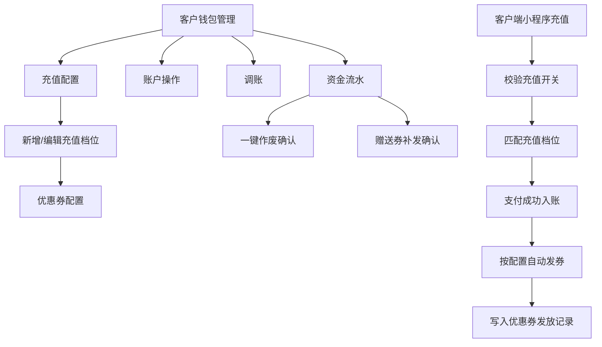
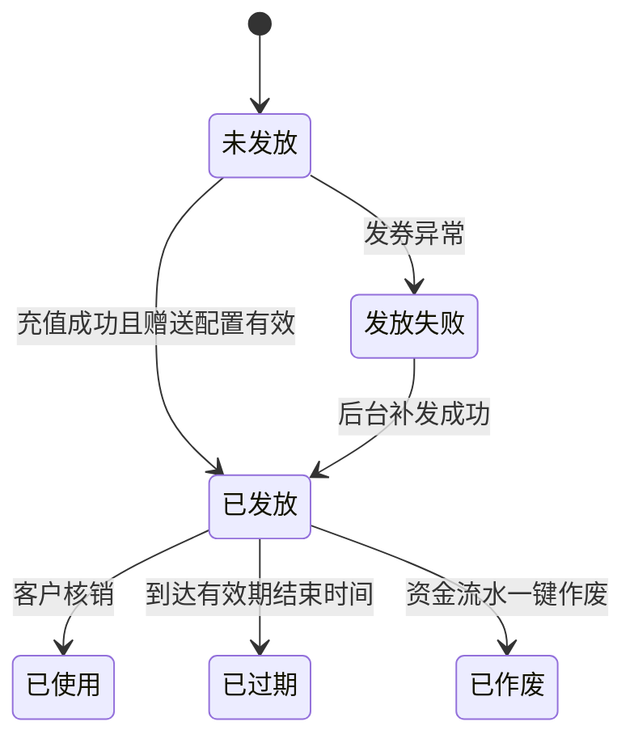

# 客户钱包管理 — 后台管理端功能设计文档

## 1. 模块：客户钱包管理（后台管理端）

### 1.1 基础信息

| 项目 | 内容 |
| --- | --- |
| 模块名称 | 客户钱包管理 — 后台管理端 |
| 端口类型 | Web 后台管理端 |
| 目标用户 | 平台管理员、财务人员、客服人员、系统管理员 |
| 业务场景 | 平台需要查询客户钱包余额、充值与消费流水，处理账户冻结/解冻/激活等状态管理，并配置客户端小程序钱包充值开关、充值档位和充值赠送优惠券规则。 |
| 上游入口 | 后台左侧菜单「客户管理 > 客户钱包管理」 |
| 下游影响 | 客户端小程序钱包充值、钱包余额支付、优惠券发放记录、优惠券核销、财务对账、操作审计 |
| 设计系统 | `DESIGN/Web后台管理端页面结构约束规范.md` |
| 关联模块 | 客户管理、供应商管理、产品管理、优惠券发放记录、客户端小程序钱包、支付、财务流水、操作日志、权限管理 |

### 1.2 功能目标

- **保留原有钱包管理能力**：延续客户钱包管理列表的查询、重置、导出、列设置、分页、账户余额展示、资金流水查看、冻结/解冻/激活等操作。
- **新增充值配置能力**：平台管理员可一键开启或关闭客户端充值功能；关闭后，客户在客户端小程序发起充值时不可成功。
- **新增充值档位能力**：平台管理员可配置 6 个及以内充值档位，支持固定金额档位和自定义金额档位，并可自定义展示顺序。
- **新增充值赠送能力**：每个充值档位可配置无赠送或赠送优惠券；充值成功后系统按档位配置自动发券，并写入「优惠券发放记录」。
- **新增赠送作废能力**：在「资金流水」中按充值流水粒度展示「是否赠送」字段；具体作废入口同样放在资金流水中对应的充值流水行，批量作废该笔充值赠送优惠券中未过期、未使用的券。
- **新增赠送补发能力**：充值赠送发券失败时记录失败原因，并在资金流水或发放记录中提供「补发」能力，补发成功后同步更新发放记录。
- **补全调账能力**：保留并明确后台调账流程，支持增加余额、扣减余额，变动原因限定为系统错误补偿、客诉赔偿、其他。

### 1.3 范围与边界

#### 1.3.1 本期包含

- 客户钱包管理列表原有功能保留：
  - 查询条件：客户编号、客户姓名、客户电话、账户状态。
  - 操作能力：查询、重置、导出、自定义列表字段、分页。
  - 列表字段：客户钱包编码、客户姓名、客户电话、累计充值、累计消费、账户余额、冻结余额、可用金额、账户状态、最后变动时间、备注、操作。
  - 行级操作：资金流水、账户操作、调账等原账户管理动作，按账户状态和权限展示。
- 客户钱包管理列表新增字段：
  - 备注：用于补充账户信息或操作记录摘要，全部角色可见。
- 资金流水列表新增字段：
  - 是否赠送：仅对「充值」类型流水展示「是 / 否」（发放失败展示「是（发放失败）」），其他类型展示「--」，具体口径见 1.8。
- 充值配置：
  - 充值功能开关：开启 / 关闭。
  - 充值档位配置：最多 6 个档位；支持固定金额和自定义金额；支持档位排序。
  - 充值赠送配置：档位可配置无赠送或赠送优惠券，优惠券类型固定为满减券。
- 优惠券发放：
  - 客户充值成功后，系统按命中的充值档位自动发放优惠券。
  - 发放结果写入「优惠券发放记录」模块，可按来源识别为充值赠送。
  - 发券失败时记录失败原因，并支持后台补发。
- 赠送券作废：
  - 在资金流水中定位指定充值流水，查询对应充值记录关联的赠送优惠券。
  - 用户确认后，将未过期、未使用的赠送券批量作废。

#### 1.3.2 本期不包含

- 不设计客户端小程序钱包充值页面原型，仅定义后台配置对客户端充值链路的影响。
- 不新建通用优惠券营销模块；本模块仅在充值档位内配置充值赠送用满减券。
- 不处理已使用、已过期赠送券的追回、退款或现金补偿。
- 不设计复杂叠加营销规则，例如多档位叠加赠送、会员等级加赠、限时活动加赠。
- 不设计支付通道接入、退款通道接入细节；支付成功回调与钱包入账以现有支付体系为准。

#### 1.3.3 边界说明

- **与客户端小程序**：后台充值配置决定客户端是否允许充值、展示哪些充值档位、充值成功后是否获得赠送；客户端需在发起支付前实时校验充值开关和档位有效性。
- **与优惠券发放记录**：本模块触发发券，发放记录模块负责记录发放流水、发放状态、失败原因、作废状态和后续查询。
- **与供应商/产品管理**：配置优惠券适用供应商、适用产品时，只能选择系统中已添加供应商及对应已发布产品。
- **与客户钱包资金流水**：充值成功后仍按原钱包流水规则生成充值入账流水；赠送优惠券不改变客户钱包余额。
- **与财务对账**：充值金额进入钱包充值账务口径；赠送优惠券只作为营销权益记录，不计入钱包余额。

### 1.4 用户角色与权限

| 角色 | 使用场景 | 可见范围 | 可操作功能 | 权限限制 |
| --- | --- | --- | --- | --- |
| 平台管理员 | 管理充值规则和客户钱包 | 全部客户钱包、全部充值配置 | 查看列表、导出、配置充值开关、配置档位、配置赠送、排序、调账、一键作废、补发赠送券 | 高危操作需二次确认并记录日志 |
| 财务人员 | 对账和查询资金变动 | 全部或授权范围内钱包数据 | 查看列表、导出、查看资金流水 | 默认不可修改充值配置和作废优惠券 |
| 客服人员 | 处理客户咨询和异常 | 授权范围内客户钱包 | 查询客户钱包、查看资金流水、按权限账户操作、调账申请或调账处理 | 不可配置充值档位；调账、作废、补发需单独授权 |
| 系统管理员 | 权限和异常处理 | 全部数据 | 权限配置、异常补偿、日志查看 | 不直接参与业务配置审批时不建议开放日常配置权限 |

补充说明：

- 「充值配置」「一键作废」「补发赠送券」「账户操作」「调账」均属于敏感操作，应接入 RBAC 权限控制。
- 所有配置变更、账户状态变更、调账、赠送券作废、补发操作均记录操作日志，包含操作人、时间、操作前值、操作后值、原因或备注。

### 1.5 用户场景与前置条件

| 场景 | 触发条件 | 前置条件 | 用户目标 | 系统结果 |
| --- | --- | --- | --- | --- |
| 查询客户钱包 | 管理员进入客户钱包管理 | 存在客户钱包数据 | 查询客户充值、消费和余额情况 | 列表展示钱包数据，可查看资金流水 |
| 导出钱包列表 | 财务点击「导出」 | 用户有导出权限 | 导出筛选结果用于对账 | 系统生成导出文件或导出任务 |
| 调整账户状态 | 客服点击冻结/解冻/激活 | 账户状态允许变更 | 限制或恢复客户钱包能力 | 钱包账户状态变更并记录日志 |
| 调账 | 管理员点击调账 | 用户有调账权限，账户状态允许 | 因系统错误、客诉赔偿或其他原因调整余额 | 生成调账资金流水，更新账户余额并记录凭证 |
| 关闭充值功能 | 管理员进入充值配置关闭开关 | 有配置权限 | 暂停客户端充值入口能力 | 客户端充值请求被阻断，提示充值暂不可用 |
| 配置充值档位 | 管理员新增或编辑档位 | 充值配置存在 | 控制客户端可选充值金额 | 客户端按启用档位和顺序展示 |
| 配置充值赠送 | 管理员为档位配置优惠券 | 存在可选供应商与产品 | 充值后自动发券提升转化 | 充值成功后生成优惠券并写入发放记录 |
| 自定义金额充值赠送 | 客户在客户端输入自定义充值金额 | 后台启用自定义档位 | 按金额匹配合适赠送规则 | 系统匹配不超过充值金额的最高固定档位，按其赠送配置发券 |
| 一键作废赠送券 | 管理员在资金流水的赠送充值记录点击作废 | 充值流水关联赠送券 | 作废未使用、未过期赠送券 | 可作废券变为已作废，已使用/已过期券不处理 |
| 补发赠送券 | 充值赠送发券失败 | 发放记录为失败，且充值订单未成功发过同一批赠送券 | 对失败赠送执行补发 | 补发成功后生成客户优惠券并更新发放记录 |

### 1.6 信息架构与页面清单

#### 1.6.1 页面/弹窗/组件清单

| 编号 | 类型 | 名称 | 页面标识 | 主要用途 | 入口 | 出口 |
| --- | --- | --- | --- | --- | --- | --- |
| P01 | 页面 | 客户钱包管理 | page-customer-wallet | 查询钱包账户、展示余额与充值赠送标识、执行账户级操作 | 侧栏「客户管理 > 客户钱包管理」 | 资金流水抽屉、账户操作弹窗、调账弹窗、充值配置页/抽屉 |
| D01 | 抽屉 | 资金流水 | drawer-wallet-flow | 查看指定客户钱包充值、消费、冻结、解冻、调账等资金变动明细，并在充值赠送流水上执行作废或补发 | P01 行「资金流水」 | 一键作废确认、补发确认、关闭返回 P01 |
| P02 | 页面/抽屉 | 充值配置 | page-recharge-config | 配置充值功能开关、充值档位、赠送规则和展示顺序 | P01 功能区「充值配置」 | 保存后返回 P01 |
| M01 | 弹窗 | 新增/编辑充值档位 | modal-recharge-tier | 维护档位类型、金额限制、展示顺序和赠送规则 | P02「新增档位」或档位行「编辑」 | 保存回 P02 |
| M02 | 弹窗 | 优惠券配置 | modal-coupon-config | 配置满减券名称、适用业务、供应商、产品、满减条件、优惠金额、有效期、发放数量 | M01「配置赠送」 | 保存回 M01 |
| M03 | 弹窗 | 一键作废确认 | modal-void-gift-coupon | 展示该充值流水关联赠送券统计，确认作废未使用未过期券 | D01 充值赠送流水行「一键作废」 | 确认后刷新 D01 与 P01 |
| M04 | 弹窗 | 账户操作 | modal-wallet-status | 冻结账户、解冻账户、激活账户等账户状态操作 | P01 行「冻结/解冻/激活」 | 确认后刷新 P01 |
| M05 | 弹窗 | 调账 | modal-wallet-adjust | 按增加余额或扣减余额调整客户钱包余额，上传凭证并记录原因 | P01 行「调账」 | 保存后刷新 P01 与 D01 |
| M06 | 弹窗 | 赠送券补发确认 | modal-reissue-gift-coupon | 对充值赠送发券失败记录执行补发 | D01 发券失败流水/记录行「补发」 | 确认后刷新 D01 与优惠券发放记录 |
| C01 | 组件 | 列设置 | component-column-setting | 自定义列表字段显示、隐藏和顺序 | P01 功能区齿轮图标 | 应用后刷新表格列 |

#### 1.6.2 页面流转

流转说明：

- 从 P01 进入 P02 时，不改变 P01 的筛选条件、页码和滚动位置；保存充值配置后返回 P01 时保留原查询状态。
- 客户端充值时必须以后端实时配置为准，不得只依赖客户端缓存档位。
- 客户钱包列表为钱包账户粒度，不再展示「是否赠送」；「是否赠送」与「一键作废」均收敛在 D01 资金流水的充值流水行。
- 一键作废仅处理指定充值流水关联的赠送优惠券，不影响客户钱包充值本金、账户余额和资金流水。

### 1.7 页面结构与交互设计

#### 1.7.1 P01 客户钱包管理

页面定位：

- 页面目标：帮助后台用户查询客户钱包账户、掌握余额情况，并执行资金流水查看、账户操作和调账，赠送相关展示与作废下沉至资金流水。
- 页面类型：列表页。
- 适用角色：平台管理员、财务人员、客服人员、系统管理员。

页面结构：

- 面包屑：`客户管理 > 客户钱包管理`。
- 筛选区：客户编号、客户姓名、客户电话、账户状态；右侧提供「查询」「重置」。
- 功能区：左侧保留「导出」，新增「充值配置」；右侧保留齿轮图标用于自定义列表字段。
- 表格区：展示客户钱包账户列表，新增「备注」字段；操作列固定在右侧，「一键作废」不在 P01 操作列展示。
- 分页区：保留「共 M 条记录，每页 N 条、首页/上一页/页码/下一页/末页、跳转页」结构。

关键交互：

- 进入页面默认加载全部账户，按最后变动时间倒序展示。
- 点击「查询」后按筛选条件刷新列表，页码回到第 1 页。
- 点击「重置」清空筛选项并刷新列表。
- 点击「导出」导出当前筛选结果，导出字段与列表展示字段保持一致（不含「是否赠送」，该字段在资金流水导出口径）。
- 点击「充值配置」进入 P02。
- 点击「资金流水」打开 D01，展示该客户钱包全部资金变动流水。
- 点击「冻结 / 解冻 / 激活」打开 M04 账户操作弹窗，确认成功后刷新账户状态。
- 点击「调账」打开 M05，按增加余额或扣减余额完成余额调整。
- 「是否赠送」与「一键作废」均不在 P01 展示，用户需进入 D01 资金流水，在具体充值流水行查看赠送状态并执行「一键作废」。

状态覆盖：

- 默认态：展示钱包数据列表。
- 加载态：表格展示加载状态，查询、导出按钮可按实现禁用。
- 空态：无数据时展示「暂无客户钱包数据」。
- 错误态：接口失败时展示错误提示和重试入口。
- 权限态：无配置权限时隐藏「充值配置」；无调账权限时隐藏「调账」；无账户操作权限时隐藏冻结/解冻/激活入口。

#### 1.7.2 D01 资金流水

页面定位：

- 页面目标：查看指定客户钱包的充值、消费、冻结、解冻、退款、调账等资金变动明细，并支持在获得赠送的充值流水上作废赠送券、在发券失败记录上补发。
- 页面类型：抽屉。

页面结构：

- 顶部：标题「资金流水」、关闭按钮；内容区顶部展示客户姓名、客户电话、钱包编码、账户状态、当前余额摘要。
- 筛选区：交易类型、时间范围、流水编号或关联订单号；右侧提供「查询」「重置」。
- 表格区：流水编号、交易类型、交易金额（元）、变动后余额（元）、关联订单号、交易时间、是否赠送、备注、操作。
- 底部：关闭按钮。

关键交互：

- 从 P01 行级「资金流水」进入时携带 `walletId`。
- 流水列表默认按流水时间倒序。
- 交易类型包含充值、消费、退款、冻结、解冻、调账等；调账流水需展示调账类型、变动原因和备注摘要。
- 备注过长时表格内截断展示，鼠标悬停或详情中查看完整备注；如调账上传凭证，操作列展示「下载附件」。
- 「是否赠送」字段仅对充值流水生效：发放成功展示「是」，发放失败展示「是（发放失败）」并配合操作列「补发」入口；未配置或未触发赠送展示「否」；其他类型流水展示「--」。
- 充值流水若关联充值赠送且存在未使用、未过期赠送券，操作列展示「一键作废」。
- 充值流水若赠送发券失败，操作列展示「补发」；补发成功后「是否赠送」更新为「是」并隐藏补发入口。
- 本次新增赠送优惠券不作为钱包金额流水，但资金流水需要展示该充值是否触发赠送、赠送状态和可操作入口。

#### 1.7.3 P02 充值配置

页面定位：

- 页面目标：配置客户端充值是否开放、配置充值档位、控制展示顺序和赠送优惠券规则。
- 页面类型：配置页或右侧抽屉，具体落地可按后台结构规范选择。

页面结构：

- 顶部状态卡：充值功能开关、最近更新时间、最近操作人。
- 档位列表：展示全部充值档位，支持新增、编辑、删除、启用/停用、上移/下移或拖拽排序。
- 说明区：提示最多 6 个档位，自定义档位仅允许 1 个，关闭充值后客户端不可充值。
- 操作区：保存、取消。

关键交互：

- 充值功能开关：
  - 开启：客户端可按启用档位发起充值。
  - 关闭：客户端充值入口可展示但不可提交，或直接隐藏入口；后端充值请求统一返回不可充值。
- 档位数量：
  - 启用和停用档位总数最多 6 个；删除后可新增。
  - 至少应配置 1 个启用档位，客户端才可正常展示充值入口。
- 档位排序：
  - 管理员可通过上移/下移或拖拽调整顺序。
  - 客户端按后台配置顺序展示启用档位。
- 保存配置：
  - 保存时整体校验档位数量、金额范围、赠送配置完整性。
  - 保存成功后生成配置版本号，用于客户端查询和支付前二次校验。

#### 1.7.4 M01 新增/编辑充值档位

页面定位：

- 页面目标：维护单个充值档位的类型、金额规则、启用状态和排序；赠送配置不在本表单内维护。
- 页面类型：居中弹窗。

页面结构：

- 基础信息：档位名称、档位类型、启用状态、展示顺序。
- 金额配置（按档位类型联动）：
  - 固定金额：仅展示并必填「固定充值金额」。
  - 自定义金额：隐藏「固定充值金额」，仅展示「最低充值金额」「最高充值金额」，两者均为非必填，留空表示不限制。
- 操作区：取消、保存。
- 提示区：提示赠送规则需通过档位卡片上的「配置赠送」（M02）进行配置，本表单不再设置赠送方式。

关键交互：

- 档位类型与金额字段强联动：
  - 选择「固定金额」时，仅展示「固定充值金额」输入，并校验其必填、`>0` 和不与已有固定档位重复。
  - 选择「自定义金额」时，隐藏「固定充值金额」并清空其值，展示「最低充值金额」「最高充值金额」，二者均非必填；若同时填写需校验最低金额 ≤ 最高金额。
- 切换档位类型时，自动清理隐藏字段中的暂存值，避免提交无效值。
- 每套配置最多只能存在 1 个自定义档位，避免客户端出现多个自定义入口。
- 本表单不展示「赠送方式 / 赠送优惠券」字段；赠送配置统一通过 P02 档位卡片上的「配置赠送」入口（M02）维护。

#### 1.7.5 M02 优惠券配置

页面定位：

- 页面目标：为充值档位配置充值赠送优惠券，券类型固定为满减券。
- 页面类型：居中弹窗或 M01 内嵌分区。

页面结构：

- 优惠券基础信息：优惠券名称、发放数量。
- 使用范围：适用业务、适用供应商、适用产品。
- 优惠规则：满减条件、优惠金额、有效期。
- 操作区：取消、保存。

关键交互：

- 适用业务为单选：汽车维修、汽车保养、汽车美容、自助洗车、车辆年检、充电卡、加油卡。
- 适用供应商支持多选，也支持「全部」。
- 适用产品根据已选供应商联动加载，只能选择所选供应商下已发布产品；支持多选，也支持「全部」。
- 若适用供应商选择「全部」，适用产品可选择「全部产品」；系统解释为所选业务下全部可用供应商的已发布产品。
- 有效期输入数字，按领取当日 + 有效期计算，算头不算尾，最后一天 23:59:59 前可用。
- 优惠金额最低支付为 0 元，即优惠券抵扣后订单应付金额不得为负。

#### 1.7.6 M03 一键作废确认

页面定位：

- 页面目标：帮助管理员确认并作废某笔充值对应的未过期、未使用赠送优惠券。
- 页面类型：居中确认弹窗。

页面结构：

- 充值信息：流水编号、充值单号、客户姓名、客户电话、充值金额、充值时间、命中档位。
- 赠送券统计：赠送总数、可作废数量、已使用数量、已过期数量、已作废数量。
- 风险提示：作废后客户无法再使用这些优惠券，已使用和已过期优惠券不会处理。
- 操作区：取消、确认作废。

关键交互：

- 打开弹窗时实时查询该充值记录关联赠送券。
- 可作废数量为 0 时，「确认作废」按钮禁用，并提示「该笔充值暂无可作废赠送券」。
- 确认作废成功后刷新 D01 资金流水的「是否赠送」、操作列状态和优惠券发放记录状态。

#### 1.7.7 M04 账户操作

页面定位：

- 页面目标：对客户钱包账户执行冻结、解冻、激活等账户状态操作。
- 页面类型：居中弹窗。

页面结构：

- 操作客户：客户姓名、账户余额。
- 操作信息：当前操作人、操作类型。
- 备注：多行文本输入。
- 操作区：取消、保存。

关键交互：

- 从 P01 行级账户操作入口打开，系统根据当前账户状态带入操作类型，如冻结账户、解冻账户、激活账户。
- 操作类型由入口决定，弹窗内原则上只读展示，避免误选其他状态动作。
- 保存前需校验备注是否符合项目要求；若冻结/解冻要求必填备注，应在提交时阻断空备注。
- 保存成功后更新钱包账户状态，并记录操作日志。

#### 1.7.8 M05 调账

页面定位：

- 页面目标：因系统错误补偿、客诉赔偿或其他原因，对客户钱包余额执行人工增加或扣减。
- 页面类型：居中弹窗。

页面结构：

- 调账客户：客户姓名、账户余额。
- 调账金额：当前操作人、调账类型、调账金额、变动原因。
- 凭证上传：上传凭证附件。
- 备注：多行文本输入。
- 操作区：取消、保存。

关键交互：

- 调账类型为单选或下拉：增加余额、扣减余额。
- 变动原因为单选或下拉：系统错误补偿、客诉赔偿、其他。
- 调账金额必填，需大于 0，保留 2 位小数。
- 扣减余额时，扣减金额不得大于当前可用金额；若业务允许扣成负数，需另行配置授权，本期默认不允许。
- 凭证上传支持图片或文件，建议限制格式为 JPG、JPEG、PNG、PDF，大小限制按项目上传规范执行。
- 保存成功后生成调账资金流水，更新账户余额、可用金额和最后变动时间；资金流水操作列可下载凭证附件。

#### 1.7.9 M06 赠送券补发确认

页面定位：

- 页面目标：对充值赠送发券失败的记录执行后台补发。
- 页面类型：居中确认弹窗。

页面结构：

- 充值信息：流水编号、充值单号、客户姓名、客户电话、充值金额、充值时间、命中档位。
- 失败信息：失败时间、失败原因、原赠送配置摘要。
- 补发提示：补发将按原充值时的赠送配置快照生成优惠券。
- 操作区：取消、确认补发。

关键交互：

- 仅发券失败且未补发成功的充值记录展示「补发」。
- 点击补发前，系统校验该充值订单未成功发放过同一批赠送券，防止重复发放。
- 补发成功后生成客户优惠券实例，并将优惠券发放记录更新为补发成功。
- 补发失败时保留失败原因，可再次补发或交由人工排查。

### 1.8 字段、控件与数据口径

#### 1.8.1 客户钱包列表字段

| 字段名称 | 字段标识 | 字段类型 | 展示规则 | 空值规则 | 数据来源 | 权限规则 |
| --- | --- | --- | --- | --- | --- | --- |
| 客户钱包编码 | wallet_code | 文本 | 示例：CTR000000001 | 为空显示 `--` | 钱包账户 | 全部可见 |
| 客户姓名 | customer_name | 文本 | 展示客户真实姓名或昵称 | 为空显示 `--` | 客户资料 | 全部可见 |
| 客户电话 | customer_phone | 文本 | 按项目隐私规则可脱敏 | 为空显示 `--` | 客户资料 | 全部可见，脱敏按权限 |
| 累计充值（元） | total_recharge_amount | 金额 | 保留 2 位小数 | 0.00 | 钱包流水汇总 | 财务字段按权限 |
| 累计消费（元） | total_consume_amount | 金额 | 保留 2 位小数 | 0.00 | 钱包流水汇总 | 财务字段按权限 |
| 账户余额（元） | account_balance | 金额 | 保留 2 位小数 | 0.00 | 钱包账户 | 财务字段按权限 |
| 冻结余额（元） | frozen_amount | 金额 | 保留 2 位小数 | 0.00 | 钱包账户 | 财务字段按权限 |
| 可用金额（元） | available_amount | 金额 | 账户余额 - 冻结余额 | 0.00 | 计算字段 | 财务字段按权限 |
| 账户状态 | account_status | 状态 | 正常、冻结、注销/停用等 | 为空显示 `--` | 钱包账户 | 全部可见 |
| 最后变动时间 | last_change_time | 日期时间 | `yyyy-MM-dd HH:mm:ss` | 为空显示 `--` | 钱包流水 | 全部可见 |
| 备注 | remark | 文本 | 长文本截断展示，鼠标悬停显示完整内容 | 为空显示 `--` | 最近一次账户操作或调账备注 | 全部可见 |
| 操作 | actions | 操作 | 资金流水、账户操作、调账 | 无可操作项时显示 `--` | 权限和状态计算 | 按权限展示 |

> 说明：客户钱包列表当前业务粒度已确认为「钱包账户」。「是否赠送」与「一键作废」均下沉到 D01 资金流水的充值流水行，按 `rechargeOrderId` 维度展示与操作。

#### 1.8.2 筛选项字段

| 字段名称 | 字段标识 | 控件类型 | 是否必填 | 默认值 | 可选项/范围 | 校验规则 | 联动规则 |
| --- | --- | --- | --- | --- | --- | --- | --- |
| 客户编号 | customer_code | 输入框 | 否 | 空 | 文本 | 去除首尾空格 | 查询列表 |
| 客户姓名 | customer_name | 输入框 | 否 | 空 | 文本 | 去除首尾空格，支持模糊查询 | 查询列表 |
| 客户电话 | customer_phone | 输入框 | 否 | 空 | 手机号 | 支持完整手机号或模糊查询 | 查询列表 |
| 账户状态 | account_status | 下拉 | 否 | 全部 | 全部、正常、冻结、注销/停用 | 枚举值有效 | 查询列表 |

#### 1.8.3 资金流水字段

| 字段名称 | 字段标识 | 字段类型 | 展示规则 | 空值规则 | 数据来源 | 权限规则 |
| --- | --- | --- | --- | --- | --- | --- |
| 流水编号 | flow_code | 文本 | 示例：CFL000000001 | 为空显示 `--` | 钱包流水 | 全部可见 |
| 交易类型 | transaction_type | 枚举 | 充值、消费、退款、冻结、解冻、调账等 | 为空显示 `--` | 钱包流水 | 全部可见 |
| 交易金额（元） | transaction_amount | 金额 | 增加为正向金额，扣减可展示负向或按类型区分 | 0.00 | 钱包流水 | 财务字段按权限 |
| 变动后余额（元） | balance_after | 金额 | 保留 2 位小数 | 0.00 | 钱包流水 | 财务字段按权限 |
| 关联订单号 | related_order_no | 文本 | 展示充值单、订单号、退款单或调账单 | `--` | 业务单据 | 全部可见 |
| 交易时间 | transaction_time | 日期时间 | `yyyy-MM-dd HH:mm:ss` | 为空显示 `--` | 钱包流水 | 全部可见 |
| 是否赠送 | gift_status | 枚举 | 充值流水：发放成功显示「是」，发放失败显示「是（发放失败）」，未配置或未触发显示「否」；其他类型流水显示 `--` | `--` | 该笔充值订单的赠送发放结果 | 全部可见 |
| 备注 | remark | 文本 | 长文本截断，支持查看完整内容 | `--` | 钱包流水/操作输入 | 全部可见 |
| 操作 | actions | 操作 | 下载附件、一键作废、补发 | 无可操作项时显示 `--` | 权限、交易类型、赠送状态计算 | 按权限展示 |

#### 1.8.4 充值档位字段

| 字段名称 | 字段标识 | 控件类型 | 是否必填 | 默认值 | 可选项/范围 | 校验规则 | 联动规则 |
| --- | --- | --- | --- | --- | --- | --- | --- |
| 档位名称 | tier_name | 输入框 | 是 | 空 | 1-20 字 | 不可为空 | 客户端展示 |
| 档位类型 | tier_type | 单选 | 是 | 固定金额 | 固定金额、自定义金额 | 每套配置最多 1 个自定义金额档位 | 控制金额字段展示 |
| 固定充值金额 | fixed_amount | 金额输入 | 固定金额必填，自定义金额隐藏 | 空 | >0，保留 2 位 | 固定档位金额不可重复 | 档位类型为固定金额时展示并必填 |
| 最低充值金额 | min_amount | 金额输入 | 自定义金额选填 | 空 | >0，保留 2 位 | 留空表示不限制；同时填写时不得大于最高充值金额 | 档位类型为自定义金额时展示 |
| 最高充值金额 | max_amount | 金额输入 | 自定义金额选填 | 空 | >0，保留 2 位 | 留空表示不限制；同时填写时不得小于最低充值金额 | 档位类型为自定义金额时展示 |
| 启用状态 | enabled | 开关 | 是 | 启用 | 启用、停用 | 至少 1 个启用档位 | 客户端仅展示启用档位 |
| 展示顺序 | sort_order | 数字/拖拽 | 是 | 末尾 | 1-6 | 不可重复 | 客户端按顺序展示 |

> 说明：本表单不再设置「赠送方式」字段，赠送规则由 P02 档位卡片上的「配置赠送」入口（M02 优惠券配置）统一维护。

#### 1.8.5 赠送优惠券字段

| 字段名称 | 字段标识 | 控件类型 | 是否必填 | 默认值 | 可选项/范围 | 校验规则 | 联动规则 |
| --- | --- | --- | --- | --- | --- | --- | --- |
| 优惠券类型 | coupon_type | 固定文本 | 是 | 满减券 | 满减券 | 不可修改 | 固定入库 |
| 优惠券名称 | coupon_name | 输入框 | 是 | 空 | 1-30 字 | 不可为空 | 发放记录展示 |
| 发放数量 | issue_quantity | 数字输入 | 是 | 1 | 正整数 | 至少 1 张 | 充值成功后按数量发券 |
| 适用业务 | business_type | 单选 | 是 | 空 | 汽车维修、汽车保养、汽车美容、自助洗车、车辆年检、充电卡、加油卡 | 不可为空 | 联动供应商/产品 |
| 适用供应商 | supplier_scope | 多选/全部 | 是 | 全部 | 系统已添加供应商 | 至少选择 1 项或全部 | 联动产品范围 |
| 适用产品 | product_scope | 多选/全部 | 是 | 全部 | 所选供应商下已发布产品 | 至少选择 1 项或全部 | 影响券可用范围 |
| 满减条件 | threshold_amount | 金额输入 | 是 | 空 | >=0 | 消费满多少可用 | 下单核销校验 |
| 优惠金额 | discount_amount | 金额输入 | 是 | 空 | >0 | 不得导致订单实付低于 0 | 下单核销校验 |
| 有效期 | valid_days | 数字输入 | 是 | 空 | 正整数，单位天 | 不可为空 | 领取当日 + 有效期 |

#### 1.8.6 调账字段

| 字段名称 | 字段标识 | 控件类型 | 是否必填 | 默认值 | 可选项/范围 | 校验规则 | 联动规则 |
| --- | --- | --- | --- | --- | --- | --- | --- |
| 客户姓名 | customer_name | 文本 | 是 | 当前行客户 | 当前钱包账户客户 | 只读 | 展示调账对象 |
| 账户余额 | account_balance | 金额文本 | 是 | 当前余额 | 保留 2 位小数 | 只读 | 扣减余额校验 |
| 当前操作人 | operator_name | 文本 | 是 | 当前登录用户 | 当前登录用户 | 只读 | 写入操作日志 |
| 调账类型 | adjust_type | 下拉/单选 | 是 | 增加余额 | 增加余额、扣减余额 | 不可为空 | 决定余额增减方向 |
| 调账金额 | adjust_amount | 金额输入 | 是 | 空 | >0，保留 2 位 | 扣减余额不得大于可用金额 | 生成调账流水 |
| 变动原因 | adjust_reason | 下拉/单选 | 是 | 系统错误补偿 | 系统错误补偿、客诉赔偿、其他 | 不可为空 | 写入流水备注 |
| 凭证上传 | attachment | 上传 | 否 | 空 | JPG、JPEG、PNG、PDF | 大小按上传规范 | 资金流水可下载附件 |
| 备注 | remark | 文本域 | 否 | 空 | 建议 ≤200 字 | 超长提示 | 写入流水备注 |

### 1.9 核心功能说明

#### 1.9.1 充值功能开关

功能入口：

- 入口位置：P01 功能区「充值配置」进入 P02。
- 入口展示条件：用户具备充值配置查看权限。
- 入口禁用条件：无配置权限时隐藏或只读。

操作流程：

1. 管理员进入 P02。
2. 系统展示当前充值功能开关状态。
3. 管理员切换开启或关闭。
4. 系统保存配置并记录操作日志。
5. 客户端充值前查询最新配置或在提交充值时由服务端校验。

业务规则：

- 开关为「开启」时，客户端可展示并提交启用状态的充值档位。
- 开关为「关闭」时，客户端小程序充值按钮置灰，不允许点击提交，并将按钮文案更改为提示类文案，例如「充值暂不可用」；服务端仍需阻断创建充值订单或支付前校验，并返回明确失败原因。
- 关闭充值功能不影响客户钱包余额消费、历史充值记录查询、已发优惠券使用。
- 开关变更立即生效；客户端如有缓存，提交充值时仍以后端校验结果为准。

#### 1.9.2 充值档位配置

功能入口：

- 入口位置：P02「新增档位」、档位行「编辑」「删除」「启用/停用」「排序」。

操作流程：

1. 管理员新增或编辑充值档位。
2. 系统根据档位类型展示固定金额或自定义金额字段。
3. 管理员选择是否赠送优惠券。
4. 若选择赠送优惠券，进入 M02 完成券配置。
5. 系统保存档位，并按排序刷新 P02。

业务规则：

- 充值档位总数最多 6 个。
- 档位类型分为固定金额和自定义金额。
- 固定金额由后台管理员定义，客户端不可修改固定档位金额。
- 自定义金额档位不定义固定充值金额，客户可在客户端自行填写充值金额。
- 自定义金额必须配置最低充值限制和最高充值限制。
- 每套配置最多允许 1 个自定义金额档位。
- 管理员可自定义档位顺序；客户端按后台顺序展示启用档位。
- 删除档位不影响历史充值订单和历史发券记录。

#### 1.9.3 自定义充值赠送匹配

触发时机：

- 客户端用户选择自定义充值档位并输入充值金额，支付成功后触发赠送匹配。

业务规则：

- 自定义充值金额必须在后台配置的最低和最高充值限制之间。
- 自定义充值金额需要与固定金额档位比较，匹配「不超过本次自定义充值金额的最高固定档位」。
- 若命中的最高固定档位配置了赠送优惠券，则按该固定档位的赠送配置发券。
- 若命中的最高固定档位为无赠送，或不存在不超过充值金额的固定档位，则本次自定义充值不赠送。
- 为避免相同金额无法命中，建议匹配条件按「自定义充值金额 >= 固定档位金额」处理。
- 自定义档位自身不直接配置赠送券，赠送规则通过匹配固定金额档位继承；如业务后续要求自定义档位独立赠送，应另行扩展。

示例：

| 固定档位 | 赠送配置 | 自定义充值金额 | 命中档位 | 赠送结果 |
| --- | --- | --- | --- | --- |
| 100 元 | 无赠送 | 80 元 | 无 | 不赠送 |
| 100 元 | 赠送 A | 100 元 | 100 元 | 赠送 A |
| 100 元、300 元 | 100 赠送 A，300 赠送 B | 260 元 | 100 元 | 赠送 A |
| 100 元、300 元 | 100 赠送 A，300 赠送 B | 500 元 | 300 元 | 赠送 B |
| 100 元、300 元 | 100 无赠送，300 赠送 B | 200 元 | 100 元 | 不赠送 |

#### 1.9.4 充值赠送优惠券

触发时机：

- 客户充值支付成功且钱包入账成功后。

操作流程：

1. 系统接收支付成功结果。
2. 系统确认充值订单、充值金额、充值档位和配置版本。
3. 系统判断该档位是否配置赠送优惠券。
4. 若有赠送，则生成客户优惠券实例。
5. 系统写入「优惠券发放记录」，发放来源为「充值赠送」。
6. 发放成功后，资金流水中该笔充值流水的「是否赠送」展示为「是」；发放失败时展示为「是（发放失败）」并提供「补发」入口。

业务规则：

- 优惠券类型固定为满减券。
- 同一充值订单只允许执行一次赠送发放，需以 `rechargeOrderId` 做幂等。
- 优惠券有效期从领取当日开始计算，算头不算尾，最后一天 23:59:59 前可用。例如 5 月 9 日领取有效期 3 天，则 5 月 11 日 23:59:59 前可用。
- 发券失败不应回滚钱包充值本金入账，但需要记录失败原因，并在资金流水或优惠券发放记录中提供「补发」能力。
- 补发时按充值成功时命中的赠送配置快照生成优惠券，不使用后台当前已修改的新配置。
- 补发需以 `rechargeOrderId` + `giftId` 或发放批次号做幂等；已成功发放过同一批赠送券的充值订单不得重复补发。
- 若赠送配置中的供应商或产品在发放时已失效：
  - 已保存的档位配置应尽量使用配置快照发券；
  - 若产品已删除或不可用导致无法生成可用券，应记录发放失败并提示配置需调整。

#### 1.9.5 一键作废赠送券

功能入口：

- 入口位置：D01 资金流水中对应充值流水的操作列「一键作废」。
- 展示条件：该充值流水关联赠送券、用户有作废权限、存在未使用且未过期的赠送券。

操作流程：

1. 管理员进入客户钱包资金流水。
2. 管理员在获得赠送的充值流水行点击「一键作废」。
3. 系统按该流水关联的充值记录查询关联赠送优惠券。
4. 系统展示赠送券统计和风险提示。
5. 管理员确认作废。
6. 系统将未过期、未使用的赠送券更新为已作废。
7. 系统记录作废日志，并刷新资金流水「是否赠送」展示、操作列状态和发放记录。

业务规则：

- 仅作废该笔充值对应赠送优惠券，不作废客户其他来源优惠券。
- 仅处理未使用、未过期、未作废的券。
- 已使用、已过期、已作废的券不处理，但需要在确认弹窗中展示数量。
- 作废操作不可逆。
- 作废优惠券不影响客户钱包余额、充值本金、累计充值金额和资金流水。
- 作废后「优惠券发放记录」中对应优惠券状态应同步为已作废或展示作废结果。

#### 1.9.6 赠送券补发

功能入口：

- 入口位置：D01 资金流水中发券失败的充值流水操作列「补发」，或优惠券发放记录中来源为充值赠送且状态为失败的记录。
- 展示条件：用户有补发权限、发放记录为失败、该充值订单未成功发放过同一批赠送券。

操作流程：

1. 管理员点击「补发」。
2. 系统展示充值信息、失败原因和原赠送配置快照。
3. 管理员确认补发。
4. 系统按原配置快照生成优惠券实例，并写入或更新优惠券发放记录。
5. 补发成功后，资金流水操作列不再展示「补发」；补发失败时记录新的失败原因。

业务规则：

- 补发只针对充值赠送发券失败，不用于补发已作废、已过期或已使用的券。
- 补发不改变充值金额、账户余额和钱包资金流水金额。
- 补发成功后，该充值流水的「是否赠送」应更新为「是」，并隐藏补发入口；客户优惠券实例与发放记录同步刷新。

#### 1.9.7 调账

功能入口：

- 入口位置：P01 客户钱包管理列表操作列「调账」。
- 展示条件：用户有调账权限，钱包账户未注销/停用。

操作流程：

1. 管理员点击「调账」。
2. 系统打开 M05，展示客户姓名、账户余额、当前操作人。
3. 管理员选择调账类型、填写调账金额、选择变动原因、上传凭证并填写备注。
4. 系统校验金额和账户状态。
5. 保存成功后更新账户余额，生成调账资金流水，并记录操作日志。

业务规则：

- 调账类型仅支持：增加余额、扣减余额。
- 变动原因仅支持：系统错误补偿、客诉赔偿、其他。
- 增加余额：账户余额、可用金额按调账金额增加。
- 扣减余额：账户余额、可用金额按调账金额扣减；本期默认扣减金额不得大于当前可用金额。
- 调账不触发充值赠送，不计入充值档位匹配，不生成优惠券。
- 调账流水应可在 D01 资金流水中查询，交易类型为「调账」，并支持下载上传凭证。

### 1.10 状态机与状态流转

#### 1.10.1 钱包账户状态

| 状态 | 状态标识 | 状态含义 | 可执行操作 | 不可执行操作 |
| --- | --- | --- | --- | --- |
| 正常 | normal | 钱包可正常充值、消费和查询 | 资金流水、冻结、调账 | 解冻 |
| 冻结 | frozen | 钱包资金被限制使用 | 资金流水、解冻、调账（按权限） | 冻结、客户端消费 |
| 注销/停用 | disabled | 钱包账户不可继续使用 | 资金流水、激活（按权限） | 充值、消费、冻结、调账 |

#### 1.10.2 充值配置状态

| 状态 | 状态标识 | 状态含义 | 可执行操作 | 不可执行操作 |
| --- | --- | --- | --- | --- |
| 充值开启 | recharge_enabled | 客户端允许充值 | 关闭、编辑档位 | 无 |
| 充值关闭 | recharge_disabled | 客户端充值不可成功 | 开启、编辑档位 | 客户端创建充值订单 |
| 档位启用 | tier_enabled | 客户端可展示该档位 | 停用、编辑、排序 | 无 |
| 档位停用 | tier_disabled | 客户端不展示该档位 | 启用、编辑、删除 | 客户端选择该档位 |

#### 1.10.3 优惠券赠送状态

流转说明：

- 已使用、已过期、已作废均为终态，不再参与一键作废。
- 发放失败需要保留失败原因，并支持后台补发，但不影响充值入账结果。

### 1.11 异常、边界与降级处理

| 异常场景 | 触发条件 | 页面表现 | 系统处理 | 用户可操作 |
| --- | --- | --- | --- | --- |
| 无权限访问充值配置 | 用户无配置权限 | 隐藏入口或提示无权限 | 拦截接口 | 联系管理员授权 |
| 充值开关关闭后客户端仍提交 | 客户端缓存旧配置 | 客户端充值按钮置灰，文案提示「充值暂不可用」；若仍提交则提示失败 | 服务端阻断创建订单 | 返回钱包页或等待功能恢复 |
| 档位超过 6 个 | 保存配置时 | 表单提示 | 阻断保存 | 删除或停用多余档位 |
| 固定金额重复 | 保存档位时 | 字段错误提示 | 阻断保存 | 修改金额 |
| 自定义金额超限 | 客户端提交充值 | 提示金额需在限制范围内 | 阻断支付 | 重新输入金额 |
| 赠送券配置不完整 | 保存档位时 | 标记缺失字段 | 阻断保存 | 补全优惠券配置 |
| 供应商或产品失效 | 发券时 | 发放记录显示失败原因，资金流水可展示补发入口 | 记录失败原因，允许按配置快照补发 | 后台调整配置或补发 |
| 重复支付回调 | 支付通道重复通知 | 后台无重复发券 | 按 rechargeOrderId 幂等 | 无需操作 |
| 补发重复提交 | 多人同时补发同一失败记录 | 提示该赠送已补发或状态已变化 | 幂等拦截重复发券 | 刷新后查看结果 |
| 一键作废无可作废券 | 已全部使用/过期/作废 | 确认按钮禁用 | 不提交作废 | 关闭弹窗 |
| 作废并发冲突 | 多人同时作废同一批券 | 提示部分券状态已变化 | 仅作废仍可作废券 | 刷新后查看结果 |
| 调账金额超过可用金额 | 扣减余额时金额过大 | 调账金额字段提示 | 阻断保存 | 修改调账金额 |
| 调账附件上传失败 | 上传凭证失败 | 上传组件提示失败 | 不保存或允许重新上传 | 重新上传 |
| 导出失败 | 导出服务异常 | Toast 或任务失败提示 | 记录失败原因 | 重试导出 |

### 1.12 模块联动与数据影响

| 关联模块 | 联动方向 | 联动场景 | 传递数据 | 影响结果 |
| --- | --- | --- | --- | --- |
| 客户端小程序钱包 | 当前模块影响对方 | 客户充值 | 充值开关、档位、金额限制、赠送摘要、关闭提示文案 | 控制充值入口、按钮置灰、档位展示和提交校验 |
| 支付模块 | 双向 | 客户支付充值订单 | 充值订单号、金额、支付状态 | 支付成功后钱包入账和发券 |
| 客户钱包流水 | 当前模块影响对方 | 充值成功、调账成功、赠送作废/补发入口展示 | 客户、金额、订单号、调账原因、赠送状态 | 生成充值/调账流水，并承载作废和补发操作入口 |
| 优惠券发放记录 | 当前模块影响对方 | 充值赠送发券、作废、补发 | 券配置、客户、充值单号、发放状态、失败原因、补发状态、作废状态 | 形成可追溯发放记录 |
| 供应商管理 | 对方影响当前模块 | 配置适用供应商 | 供应商列表、状态 | 限定可选供应商 |
| 产品管理 | 对方影响当前模块 | 配置适用产品 | 已发布产品列表、状态 | 限定可选产品 |
| 权限管理 | 对方影响当前模块 | 进入页面和执行敏感操作 | 用户角色、权限点 | 控制按钮和接口 |
| 操作日志 | 当前模块影响对方 | 配置变更、账户变更、调账、作废、补发 | 操作人、前后值、对象 ID | 形成审计记录 |

### 1.13 数据模型与接口建议

#### 1.13.1 核心数据对象

| 对象名称 | 对象说明 | 关键字段 | 备注 |
| --- | --- | --- | --- |
| 客户钱包 | 客户余额账户 | walletId、walletCode、customerId、balance、frozenAmount、status、lastChangeTime | 已有对象，新增列表展示字段 |
| 充值配置 | 钱包充值全局配置 | configId、rechargeEnabled、version、updatedBy、updatedAt | 客户端查询和支付前校验使用 |
| 充值档位 | 单个充值档位 | tierId、configId、tierType、fixedAmount、minAmount、maxAmount、enabled、sortOrder、giftType | 最多 6 个 |
| 赠送优惠券配置 | 档位绑定的券配置 | giftId、tierId、couponName、businessType、supplierScope、productScope、thresholdAmount、discountAmount、validDays、issueQuantity | 类型固定满减券 |
| 充值订单 | 客户充值记录 | rechargeOrderId、customerId、walletId、amount、tierId、matchedFixedTierId、giftIssued、payStatus | 赠送发放幂等依据 |
| 客户优惠券 | 发放到客户账户的券实例 | couponInstanceId、customerId、sourceType、sourceOrderId、status、validStartTime、validEndTime | sourceType=充值赠送 |
| 优惠券发放记录 | 发券审计记录 | issueRecordId、sourceType、sourceOrderId、couponInstanceId、issueStatus、voidStatus、failReason | 供发放记录模块查询 |
| 调账单 | 后台人工调账记录 | adjustId、walletId、adjustType、adjustAmount、adjustReason、attachmentId、remark、operatorId、status | 生成调账资金流水 |

#### 1.13.2 接口清单建议

| 接口用途 | 请求方式 | 路径建议 | 入参 | 出参 | 备注 |
| --- | --- | --- | --- | --- | --- |
| 查询客户钱包列表 | GET | `/api/admin/customer-wallets` | customerCode、customerName、phone、status、page、pageSize | list、pagination | 包含 hasRechargeGift |
| 导出客户钱包列表 | POST | `/api/admin/customer-wallets/export` | 当前筛选条件 | fileUrl 或 taskId | 异步导出可选 |
| 查询资金流水 | GET | `/api/admin/customer-wallets/{walletId}/flows` | flowType、timeRange、page、pageSize | list、pagination | D01 使用 |
| 提交调账 | POST | `/api/admin/customer-wallets/{walletId}/adjustments` | adjustType、adjustAmount、adjustReason、attachmentId、remark | adjustId、flowId、balanceAfter | 需权限和二次确认 |
| 账户状态操作 | POST | `/api/admin/customer-wallets/{walletId}/status-actions` | actionType、remark | status | 冻结/解冻/激活 |
| 查询充值配置 | GET | `/api/admin/wallet-recharge/config` | 无 | config、tiers | P02 使用 |
| 保存充值配置 | PUT | `/api/admin/wallet-recharge/config` | rechargeEnabled、tiers、version | configVersion | 需乐观锁 |
| 查询供应商 | GET | `/api/admin/suppliers/options` | businessType、keyword | suppliers | M02 使用 |
| 查询产品 | GET | `/api/admin/products/options` | businessType、supplierIds、keyword | products | 仅已发布产品 |
| 客户端查询充值档位 | GET | `/api/client/wallet-recharge/options` | customerId | rechargeEnabled、tiers、configVersion | 客户端使用 |
| 客户端创建充值订单 | POST | `/api/client/wallet-recharge/orders` | tierId、amount、configVersion | rechargeOrderId、payParams | 服务端二次校验 |
| 支付成功处理赠送 | POST/Internal | `/api/internal/wallet-recharge/orders/{id}/paid` | payResult | walletFlow、couponIssueResult | 幂等处理 |
| 查询作废赠送券 | GET | `/api/admin/wallet-recharge/orders/{id}/gift-coupons` | rechargeOrderId | summary、couponList | M03 使用 |
| 一键作废赠送券 | POST | `/api/admin/wallet-recharge/orders/{id}/gift-coupons/void` | reason、version | voidCount、skipCount | 仅作废未使用未过期 |
| 补发赠送券 | POST | `/api/admin/wallet-recharge/orders/{id}/gift-coupons/reissue` | issueRecordId、reason、version | issueStatus、couponList | 仅发券失败可补发 |

#### 1.13.3 数据一致性要求

- 充值配置保存需使用版本号或更新时间做乐观锁，避免多人同时编辑覆盖。
- 客户端创建充值订单时必须校验配置版本、充值开关、档位状态、金额限制。
- 支付成功后钱包入账和优惠券发放建议在同一业务事务或可靠消息中处理；发券失败需可追踪。
- 充值赠送发放必须以 `rechargeOrderId` 幂等，防止重复发券。
- 赠送券补发必须校验原发放记录状态和发放批次，防止重复补发。
- 一键作废需按优惠券实例状态逐条校验，避免作废已使用或已过期券。
- 调账需先写入调账单和资金流水，再更新钱包余额；失败时需保证余额与流水一致。
- 所有敏感操作必须记录操作日志。

### 1.14 埋点与指标

| 指标/事件 | 触发时机 | 事件参数 | 用途 |
| --- | --- | --- | --- |
| 钱包列表查询 | 点击查询 | 筛选条件、用户角色 | 分析后台使用频率 |
| 充值配置保存 | 保存成功/失败 | 操作人、开关状态、档位数、失败原因 | 审计配置变更 |
| 客户端充值提交失败 | 充值开关关闭或金额不合法 | 客户、金额、失败原因 | 监控配置影响 |
| 充值赠送发券成功 | 支付成功发券完成 | 充值单号、档位、券数量 | 统计赠送效果 |
| 充值赠送发券失败 | 发券失败 | 充值单号、失败原因 | 运营补发和异常排查 |
| 充值赠送补发成功 | 补发完成 | 充值单号、券数量、操作人 | 审计补发操作 |
| 一键作废成功 | 作废完成 | 充值单号、作废数量、跳过数量 | 审计敏感操作 |
| 钱包调账成功 | 调账完成 | 钱包编码、调账类型、金额、原因、操作人 | 审计资金调整 |

### 1.15 高保真交互原型生成要求

若后续基于本文档生成后台 HTML 原型，需要满足：

- 保留截图中客户钱包管理后台壳层、侧栏、面包屑、查询区、导出、表格、分页、操作列结构。
- P01 必须展示原有查询字段和原有钱包列表字段，并新增「备注」字段；P01 不展示「是否赠送」和「一键作废」。
- D01 必须按补充截图展示资金流水抽屉结构，包含交易类型筛选、流水列表，并新增「是否赠送」字段以及操作列「下载附件、一键作废、补发」按钮。
- M04/M05 必须按补充截图覆盖账户操作和调账结构；调账类型为增加余额、扣减余额，变动原因为系统错误补偿、客诉赔偿、其他。
- P02 必须覆盖充值开关、6 个以内档位、固定金额、自定义金额、档位排序、赠送配置。
- M02 必须覆盖优惠券配置字段：优惠券名称、适用业务、适用供应商、适用产品、满减条件、优惠金额、有效期、发放数量。
- M03 必须展示可作废、已使用、已过期、已作废统计，并体现确认后的成功反馈。
- 原型需包含默认态、空态、错误态、无权限态和关键校验失败态。
- 原型结构必须遵循 `DESIGN/Web后台管理端页面结构约束规范.md`。

### 1.16 开发实现补充说明

#### 1.16.1 权限与安全

- 权限点建议拆分：
  - `customer_wallet:view`：查看钱包列表。
  - `customer_wallet:export`：导出。
  - `customer_wallet:flow:view`：查看资金流水。
  - `customer_wallet:status:update`：冻结/解冻/激活账户。
  - `customer_wallet:adjust`：调账。
  - `wallet_recharge_config:view`：查看充值配置。
  - `wallet_recharge_config:update`：编辑充值配置。
  - `wallet_recharge_gift:void`：一键作废赠送券。
  - `wallet_recharge_gift:reissue`：补发充值赠送券。
- 手机号、金额字段是否脱敏按现有后台权限策略执行。
- 一键作废、补发、调账、关闭充值、账户冻结需二次确认。

#### 1.16.2 性能与分页

- 客户钱包列表按分页查询，默认每页 10 或沿用现有页面配置。
- 钱包金额汇总建议由后端聚合返回，不建议前端遍历流水计算。
- 导出数据量较大时建议走异步导出任务。
- 供应商和产品选择器支持关键词搜索和分页加载。

#### 1.16.3 兼容与适配

- 历史充值流水若没有赠送数据，资金流水中「是否赠送」默认展示「否」；非充值类型流水统一显示 `--`。
- 历史充值记录若无法关联充值单号，则资金流水中不展示「一键作废」和「补发」。
- 已发放优惠券需保存配置快照，避免后续档位或券配置修改影响历史券。
- 客户端旧版本若无法展示新档位配置或置灰文案，服务端仍需在创建充值订单时完成校验并阻断。

### 1.17 验收标准

| 编号 | 场景 | 前置条件 | 操作步骤 | 预期结果 |
| --- | --- | --- | --- | --- |
| AC01 | 保留钱包列表原功能 | 用户有查看权限 | 进入客户钱包管理 | 可看到客户编号、姓名、电话、账户状态筛选，导出、列设置、表格和分页正常展示 |
| AC02 | 资金流水新增是否赠送 | 存在充值赠送记录 | 在客户钱包行点击「资金流水」 | 资金流水列表中充值流水展示「是否赠送」字段：发放成功为「是」、发放失败为「是（发放失败）」、未触发为「否」、其他类型为 `--`；P01 钱包列表不再展示该字段 |
| AC03 | 打开充值配置 | 用户有配置权限 | 点击「充值配置」 | 进入充值配置页面/抽屉，展示充值开关和档位列表 |
| AC04 | 关闭充值功能 | 充值开关为开启 | 后台关闭充值并保存，客户端进入充值页 | 客户端充值按钮置灰并展示提示文案，强行提交时服务端返回充值暂不可用 |
| AC05 | 配置固定金额档位 | 用户有配置权限 | 新增固定金额档位并保存 | 档位保存成功，客户端按排序展示该档位 |
| AC06 | 配置自定义档位 | 未存在自定义档位 | 新增自定义档位，填写最低和最高金额 | 保存成功，客户端可输入限制范围内金额 |
| AC07 | 限制档位数量 | 已有 6 个档位 | 继续新增档位 | 系统阻断并提示最多配置 6 个充值档位 |
| AC08 | 固定档位赠送 | 固定档位配置赠送券 | 客户选择该固定档位充值成功 | 系统按配置发券并写入优惠券发放记录 |
| AC09 | 自定义充值匹配赠送 | 固定档位 100 赠送 A，300 赠送 B | 客户自定义充值 260 元成功 | 系统命中 100 元档位并赠送 A |
| AC10 | 自定义充值不赠送 | 自定义金额低于所有固定档位 | 客户充值成功 | 系统不发券，资金流水该笔充值的「是否赠送」为「否」 |
| AC11 | 优惠券有效期 | 配置有效期 3 天 | 用户 5 月 9 日充值成功 | 赠送券在 5 月 11 日 23:59:59 前可用 |
| AC12 | 资金流水展示作废入口 | 钱包账户存在获得赠送的充值流水 | 进入资金流水并查看该充值流水操作列 | 展示「一键作废」按钮，P01 钱包列表不直接展示作废入口 |
| AC13 | 一键作废成功 | 赠送券中有未使用未过期券 | 在资金流水点击一键作废并确认 | 未使用未过期券变为已作废，已使用/已过期券不处理 |
| AC14 | 一键作废无可作废券 | 赠送券均已使用或已过期 | 在资金流水点击一键作废 | 弹窗展示无可作废数量，确认按钮禁用 |
| AC15 | 发券失败补发 | 充值赠送发券失败 | 在资金流水或发放记录点击补发并确认 | 系统按原配置快照补发优惠券，更新发放记录为补发成功 |
| AC16 | 调账增加余额 | 用户有调账权限 | 点击调账，选择增加余额、填写金额和原因后保存 | 钱包余额增加，生成调账资金流水，操作日志可追溯 |
| AC17 | 调账扣减余额 | 用户有调账权限且可用金额充足 | 点击调账，选择扣减余额、填写金额和原因后保存 | 钱包余额扣减，生成调账资金流水，操作日志可追溯 |
| AC18 | 调账扣减超额拦截 | 可用金额小于扣减金额 | 保存扣减余额调账 | 系统阻断保存并提示扣减金额不得大于可用金额 |
| AC19 | 操作日志 | 执行配置保存、一键作废、补发、调账 | 查看操作日志 | 可追溯操作人、时间、对象、前后值和结果 |

### 1.18 已确认问题

| 编号 | 问题 | 影响范围 | 建议决策人 | 状态 |
| --- | --- | --- | --- | --- |
| Q01 | 客户钱包列表当前业务粒度是「钱包账户」还是「充值记录」？ | 列表字段和一键作废入口 | 产品/研发 | 已确认：钱包账户粒度；一键作废放在资金流水具体充值流水行 |
| Q02 | 自定义充值金额等于固定档位金额时，是否按命中该固定档位处理？ | 自定义充值赠送匹配 | 产品/业务 | 已确认：采用大于等于规则 |
| Q03 | 发券失败后如何处理？ | 异常补偿 | 产品/运营/研发 | 已确认：记录失败原因，并提供补发功能 |
| Q04 | 关闭充值功能后客户端入口如何展示？ | 客户端体验 | 产品/设计 | 已确认：充值按钮置灰，并更改按钮文案提示 |
| Q05 | 调账类型和变动原因枚举如何定义？ | 调账功能 | 产品/财务 | 已确认：调账类型为增加余额、扣减余额；变动原因为系统错误补偿、客诉赔偿、其他 |

### 1.19 输出前质量检查清单

- [x] 已保留客户钱包管理原有查询、导出、列表、分页和行级操作能力。
- [x] 已覆盖充值功能开关及关闭后的客户端影响。
- [x] 已覆盖 6 个以内充值档位、固定金额、自定义金额和排序。
- [x] 已覆盖自定义充值匹配固定档位赠送规则。
- [x] 已覆盖优惠券赠送字段、发放记录和有效期规则。
- [x] 已将「是否赠送」字段下沉到资金流水充值流水行，并覆盖「一键作废」操作入口。
- [x] 已覆盖发券失败记录和补发功能。
- [x] 已覆盖调账类型、变动原因、凭证上传和调账流水。
- [x] 已覆盖权限、异常、接口建议、数据一致性和验收标准。

### 1.20 变更记录

| 日期 | 版本 | 变更内容 | 变更人 |
| --- | --- | --- | --- |
| 2026-05-09 | v1.0 | 新增客户钱包管理后台功能设计文档；在保留原客户钱包管理能力基础上补充充值配置、充值档位、赠送优惠券、一键作废及列表字段调整。 | AI 助手 |
| 2026-05-09 | v1.1 | 根据确认问题补充：客户钱包列表确认为账户粒度，一键作废调整到资金流水；自定义充值采用大于等于匹配；发券失败记录原因并支持补发；客户端关闭充值时按钮置灰改文案；补全调账类型、变动原因、凭证和流水规则。 | AI 助手 |
| 2026-05-09 | v1.2 | 客户钱包列表新增「备注」字段；将「是否赠送」字段从客户钱包列表移至资金流水列表，按充值流水粒度展示「是 / 否 / 是（发放失败） / --」并联动一键作废与补发操作，同步更新字段表、验收标准、原型要求与质量检查。 | AI 助手 |
| 2026-05-09 | v1.3 | 修复抽屉与弹窗层级问题（弹窗 z-index 提升至抽屉之上）；M01 新增/编辑充值档位调整：档位类型与金额字段强联动（固定金额→必填固定充值金额；自定义金额→隐藏固定金额，最低/最高金额改为非必填，留空表示不限制），移除表单内「赠送方式」字段，赠送规则统一通过档位卡片「配置赠送」(M02) 维护；P02 充值配置去掉「客户端展示预览」分区。 | AI 助手 |
