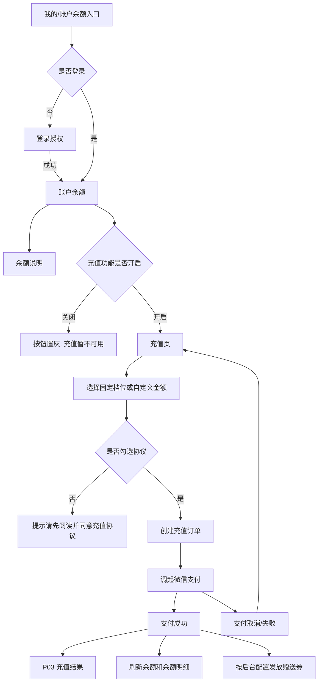
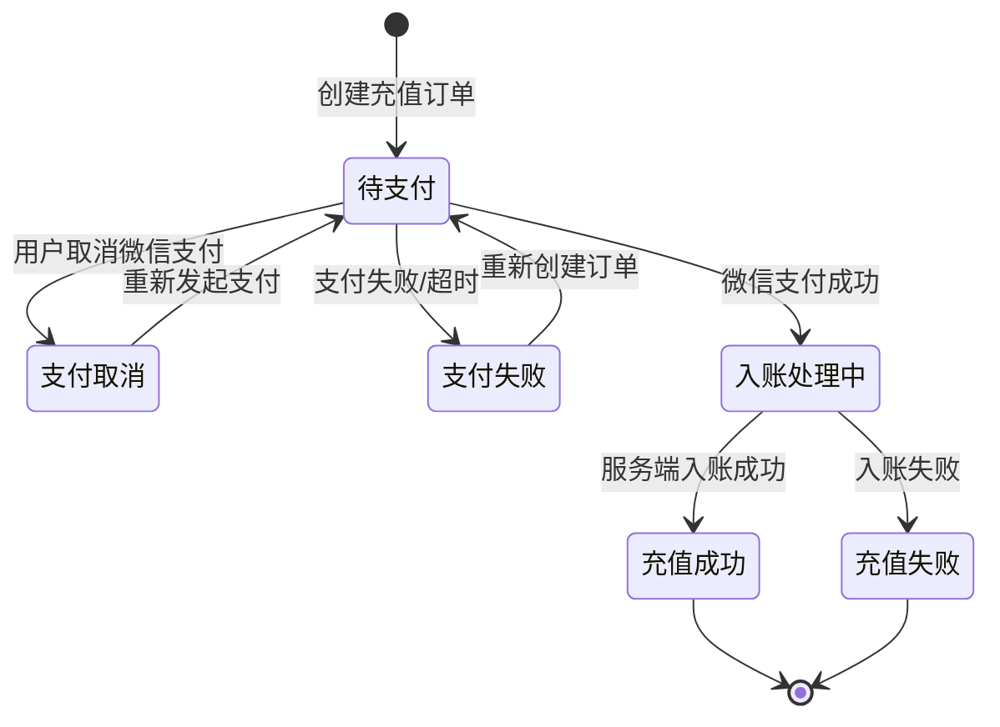

# 客户钱包管理 — 客户端功能设计文档

## 1. 模块：客户钱包管理（微信小程序客户端）

### 1.1 基础信息

| 项目 | 内容 |
| --- | --- |
| 模块名称 | 客户钱包管理 — 客户端 |
| 端口类型 | 微信小程序 |
| 目标用户 | 小程序登录客户 |
| 业务场景 | 客户查看账户余额、余额明细，并通过微信支付为钱包充值；充值成功后获得余额入账及后台配置的赠送优惠券。 |
| 上游入口 | 小程序「我的 / 个人中心 / 账户余额」入口、余额页底部「充值」按钮 |
| 下游去向 | 微信支付、账户余额明细、优惠券列表、客服咨询 |
| 设计依据 | 用户提供的「账户余额」截图、后台管理端充值配置功能设计 |
| 关联模块 | 后台客户钱包管理、充值配置、微信支付、优惠券发放记录、客户优惠券、客服、财务调账 |

### 1.2 功能目标

- **完整保留账户余额页能力**：按照截图保留页面标题、返回、余额展示、余额说明入口、余额明细列表和底部「充值」按钮。
- **新增客户端充值能力**：客户点击「充值」进入充值页面，选择后台配置的充值档位或自定义金额后发起充值。
- **展示充值赠送权益**：充值页面展示每个档位对应的赠送优惠券摘要，帮助客户在支付前理解可获得权益。
- **限定支付方式**：充值仅支持微信支付，不提供其他支付方式选择。
- **强化充值协议确认**：充值支付前必须勾选充值协议，未勾选时禁止提交支付并给出提示。
- **明确退款与提现边界**：充值后不支持客户自助提现；如需退款，联系平台客服，由平台客服通过调账、扣除赠送优惠券后再线下退款。
- **支持后台关闭态**：后台关闭充值功能后，账户余额页充值按钮置灰并修改文案提示，充值页不可进入或进入后不可支付。

### 1.3 范围与边界

#### 1.3.1 本期包含

- 账户余额页：
  - 展示当前余额。
  - 展示余额说明入口。
  - 展示余额明细列表：订单支付、钱包充值、订单退款等。
  - 底部固定「充值」按钮。
  - 充值关闭时，按钮置灰并改为提示文案。
- 充值页：
  - 展示可选充值档位。
  - 展示自定义充值入口（若后台启用）。
  - 展示档位对应赠送优惠券摘要。
  - 展示支付方式，固定为微信支付。
  - 展示充值协议勾选。
  - 展示充值说明：充值后不支持提现，退款需联系客服处理。
- 支付流程：
  - 客户确认金额与协议后调起微信支付。
  - 支付成功后刷新钱包余额和余额明细。
  - 根据后台赠送配置发放优惠券。
- 异常与状态：
  - 充值关闭态。
  - 未勾选协议。
  - 档位失效或金额超限。
  - 支付取消、支付失败、入账处理中、发券失败提示。

#### 1.3.2 本期不包含

- 不提供客户端自助提现。
- 不提供客户端直接申请退款流程。
- 不设计充值退款审批后台；退款由客服线下处理，后台通过调账和优惠券扣除配合。
- 不设计除微信支付以外的支付方式。
- 不设计优惠券营销中心，仅展示充值档位对应赠送摘要。
- 不处理已使用赠送券的现金补偿规则，需由客服按线下流程处理。

#### 1.3.3 边界说明

- **与后台充值配置**：客户端只读取后台已启用的充值配置，不允许客户端自行定义固定档位和赠送规则。
- **与微信支付**：客户端负责创建充值订单并调起微信支付；支付成功回调、钱包入账以服务端结果为准。
- **与优惠券模块**：充值成功后由服务端按后台配置发券；客户端仅展示赠送摘要和发券结果提示。
- **与客服退款**：客户不可在客户端提现或退款；如确需退款，通过客服线下流程处理，客服在后台执行调账、扣除赠送券和退款记录。
- **与余额明细**：充值成功后余额明细新增「钱包充值」记录；赠送券不进入余额明细金额流水。

### 1.4 用户角色与权限

| 角色 | 使用场景 | 可见范围 | 可操作功能 | 权限限制 |
| --- | --- | --- | --- | --- |
| 登录客户 | 查看余额、发起充值、查看明细 | 本人钱包余额、本人余额流水、本人充值可得赠送 | 查看余额、查看明细、进入充值页、选择档位、微信支付、查看协议 | 充值需登录；不可自助提现；不可自助退款 |
| 未登录用户 | 从入口访问账户余额 | 不展示个人钱包数据 | 引导登录 | 登录后才可查看余额和充值 |
| 后台客服 | 处理充值退款咨询 | 授权范围内客户钱包与流水 | 线下退款协助、后台调账、扣除优惠券 | 不在客户端操作 |

### 1.5 用户场景与前置条件

| 场景 | 触发条件 | 前置条件 | 用户目标 | 系统结果 |
| --- | --- | --- | --- | --- |
| 查看账户余额 | 用户进入账户余额页 | 用户已登录并存在钱包账户 | 查看当前余额和历史变动 | 页面展示余额卡和余额明细 |
| 正常充值 | 用户点击「充值」 | 后台充值功能开启，存在启用档位 | 选择金额并完成微信支付 | 生成充值订单，支付成功后余额入账 |
| 查看赠送权益 | 用户进入充值页 | 档位配置了赠送优惠券 | 了解充值后可获得哪些优惠券 | 档位卡展示赠送券名称、门槛、金额、有效期等摘要 |
| 自定义金额充值 | 用户选择自定义充值 | 后台启用自定义档位 | 输入充值金额 | 金额合法后可发起支付，并按固定档位匹配赠送 |
| 未勾选协议 | 用户未勾选协议点击支付 | 充值页已选择金额 | 系统提醒需先确认协议 | 阻断支付，保留选择内容 |
| 充值关闭 | 用户进入余额页或点击充值 | 后台关闭充值功能 | 明确当前不可充值 | 充值按钮置灰并提示「充值暂不可用」 |
| 支付取消 | 用户在微信支付页取消 | 已创建充值订单 | 返回充值页 | 订单取消或待支付，余额不变 |
| 充值后退款咨询 | 用户需要退款 | 充值成功后 | 联系平台处理 | 客服通过后台调账、扣除优惠券后线下退款 |

### 1.6 信息架构与页面清单

#### 1.6.1 页面/弹窗/组件清单

| 编号 | 类型 | 名称 | 页面标识 | 主要用途 | 入口 | 出口 |
| --- | --- | --- | --- | --- | --- | --- |
| P01 | 页面 | 账户余额 | page-wallet-balance | 展示当前余额、余额明细和充值入口 | 我的/个人中心/账户余额 | P02 充值页、余额说明弹窗 |
| P02 | 页面 | 充值 | page-wallet-recharge | 选择充值档位、查看赠送、确认协议并支付 | P01「充值」按钮 | 微信支付、M02 充值协议、M03 退款说明 |
| P03 | 页面 | 充值结果 | page-recharge-result | 展示充值成功、处理中或失败结果 | 微信支付返回 | P01 账户余额、优惠券列表 |
| M01 | 弹窗 | 余额说明 | modal-balance-rule | 说明余额用途、余额明细含义和不可提现规则 | P01「余额说明」 | 关闭返回 P01 |
| M02 | 弹窗/页面 | 充值协议 | modal-recharge-agreement | 展示充值协议全文 | P02 协议链接 | 返回 P02 |
| M03 | 弹窗 | 退款说明 | modal-refund-service | 说明充值后不支持提现，退款需联系客服 | P02 充值说明/客服入口 | 联系客服或关闭 |
| C01 | 组件 | 余额卡片 | component-balance-card | 展示当前余额和说明入口 | P01 顶部 | 无 |
| C02 | 组件 | 余额明细列表 | component-balance-flow-list | 展示订单支付、钱包充值、订单退款等流水 | P01 内容区 | 下拉刷新、滚动加载 |
| C03 | 组件 | 充值档位卡 | component-recharge-tier-card | 展示充值金额、赠送摘要、选中状态 | P02 内容区 | 选择档位 |
| C04 | 组件 | 协议勾选栏 | component-agreement-check | 支付前确认充值协议 | P02 底部支付区 | 勾选/取消勾选 |

#### 1.6.2 页面流转

流转说明：

- 从 P01 点击「充值」进入 P02 前，应实时校验后台充值开关，避免客户端缓存导致误入。
- P02 进入时需要拉取最新充值配置、档位列表、赠送摘要和配置版本号。
- 支付前需要再次校验充值开关、档位状态、金额范围和协议勾选状态。
- 微信支付返回后，客户端不直接以本地支付回调作为最终余额依据，需查询服务端充值订单状态。
- 支付成功后返回 P03，再由 P03 引导返回 P01；P01 需要刷新余额和明细。

### 1.7 页面结构与交互设计

#### 1.7.1 P01 账户余额

页面定位：

- 页面目标：帮助客户查看当前钱包余额、余额变动明细，并在可充值时进入充值页。
- 页面类型：移动端详情页。
- 适用角色：登录客户。

页面结构：

- 顶部导航：
  - 左侧返回图标。
  - 中间标题「账户余额」。
  - 右侧遵循小程序胶囊区域避让，不放业务按钮。
- 余额卡片：
  - 背景使用截图中的红粉渐变及波浪装饰风格。
  - 主金额展示：`¥ 1000.00`。
  - 辅助文案：`当前余额`。
  - 右上角入口：`余额说明`。
  - 截图中「提现」位置本期不展示；账户余额页不提供任何提现入口。
- 余额明细：
  - 分组标题「余额明细」。
  - 列表展示交易类型、关联订单号、交易时间、金额变动。
  - 支出金额右侧红色负数，例如 `-10.00`。
  - 收入金额右侧绿色正数，例如 `+10.00`。
- 底部操作：
  - 固定底部主按钮。
  - 正常态文案：`充值`。
  - 关闭态文案：`充值暂不可用`，按钮置灰。

关键交互：

- 进入页面默认加载余额和最近余额明细，按交易时间倒序展示。
- 点击「余额说明」打开 M01，说明余额用途、余额明细、不可提现和退款联系客服规则。
- 点击「充值」：
  - 若充值功能开启，进入 P02 充值页。
  - 若充值功能关闭，按钮不可点击或点击后 toast 提示「充值功能暂不可用」。
- 下拉刷新：刷新余额和明细。
- 上拉加载：加载更多余额明细。

状态覆盖：

- 默认态：展示余额卡、明细列表、充值按钮。
- 加载态：余额卡金额展示骨架或 `--`，明细列表展示骨架。
- 空态：无明细时展示「暂无余额明细」，底部充值按钮仍按开关状态展示。
- 错误态：余额接口失败时展示重试入口，不允许使用旧余额直接发起支付。
- 禁用态：充值关闭时按钮置灰，文案为「充值暂不可用」。

#### 1.7.2 P02 充值

页面定位：

- 页面目标：让客户选择充值金额、了解赠送权益、确认协议并通过微信支付充值。
- 页面类型：移动端表单/选择页。
- 适用角色：登录客户。

页面结构：

- 顶部导航：
  - 左侧返回。
  - 标题「充值」。
- 当前余额摘要：
  - 展示当前余额，例如 `当前余额 ¥1000.00`。
  - 提示充值成功后余额实时更新，以服务端入账结果为准。
- 充值档位区：
  - 固定金额档位以卡片网格展示。
  - 卡片主信息：充值金额，如 `¥100`、`¥300`。
  - 卡片副信息：赠送摘要，如 `赠满99减10券 1张`。
  - 无赠送时展示 `无赠送` 或不展示副标签。
  - 选中档位显示高亮边框、选中角标或主色背景。
- 自定义金额区：
  - 若后台启用自定义档位，展示「自定义金额」卡片或输入区。
  - 用户输入充值金额。
  - 若后台配置最低/最高限制，则展示对应提示；若未配置，则不展示限制或展示「金额不限」。
  - 自定义金额对应赠送按照后台规则匹配固定档位，页面需要在输入金额后展示预计赠送。
- 赠送权益区：
  - 展示当前已选档位预计获得的优惠券。
  - 包含优惠券名称、适用业务、满减条件、优惠金额、有效期、数量。
  - 发券以支付成功后的服务端结果为准。
- 支付方式区：
  - 固定展示微信支付。
  - 不提供单选列表或其他支付方式。
- 充值说明区：
  - 文案：`充值后余额不支持自助提现。如需退款，请联系平台客服处理，平台客服将核实余额、调账并扣除未使用赠送优惠券后线下退款。`
  - 展示客服电话：`400-888-6666`，并提供一键拨打入口。
- 协议区：
  - 复选框 + 文案：`我已阅读并同意《充值协议》`。
  - 点击《充值协议》打开 M02。
- 底部支付栏：
  - 展示应付金额。
  - 主按钮：`微信支付` 或 `立即支付`。
  - 未选择金额、金额不合法、未勾选协议、充值关闭时按钮不可用。

关键交互：

- 进入页面时拉取后台充值配置，若充值关闭，展示禁用态并禁止支付。
- 选择固定档位后：
  - 更新选中态。
  - 更新应付金额。
  - 更新赠送权益区。
- 选择自定义金额后：
  - 展示金额输入框。
  - 输入金额时校验金额格式、最低/最高限制。
  - 根据金额实时展示预计赠送权益；若未命中赠送档位，展示「本次充值暂无赠送」。
- 点击《充值协议》打开 M02，关闭后回到 P02，已输入内容和已选档位不丢失。
- 未勾选协议点击支付：
  - toast 提示「请先阅读并同意充值协议」。
  - 不创建充值订单。
- 点击支付：
  - 先创建充值订单。
  - 服务端二次校验充值开关、档位状态、金额、配置版本。
  - 校验通过后返回微信支付参数，客户端调起微信支付。
- 支付成功：
  - 跳转 P03，展示充值成功。
  - 刷新钱包余额、余额明细和优惠券发放结果。
- 支付取消：
  - 停留或返回 P02，提示「支付已取消」。
  - 已选档位、输入金额、协议勾选状态保留。

状态覆盖：

- 默认态：展示档位、赠送、微信支付、协议、底部支付按钮。
- 加载态：档位区骨架，支付按钮禁用。
- 空态：无可用档位时展示「暂无可充值档位」，支付按钮禁用。
- 错误态：配置拉取失败时展示「充值配置加载失败，请重试」。
- 关闭态：展示「充值功能暂不可用」，按钮禁用。
- 金额错误态：自定义金额为空、格式错误、低于最低限制或高于最高限制时，在输入框下方展示错误提示。

#### 1.7.3 P03 充值结果

页面定位：

- 页面目标：告知客户充值处理结果，并引导查看余额或优惠券。
- 页面类型：结果页。
- 适用角色：登录客户。

页面结构：

- 结果图标：成功、处理中、失败三种状态。
- 结果标题：`充值成功` / `充值处理中` / `充值失败`。
- 金额信息：充值金额、支付方式、充值单号、支付时间。
- 赠送结果：
  - 发券成功：展示预计获得优惠券数量和「去查看优惠券」入口。
  - 发券失败：展示「赠送券发放中，请稍后查看」或「赠送券发放失败，平台将为您处理」。
  - 无赠送：不展示或展示「本次充值无赠送」。
- 操作按钮：
  - 主按钮：`返回账户余额`。
  - 次按钮：`查看优惠券`（仅有赠送时展示）。

关键交互：

- 进入结果页时查询充值订单最终状态，不只依赖微信支付客户端回调。
- 充值成功后返回 P01，P01 余额和明细必须刷新。
- 处理中状态允许用户点击「刷新状态」。
- 失败状态展示失败原因和「重新充值」入口。

#### 1.7.4 M01 余额说明

页面定位：

- 页面目标：解释余额用途、明细来源、充值与退款规则。
- 页面类型：弹窗或页面。

页面内容：

- 余额可用于平台内支持钱包支付的订单消费。
- 余额明细包含订单支付、钱包充值、订单退款、客服调账等记录。
- 充值成功后不支持客户自助提现。
- 如需退款，请联系平台客服，由客服核实后通过后台调账、扣除赠送优惠券并线下退款。
- 赠送优惠券不折现、不计入余额。

#### 1.7.5 M02 充值协议

页面定位：

- 页面目标：在支付前让客户明确充值规则、支付方式、退款方式和赠送权益规则。
- 页面类型：协议弹窗或协议页面。

协议核心条款：

- 本充值服务仅支持微信支付。
- 充值金额将进入账户余额，可用于平台内指定业务消费。
- 充值成功后不支持客户自助提现。
- 如需退款，需联系平台客服处理；平台将根据实际余额、订单消费、赠送优惠券使用情况进行核实。
- 退款前，平台可扣除该笔充值相关未使用赠送优惠券；已使用或已过期赠送权益的处理以平台规则和客服核实结果为准。
- 充值赠送权益以支付成功时后台配置和服务端发放结果为准。

原型展示协议模拟文本：

- 《充值协议》版本号：`v2026.05.09`。
- 协议标题：`车管家账户余额充值协议`。
- 协议正文用于原型演示，包含充值服务说明、微信支付说明、余额使用范围、不可提现说明、退款联系客服说明、赠送优惠券规则、异常处理和用户确认条款。

### 1.8 字段、控件与数据口径

#### 1.8.1 账户余额页字段

| 字段名称 | 字段标识 | 字段类型 | 展示规则 | 空值规则 | 数据来源 | 权限规则 |
| --- | --- | --- | --- | --- | --- | --- |
| 当前余额 | wallet_balance | 金额 | `¥ 1000.00`，保留 2 位小数 | 加载失败显示 `--` | 钱包账户 | 本人可见 |
| 明细类型 | flow_type | 枚举 | 订单支付、钱包充值、订单退款、调账等 | `--` | 钱包流水 | 本人可见 |
| 关联订单号 | related_order_no | 文本 | 展示订单号/充值单号 | 为空不展示或显示 `--` | 业务单据 | 本人可见 |
| 交易时间 | transaction_time | 日期时间 | `yyyy-MM-dd HH:mm` | `--` | 钱包流水 | 本人可见 |
| 变动金额 | change_amount | 金额 | 收入为绿色 `+10.00`，支出为红色 `-10.00` | `0.00` | 钱包流水 | 本人可见 |
| 充值按钮状态 | recharge_button_status | 状态 | 开启显示「充值」，关闭显示「充值暂不可用」 | 关闭态置灰 | 后台充值开关 | 本人可见 |

#### 1.8.2 充值页字段

| 字段名称 | 字段标识 | 控件类型 | 是否必填 | 默认值 | 可选项/范围 | 校验规则 | 联动规则 |
| --- | --- | --- | --- | --- | --- | --- | --- |
| 充值档位 | tier_id | 卡片单选 | 固定档位必选 | 默认不选或选中首个启用档位 | 后台启用档位 | 档位必须有效 | 联动金额、赠送权益 |
| 充值金额 | recharge_amount | 金额 | 是 | 选中档位金额 | 固定金额或自定义输入 | >0，保留 2 位 | 自定义金额受最低/最高限制影响 |
| 自定义最低限制 | min_amount | 只读提示 | 否 | 后台返回 | 后台配置 | 留空表示不限制 | 控制输入校验 |
| 自定义最高限制 | max_amount | 只读提示 | 否 | 后台返回 | 后台配置 | 留空表示不限制 | 控制输入校验 |
| 预计赠送 | expected_gift | 信息展示 | 否 | 根据档位计算 | 优惠券摘要 | 以服务端实际发放为准 | 受档位/金额影响 |
| 支付方式 | pay_method | 固定项 | 是 | 微信支付 | 微信支付 | 不可切换 | 创建支付单 |
| 充值协议 | agreement_checked | 复选框 | 是 | 未勾选 | 勾选/未勾选 | 未勾选阻断支付 | 控制支付按钮可用性 |

#### 1.8.3 充值档位卡字段

| 字段名称 | 展示位置 | 展示规则 | 点击/操作行为 |
| --- | --- | --- | --- |
| 充值金额 | 卡片主标题 | `¥100` / `¥300`；自定义档位展示「自定义金额」 | 点击选中档位 |
| 赠送摘要 | 卡片副标题 | 有赠送展示优惠券摘要，无赠送展示「无赠送」或不展示 | 随选中态更新权益区 |
| 档位状态 | 卡片状态 | 停用档位不展示；失效档位不可选 | 失效提示并刷新配置 |
| 选中状态 | 卡片边框/角标 | 选中后高亮 | 更新应付金额 |

### 1.9 核心功能说明

#### 1.9.1 进入账户余额页

功能入口：

- 入口位置：小程序「我的 / 账户余额」。
- 展示条件：用户已登录。
- 禁用条件：未登录时跳转登录授权，不展示余额数据。

操作流程：

1. 用户进入账户余额页。
2. 系统校验登录态。
3. 系统拉取钱包余额、充值开关、最近余额明细。
4. 页面展示余额卡、明细列表和充值按钮。
5. 若充值功能关闭，充值按钮置灰并显示「充值暂不可用」。

业务规则：

- 余额以服务端返回为准，不允许客户端本地计算最终余额。
- 余额明细按交易时间倒序。
- 充值按钮展示状态以后台充值开关实时结果为准。

#### 1.9.2 选择充值档位

功能入口：

- 入口位置：P02 充值页档位区。
- 展示条件：后台充值功能开启且存在启用档位。
- 禁用条件：配置失效、档位停用、金额不合法。

操作流程：

1. 用户点击 P01「充值」。
2. 系统进入 P02 并拉取充值配置。
3. 用户选择固定档位或自定义金额。
4. 页面展示当前应付金额和预计赠送权益。
5. 用户勾选协议后点击「微信支付」。

业务规则：

- 固定档位金额由后台配置，客户端不可修改。
- 自定义金额是否展示由后台自定义档位配置决定。
- 自定义金额最低/最高限制可为空，空表示不限制。
- 自定义金额赠送规则由服务端按后台配置匹配，客户端仅展示预计结果。
- 档位和赠送摘要需使用同一配置版本，支付前服务端二次校验。

#### 1.9.3 微信支付充值

功能入口：

- 入口位置：P02 底部「微信支付 / 立即支付」按钮。
- 展示条件：充值功能开启。
- 可点击条件：已选择合法金额、已勾选充值协议。

操作流程：

1. 用户确认金额、赠送权益、充值说明。
2. 用户勾选「我已阅读并同意《充值协议》」。
3. 用户点击「微信支付」。
4. 客户端请求创建充值订单。
5. 服务端校验充值开关、档位状态、金额范围、配置版本。
6. 服务端返回微信支付参数。
7. 客户端调起微信支付。
8. 支付成功后进入 P03，查询订单最终状态。
9. 订单成功后钱包余额入账，并写入余额明细「钱包充值」。
10. 若命中赠送，服务端发放优惠券并写入优惠券发放记录。

业务规则：

- 支付方式固定为微信支付，不展示其他选项。
- 同一充值订单需防重复支付和重复入账。
- 支付成功但服务端未完成入账时，结果页展示「充值处理中」。
- 发券失败不影响余额入账，但需提示权益可能延迟并由后台补发。

#### 1.9.4 充值协议确认

功能入口：

- 入口位置：P02 支付栏上方。
- 展示条件：充值页默认展示。
- 禁用条件：无。

操作流程：

1. 用户进入 P02。
2. 页面默认不勾选协议。
3. 用户点击《充值协议》查看协议内容。
4. 用户勾选协议。
5. 支付按钮满足其他条件后可用。

业务规则：

- 未勾选协议不得创建充值订单。
- 未勾选时点击支付，提示「请先阅读并同意充值协议」。
- 查看协议不等于自动勾选，必须由用户主动勾选。

#### 1.9.5 充值关闭态

功能入口：

- 入口位置：P01 充值按钮、P02 页面初始化、支付前二次校验。

操作流程：

1. 后台关闭充值功能。
2. 用户进入 P01。
3. 客户端拉取开关状态。
4. P01 底部按钮置灰，文案显示「充值暂不可用」。
5. 用户无法进入 P02，或进入后页面显示「充值功能暂不可用」并禁止支付。

业务规则：

- 充值开关关闭后，客户端按钮必须置灰并修改文案。
- 即便客户端缓存仍显示可充值，服务端创建充值订单时必须阻断。
- 阻断提示建议为「充值功能暂不可用，请稍后再试」。

#### 1.9.6 退款与不可提现说明

功能入口：

- 入口位置：P01 余额说明、P02 充值说明、M02 充值协议。

业务规则：

- 客户端不提供自助提现。
- 充值后如需退款，客户需联系平台客服处理。
- 客服处理退款前需核实充值记录、消费记录、余额、赠送优惠券状态。
- 线下退款前，后台可通过调账扣减余额，并作废或扣除该笔充值相关未使用赠送优惠券。
- 赠送优惠券不折现，不作为余额退还。

### 1.10 状态机与状态流转

#### 1.10.1 充值订单状态定义

| 状态 | 状态标识 | 状态含义 | 可执行操作 | 不可执行操作 |
| --- | --- | --- | --- | --- |
| 待支付 | pending_pay | 充值订单已创建，未完成微信支付 | 继续支付、取消支付 | 发券、入账 |
| 支付取消 | pay_cancelled | 用户取消微信支付 | 重新充值 | 入账、发券 |
| 支付失败 | pay_failed | 微信支付失败或超时 | 重新支付/重新充值 | 入账、发券 |
| 入账处理中 | crediting | 支付成功，服务端正在处理入账 | 刷新状态、返回余额页 | 重复支付 |
| 充值成功 | success | 支付成功且余额入账完成 | 查看余额、查看优惠券 | 重复支付 |
| 充值失败 | failed | 支付或入账失败 | 重新充值、联系客服 | 使用失败订单余额 |

#### 1.10.2 状态流转

### 1.11 异常、边界与降级处理

| 异常场景 | 触发条件 | 页面表现 | 系统处理 | 用户可操作 |
| --- | --- | --- | --- | --- |
| 未登录 | 进入余额页或充值页 | 跳转登录授权 | 不加载钱包数据 | 登录后继续 |
| 充值功能关闭 | 后台关闭开关 | P01 按钮置灰，文案「充值暂不可用」 | 服务端阻断创建订单 | 稍后重试 |
| 无可用档位 | 后台未配置启用档位 | P02 展示暂无可充值档位 | 禁用支付 | 返回余额页 |
| 档位失效 | 支付前档位被停用或删除 | toast 提示「充值档位已更新，请重新选择」 | 刷新配置 | 重新选择 |
| 自定义金额低于限制 | 输入金额低于最低值 | 输入框下方错误提示 | 阻断支付 | 修改金额 |
| 自定义金额高于限制 | 输入金额高于最高值 | 输入框下方错误提示 | 阻断支付 | 修改金额 |
| 未勾选协议 | 点击支付时未勾选 | toast 提示 | 不创建订单 | 勾选协议 |
| 微信支付取消 | 用户取消支付 | toast「支付已取消」 | 订单保持待支付或取消 | 重新支付 |
| 微信支付失败 | 支付接口失败 | 结果页失败态 | 记录失败原因 | 重试/联系客服 |
| 支付成功但入账延迟 | 回调未完成 | 结果页「充值处理中」 | 轮询或刷新订单状态 | 刷新/返回 |
| 发券失败 | 余额入账成功但赠送券发放失败 | 成功页提示权益发放中/平台处理 | 后台记录失败并支持补发 | 稍后查看优惠券 |
| 客户端网络异常 | 请求超时 | 错误提示和重试 | 不重复创建订单 | 重试 |

### 1.12 模块联动与数据影响

| 关联模块 | 联动方向 | 联动场景 | 传递数据 | 影响结果 |
| --- | --- | --- | --- | --- |
| 后台充值配置 | 后台影响客户端 | 进入 P01/P02、支付前校验 | 充值开关、档位、赠送配置、配置版本 | 控制按钮状态、档位展示、赠送摘要 |
| 微信支付 | 客户端调用支付 | 点击微信支付 | 充值单号、金额、openid、支付参数 | 完成支付或返回失败 |
| 钱包账户 | 充值影响钱包 | 支付成功入账 | 用户 ID、充值金额、充值单号 | 增加账户余额 |
| 余额明细 | 充值影响明细 | 入账成功 | 流水类型、金额、时间、订单号 | 新增「钱包充值」流水 |
| 优惠券模块 | 充值触发发券 | 命中赠送规则 | 用户 ID、充值单号、赠送配置快照 | 生成客户优惠券 |
| 客服/调账 | 客服处理退款 | 用户要求退款 | 充值记录、余额、优惠券状态、客服电话 `400-888-6666` | 调账、扣券、线下退款 |

补充说明：

- 充值支付与余额入账必须以服务端为准，客户端只负责展示与调起支付。
- 支付成功后余额、明细、赠送券可能存在短暂延迟，结果页需支持处理中态。
- 自定义金额预计赠送可以由服务端实时计算并返回，避免客户端规则不一致。

### 1.13 数据模型与接口建议

#### 1.13.1 核心数据对象

| 对象名称 | 对象说明 | 关键字段 | 备注 |
| --- | --- | --- | --- |
| 钱包账户 | 客户余额账户 | walletId、customerId、balance、status、lastChangeTime | 余额展示和支付校验 |
| 钱包流水 | 余额变动记录 | flowId、flowType、amount、relatedOrderNo、time | P01 明细列表 |
| 充值配置 | 后台配置快照 | rechargeEnabled、configVersion、tiers | P01/P02 使用 |
| 充值档位 | 可选充值金额 | tierId、tierType、fixedAmount、minAmount、maxAmount、sortOrder、giftSummary | P02 档位区 |
| 充值订单 | 客户发起的充值单 | rechargeOrderId、amount、payMethod、status、configVersion | 支付与入账依据 |
| 赠送摘要 | 预计赠送优惠券 | couponName、businessType、thresholdAmount、discountAmount、validDays、quantity | 支付前展示 |

#### 1.13.2 接口清单建议

| 接口用途 | 请求方式 | 路径建议 | 入参 | 出参 | 备注 |
| --- | --- | --- | --- | --- | --- |
| 查询账户余额 | GET | `/api/client/wallet/summary` | customerId/token | balance、rechargeEnabled、buttonText | P01 初始化 |
| 查询余额明细 | GET | `/api/client/wallet/flows` | page、pageSize、cursor | list、hasMore | 支持滚动加载 |
| 查询充值配置 | GET | `/api/client/wallet/recharge/config` | customerId/token | rechargeEnabled、configVersion、tiers | P02 初始化 |
| 计算预计赠送 | POST | `/api/client/wallet/recharge/gift/preview` | amount、tierId、configVersion | giftSummary、matchedTier | 自定义金额建议调用 |
| 创建充值订单 | POST | `/api/client/wallet/recharge/orders` | tierId、amount、configVersion、agreementConfirmed | rechargeOrderId、payParams | 服务端二次校验 |
| 查询充值结果 | GET | `/api/client/wallet/recharge/orders/{id}` | rechargeOrderId | status、amount、giftIssueStatus | P03 使用 |
| 查询充值协议 | GET | `/api/client/wallet/recharge/agreement` | version | title、content、version | M02 使用 |

#### 1.13.3 数据一致性要求

- 支付前必须二次校验充值开关、档位状态、金额范围、配置版本和协议勾选。
- 创建充值订单需防重复提交，建议使用前端请求 ID + 服务端幂等键。
- 微信支付回调需幂等处理，同一充值订单只允许入账一次。
- 发券需以 `rechargeOrderId` 做幂等，同一笔充值不得重复发放同一批赠送券。
- 余额展示以服务端钱包账户余额为准，不通过客户端明细累加计算。

### 1.14 埋点与指标

| 指标/事件 | 触发时机 | 事件参数 | 用途 |
| --- | --- | --- | --- |
| 账户余额页曝光 | P01 加载完成 | customerId、balanceRange、rechargeEnabled | 观察入口使用 |
| 充值按钮点击 | 点击 P01 充值按钮 | rechargeEnabled、buttonStatus | 观察充值转化入口 |
| 充值页曝光 | P02 加载完成 | configVersion、tierCount、hasCustomTier | 观察档位展示 |
| 充值档位选择 | 选择档位 | tierId、tierType、amount、hasGift | 分析档位偏好 |
| 自定义金额输入 | 输入完成/失焦 | amount、valid、matchedTier | 分析自定义充值 |
| 协议勾选 | 勾选协议 | agreementVersion | 合规留痕 |
| 微信支付点击 | 点击支付按钮 | amount、tierId、hasGift | 支付转化分析 |
| 支付成功 | 充值成功 | rechargeOrderId、amount、giftIssueStatus | 充值效果统计 |
| 支付失败/取消 | 支付失败或取消 | reason、amount、tierId | 流失原因分析 |
| 充值关闭拦截 | 关闭态点击或创建订单被阻断 | source、configVersion | 监控后台配置影响 |

### 1.15 高保真交互原型生成要求

若后续基于本文档生成客户端 HTML 原型，需要满足：

- 原型应以微信小程序移动端尺寸呈现，参考用户提供截图中的账户余额页结构。
- P01 必须包含顶部导航、余额卡、余额说明入口、余额明细列表、底部固定充值按钮。
- P01 充值关闭态必须展示置灰按钮和「充值暂不可用」文案。
- P02 必须覆盖固定档位、自定义金额、赠送摘要、微信支付、充值说明、协议勾选和底部支付栏。
- P02 未勾选协议时点击支付必须给出明确提示。
- P03 必须覆盖充值成功、处理中、失败三种结果状态。
- 原型需覆盖加载态、空态、错误态、关闭态、支付取消、发券失败提示。
- 充值协议和余额说明可以使用弹窗或页面，必须可点击查看和关闭。
- 设计上应保留截图中的红粉渐变余额卡风格，同时保证按钮触控热区不少于 44px。

### 1.16 开发实现补充说明

#### 1.16.1 安全与合规

- 充值需登录后操作，未登录不得创建充值订单。
- 支付金额、档位、赠送权益不得完全依赖客户端传参，服务端必须按配置版本重新计算。
- 充值协议勾选状态和协议版本建议记录到充值订单中。
- 支付回调、余额入账、赠送发券均需幂等。
- 客户端不得提供提现入口；如历史页面存在提现文字，应隐藏。

#### 1.16.2 性能与体验

- 账户余额和充值配置可短缓存，但进入充值页和支付前必须刷新或二次校验。
- 余额明细采用分页或 cursor 加载。
- 支付按钮点击后进入 loading 状态，防止重复点击。
- 自定义金额输入建议防抖调用预计赠送接口。
- 支付结果页可短轮询订单状态，避免用户看到支付成功但余额未刷新。

#### 1.16.3 兼容与适配

- 适配微信小程序胶囊、安全区、底部固定按钮避让。
- 适配小屏机型，底部支付栏不得遮挡协议勾选。
- 金额输入需调起数字键盘。
- 网络弱环境下保留用户已选档位和已输入金额。
- 历史无充值配置时，P01 按钮置灰并提示「充值暂不可用」。

### 1.17 验收标准

| 编号 | 场景 | 前置条件 | 操作步骤 | 预期结果 |
| --- | --- | --- | --- | --- |
| AC01 | 账户余额页展示 | 用户已登录且有余额明细 | 进入账户余额页 | 页面展示余额卡、余额说明、余额明细和底部充值按钮 |
| AC02 | 充值功能开启 | 后台充值功能开启且有启用档位 | 点击 P01「充值」 | 进入充值页，展示可选档位和赠送摘要 |
| AC03 | 充值功能关闭 | 后台充值功能关闭 | 进入账户余额页 | 底部按钮置灰，文案为「充值暂不可用」，不可进入支付流程 |
| AC04 | 固定档位充值 | 存在固定金额档位 | 选择档位并查看页面 | 应付金额更新，赠送权益区展示该档位赠送 |
| AC05 | 自定义充值金额 | 后台启用自定义档位 | 输入合法金额 | 页面展示预计赠送；金额不合法时阻断支付并提示 |
| AC06 | 仅微信支付 | 进入充值页 | 查看支付方式 | 只展示微信支付，不展示其他支付方式 |
| AC07 | 协议未勾选 | 已选择充值金额但未勾选协议 | 点击支付 | 不创建订单，提示「请先阅读并同意充值协议」 |
| AC08 | 协议已勾选支付 | 已选择合法金额并勾选协议 | 点击微信支付 | 创建充值订单并调起微信支付 |
| AC09 | 支付成功 | 微信支付成功且服务端入账成功 | 返回小程序 | 展示充值成功页，余额明细新增钱包充值记录 |
| AC10 | 发券成功 | 档位配置赠送 | 充值成功 | 客户获得对应优惠券，可在结果页或优惠券列表查看 |
| AC11 | 发券失败 | 余额入账成功但发券失败 | 查看充值结果 | 余额充值成功，页面提示赠送券发放中或平台处理 |
| AC12 | 支付取消 | 用户在微信支付页取消 | 返回小程序 | 页面提示支付已取消，余额不变，可重新支付 |
| AC13 | 退款说明 | 用户查看余额说明或充值协议 | 点击说明/协议 | 明确展示充值后不支持提现，退款需联系客服处理 |
| AC14 | 服务端二次拦截 | 客户端缓存为开启但后台已关闭 | 点击支付 | 服务端阻断创建订单，客户端提示充值暂不可用 |

### 1.18 已确认问题

| 编号 | 问题 | 影响范围 | 建议决策人 | 状态 |
| --- | --- | --- | --- | --- |
| Q01 | 账户余额截图中的「提现」入口是否需要彻底隐藏，还是改为点击后展示「不支持提现/联系客服退款」说明？ | P01 余额卡片交互 | 产品/业务 | 已确认：不展示提现入口 |
| Q02 | 充值协议是否已有法务/运营固定文本与版本号？ | M02 充值协议、订单留痕 | 产品/法务/运营 | 已确认：暂无正式文本，原型阶段模拟一套协议用于展示 |
| Q03 | 退款联系客服入口使用微信小程序官方客服能力，还是展示客服电话/客服二维码？ | P02 充值说明、M03 退款说明 | 产品/客服 | 已确认：展示客服电话，原型使用 `400-888-6666` |

### 1.19 输出前质量检查清单

- [x] 已识别为微信小程序客户端功能设计。
- [x] 已保留截图中的账户余额页核心结构。
- [x] 已覆盖点击充值进入充值页、选择档位、查看赠送权益。
- [x] 已明确支付方式仅支持微信支付。
- [x] 已明确充值后不支持自助提现，退款联系客服线下处理。
- [x] 已覆盖充值协议勾选后才能支付。
- [x] 已覆盖后台关闭充值功能时按钮置灰和文案提示。
- [x] 已覆盖状态、异常、接口建议、验收标准和已确认问题。

### 1.20 变更记录

| 日期 | 版本 | 变更内容 | 变更人 |
| --- | --- | --- | --- |
| 2026-05-09 | v1.0 | 新增客户钱包管理客户端功能设计文档；基于账户余额截图完整设计余额页与充值链路，并补充充值档位、赠送展示、微信支付、协议确认、不可提现/退款联系客服、充值关闭态等规则。 | AI 助手 |
| 2026-05-09 | v1.1 | 根据确认问题更新：账户余额页不展示提现入口；充值协议暂无正式文本，原型阶段模拟一套协议；退款咨询展示客服电话，原型使用 `400-888-6666`；将待确认问题调整为已确认问题。 | AI 助手 |
