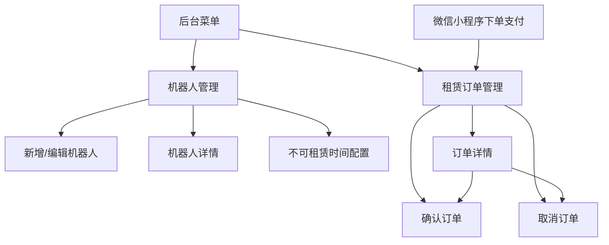
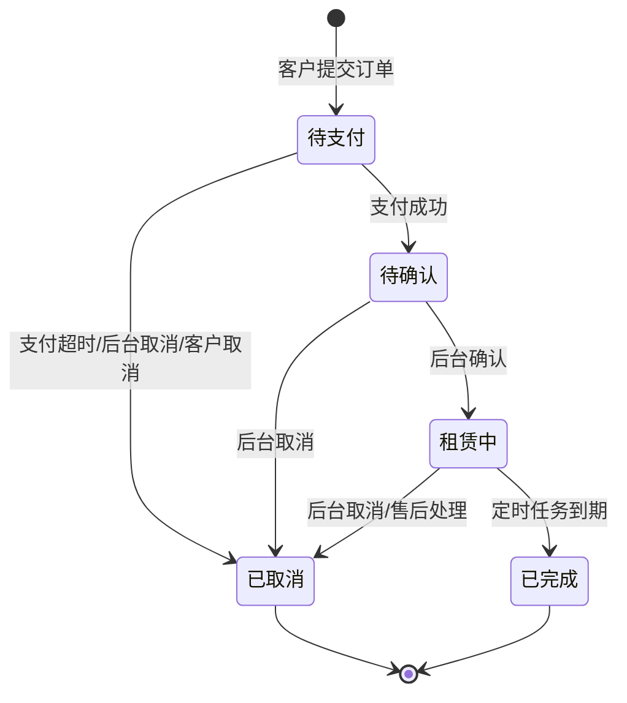

# 机器人租赁 — 后台管理端功能设计文档

## 1. 模块：机器人租赁（后台管理端）

### 1.1 基础信息

| 项目 | 内容 |
| --- | --- |
| 模块名称 | 机器人租赁 — 后台管理端 |
| 端口类型 | Web 后台管理端 |
| 目标用户 | 平台管理员、运营人员、客服人员、财务人员 |
| 业务场景 | 平台维护可租赁机器人信息、日租价、月租价和不可租赁时间，并处理客户在小程序提交的租赁订单。 |
| 上游入口 | 后台左侧菜单「业务管理 > 机器人租赁」或「机器人租赁」 |
| 下游影响 | 微信小程序机器人列表、详情、下单计价、在线支付、订单查看、财务对账、操作日志 |
| 设计系统 | `DESIGN/Web后台管理端页面结构约束规范.md`、`DESIGN/DESIGN_ARCO.md` |
| 关联模块 | 微信小程序机器人租赁、微信支付、订单中心、客户管理、统一售后处理、财务流水、权限管理、操作日志 |

### 1.2 功能目标

- 后台可配置多个机器人，包含基础信息、图片、简介、参数、展示状态和启用状态。
- 后台可配置机器人租赁价格，支持日租价和月租价。
- 后台可按机器人配置不可租赁时间段，客户端在选择租赁时间时将不可租时间和已租时间统一禁选。
- 客户端只展示后台配置为可展示、已启用且至少有一种有效租赁价格的机器人。
- 后台可查询、查看、确认、取消机器人租赁订单；订单确认后进入租赁中，租赁到期由定时任务释放机器人为待租赁。
- 配置变更、订单确认、订单取消均保留操作日志，便于后续客服和财务追溯。

### 1.3 范围与边界

#### 1.3.1 本期包含

- 机器人管理：列表查询、分页、新增、编辑、查看、启用、停用、展示/不展示。
- 机器人信息配置：机器人名称、编号、封面图、轮播图、适用场景、简介、参数说明、排序值、备注。
- 价格配置：日租价、月租价；支持仅配置日租、仅配置月租或两者都配置。
- 不可租赁时间配置：按某一个机器人配置不可租赁时间段；客户端对不可租赁配置和已租配置做相同禁选处理。
- 订单管理：订单查询、分页、详情查看、待确认订单确认、订单取消。
- 订单查询条件：订单编号、机器人名称、客户姓名/手机号、租赁方式、订单状态、下单时间。
- 订单详情：客户信息、机器人快照、租赁方式、租赁时间、租赁时长、金额、支付信息、操作记录。

#### 1.3.2 本期不包含

- 不设计库存数量限制；本期约束对象是某一个机器人在某一段时间是否可租。
- 不设计押金、违约金、续租、提前归还、发票、合同签署。
- 不设计配送、安装、回收、维保工单。
- 不设计后台代客下单，订单来源仅为微信小程序。
- 不设计独立品牌、型号、适用场景字典，相关信息在机器人表单内维护。

#### 1.3.3 边界说明

- **与微信小程序**：后台配置决定客户端列表、详情、价格、可下单方式和不可租赁时间；客户端下单前必须实时校验机器人状态、价格和时间段可用性。
- **与支付模块**：客户端创建订单并发起微信支付；支付回调以服务端结果为准。
- **与订单/财务/售后模块**：机器人租赁订单可进入统一订单、财务流水或对账口径；待确认订单取消后如已支付，进入平台统一售后处理流程。
- **与履约流程**：订单确认后表示租赁开始，占用对应机器人时间段；到期后由定时任务释放机器人为待租赁。

### 1.4 用户角色与权限

| 角色 | 使用场景 | 可见范围 | 可操作功能 | 权限限制 |
| --- | --- | --- | --- | --- |
| 平台管理员 | 配置机器人并处理订单 | 全部机器人和订单 | 新增、编辑、启停、配置不可租赁时间、查看、确认订单、取消订单、导出 | 敏感操作需二次确认并记录日志 |
| 运营人员 | 维护展示内容和确认租赁 | 授权范围内机器人和订单 | 查看、编辑、启停、配置不可租赁时间、确认订单、取消订单 | 是否允许改价由权限控制 |
| 客服人员 | 查询客户订单和处理咨询 | 授权范围内订单 | 查询、查看详情、协助取消 | 默认不可新增/编辑机器人 |
| 财务人员 | 对账和核查支付 | 全部或授权范围内订单 | 查询、查看、导出 | 默认不可确认或取消订单 |

补充说明：

- 「新增/编辑机器人」「启用/停用」「确认订单」「取消订单」「导出」均接入 RBAC 权限控制。
- 客户手机号、订单金额等敏感字段按项目统一权限展示或脱敏。
- 写操作记录操作人、操作时间、操作对象、操作前值、操作后值和原因。

### 1.5 用户场景与前置条件

| 场景 | 触发条件 | 前置条件 | 用户目标 | 系统结果 |
| --- | --- | --- | --- | --- |
| 配置机器人 | 管理员点击新增 | 有配置权限 | 录入机器人展示信息和价格 | 保存机器人，满足条件后可在客户端展示 |
| 修改价格 | 运营编辑机器人价格 | 机器人已存在 | 调整日租价/月租价 | 新订单按新价格计算，历史订单不回写 |
| 停用机器人 | 机器人暂不可租 | 有启停权限 | 客户端不再允许新下单 | 客户端隐藏或详情提示不可租赁 |
| 查询订单 | 客服进入订单管理 | 存在订单数据 | 定位客户订单 | 列表展示匹配订单 |
| 配置不可租赁时间 | 机器人维护、保养或业务占用 | 有不可租时间配置权限 | 阻止客户选择该时间段 | 客户端将该时间段置灰禁选 |
| 确认订单 | 客户支付成功后订单待确认 | 订单状态为待确认 | 确认平台可履约 | 订单状态变为租赁中，对应时间段被占用 |
| 取消订单 | 订单无法履约或客户取消 | 订单状态允许取消 | 终止订单 | 订单状态变为已取消，已支付订单进入统一售后处理 |
| 到期释放 | 租赁结束时间已到 | 定时任务正常运行 | 释放机器人可租状态 | 机器人对应时间段结束后恢复待租赁 |

### 1.6 信息架构与页面清单

#### 1.6.1 页面/弹窗/组件清单

| 编号 | 类型 | 名称 | 页面标识 | 主要用途 | 入口 | 出口 |
| --- | --- | --- | --- | --- | --- | --- |
| P01 | 页面 | 机器人管理 | page-robot-list | 查询和维护机器人信息、价格、展示状态 | 侧栏「机器人租赁 > 机器人管理」 | 新增/编辑抽屉、详情抽屉 |
| D01 | 抽屉 | 新增/编辑机器人 | drawer-robot-form | 维护机器人基础信息、图片、价格、展示状态 | P01「新增」或行「编辑」 | 保存后返回 P01 |
| D02 | 抽屉 | 机器人详情 | drawer-robot-detail | 查看机器人完整信息、价格和变更记录 | P01 行「查看」 | 关闭返回 P01 |
| D04 | 抽屉 | 不可租赁时间配置 | drawer-unavailable-period | 按机器人配置维护、保养、业务占用等不可租赁时间段 | P01 行「不可租时间」 | 保存后返回 P01 |
| P02 | 页面 | 租赁订单管理 | page-robot-rental-order | 查询订单并执行确认、取消、查看 | 侧栏「机器人租赁 > 租赁订单」 | 订单详情、确认弹窗、取消弹窗 |
| D03 | 抽屉 | 订单详情 | drawer-rental-order-detail | 查看订单、租赁、金额、支付和操作记录 | P02 行「查看」 | 关闭返回 P02 |
| M01 | 弹窗 | 确认订单 | modal-confirm-order | 确认待确认订单可履约 | P02/D03「确认」 | 确认后刷新订单状态 |
| M02 | 弹窗 | 取消订单 | modal-cancel-order | 取消订单并填写原因 | P02/D03「取消」 | 确认后刷新订单状态 |

#### 1.6.2 页面流转

流转说明：

- P01 保存机器人后返回列表，保留原筛选条件和页码。
- D04 保存后，客户端选择租赁日期/月分时实时禁选对应不可租赁时间段。
- 客户端订单支付成功后进入 P02 可查询范围，后台对待确认订单进行确认或取消。
- P02 执行确认后订单进入租赁中；执行取消后刷新列表和详情状态，已支付订单进入统一售后处理流程。

### 1.7 页面结构与交互设计

#### 1.7.1 P01 机器人管理

页面定位：

- 页面目标：维护客户端可展示、可下单的机器人信息和租赁价格。
- 页面类型：列表页。
- 适用角色：平台管理员、运营人员。

页面结构：

- 面包屑：`机器人租赁 > 机器人管理`。
- 筛选区：机器人名称、机器人编号、展示状态、启用状态、当前可租状态；右侧提供「查询」「重置」。
- 功能区：左侧「新增机器人」；右侧可按项目规范提供刷新、列设置。
- 表格区：机器人编号、封面图、机器人名称、适用场景、日租价、月租价、当前可租状态、展示状态、启用状态、排序值、最近更新时间、操作。
- 分页区：采用后台统一分页结构。

关键交互：

- 进入页面默认按最近更新时间倒序展示机器人。
- 点击「新增机器人」打开 D01，默认展示状态为不展示，启用状态为停用。
- 点击「编辑」打开 D01 并带入当前机器人信息。
- 点击「查看」打开 D02，只读展示完整信息。
- 点击「不可租时间」打开 D04，可维护该机器人不可租赁时间段。
- 点击「启用/停用」需二次确认；停用后客户端不允许新下单，历史订单不受影响。
- 修改价格后仅影响后续新订单；已创建订单继续使用下单时锁定价格。

状态覆盖：

- 默认态：展示机器人列表。
- 加载态：表格显示加载中，查询按钮可禁用。
- 空态：无数据时展示「暂无机器人信息」，有新增权限时展示新增入口。
- 错误态：列表接口失败时展示错误提示和重试入口。
- 权限态：无新增/编辑权限时隐藏对应按钮，仅允许查看。

#### 1.7.2 D01 新增/编辑机器人

页面定位：

- 页面目标：维护机器人对外展示信息、租赁价格和展示控制。
- 页面类型：右侧抽屉表单。

页面结构：

- 基础信息：机器人名称、机器人编号、封面图、轮播图、适用场景、机器人简介。
- 参数信息：品牌/型号、尺寸、重量、续航或服务能力、备注说明。
- 租赁价格：日租价、月租价。
- 展示控制：展示状态、启用状态、排序值。
- 操作区：保存、取消。

关键交互：

- 新增时机器人编号可由系统自动生成；如支持手动填写，需校验唯一。
- 图片上传成功后展示缩略图，可删除或替换。
- 日租价和月租价允许分别为空，但至少填写一个大于 0 的价格后才允许启用。
- 当展示状态为展示且启用状态为启用时，客户端列表可展示该机器人。
- 点击取消时，如表单已修改需二次确认是否放弃编辑。

#### 1.7.3 D02 机器人详情

- 展示机器人名称、编号、启用状态、展示状态、封面图、轮播图、适用场景、简介、参数信息、日租价、月租价、创建人、创建时间、最近更新人、最近更新时间。
- 点击关闭返回 P01。
- 有编辑权限时可在详情顶部提供「编辑」入口，进入 D01。

#### 1.7.4 D04 不可租赁时间配置

页面定位：

- 页面目标：按单个机器人配置不可租赁时间段，用于维护、保养、内部占用等业务场景。
- 页面类型：右侧抽屉表单。

页面结构：

- 顶部摘要：机器人名称、编号、当前可租状态。
- 不可租时间列表：开始时间、结束时间、原因、备注、创建人、创建时间、操作。
- 新增时间段表单：租赁方式口径、开始日期/月份、结束日期/月份、不可租原因、备注。
- 操作区：保存、取消。

关键交互：

- 新增不可租赁时间段时，开始时间不可晚于结束时间。
- 不可租原因建议枚举：维护保养、内部占用、线下租赁、其他。
- 保存时服务端需校验该时间段是否与已租订单或其他不可租配置冲突；冲突时提示具体冲突时间段。
- 客户端对不可租配置和已租订单占用做相同处理：对应日期或月份置灰禁选。
- 不可租赁时间段生效期间，该机器人在该时间段视为租赁中；到期后由定时任务恢复为待租赁。

#### 1.7.5 P02 租赁订单管理

页面定位：

- 页面目标：查询客户租赁订单，并处理待确认订单、售后前置取消和履约状态查看。
- 页面类型：列表页。
- 适用角色：平台管理员、运营人员、客服人员、财务人员。

页面结构：

- 面包屑：`机器人租赁 > 租赁订单`。
- 筛选区：订单编号、机器人名称、客户姓名/手机号、租赁方式、订单状态、售后处理状态、下单时间范围；右侧提供「查询」「重置」。
- 功能区：可按权限提供「导出」。
- 表格区：订单编号、机器人名称、客户信息、租赁方式、租赁时间段、租赁时长、订单金额、支付状态、订单状态、下单时间、操作。
- 分页区：采用后台统一分页结构。

关键交互：

- 进入页面默认展示近 30 天订单，按下单时间倒序。
- 点击「查询」按筛选条件刷新列表，页码回到第 1 页。
- 点击「查看」打开 D03。
- 待支付、待确认订单展示「取消」操作；待确认订单展示「确认」操作。
- 租赁中、已取消、已完成订单仅允许查看，是否允许售后由统一售后模块处理。
- 取消订单需填写取消原因；确认订单需二次确认。

#### 1.7.6 D03 订单详情

- 订单摘要：订单编号、订单状态、支付状态、订单金额。
- 机器人信息：机器人名称、编号、封面、下单时日租价/月租价快照。
- 租赁信息：租赁方式、开始时间、结束时间、租赁时长、价格计算口径。
- 客户信息：客户姓名、手机号、用户 ID。
- 支付信息：支付方式、支付单号、支付时间、实付金额。
- 操作记录：创建订单、支付成功、后台确认、进入租赁中、后台取消、售后处理、定时完成等记录。
- 操作区：按状态展示「确认」「取消」「关闭」。

#### 1.7.7 M01 确认订单

- 仅待确认订单展示。
- 弹窗文案：`确认后表示平台已接受该机器人租赁订单，请确认租赁时间和服务资源可满足。`
- 点击确认后状态变为租赁中，记录操作人和操作时间，同时占用该机器人对应租赁时间段。
- 若服务端发现订单状态已变化，提示「订单状态已更新，请刷新后重试」。

#### 1.7.8 M02 取消订单

- 支持待支付、待确认订单取消。
- 表单字段：取消原因、备注说明。
- 取消原因建议枚举：客户取消、机器人不可用、时间不可履约、重复下单、其他。
- 待支付订单取消后直接关闭订单。
- 待确认订单已支付，取消后订单状态变为已取消，并进入平台统一售后处理流程。
- 点击确认后记录取消原因、操作人和操作时间；如占用过机器人时间段，需释放对应占用。

### 1.8 字段、控件与数据口径

#### 1.8.1 机器人列表字段

| 字段名称 | 字段标识 | 字段类型 | 展示规则 | 空值规则 | 数据来源 | 权限规则 |
| --- | --- | --- | --- | --- | --- | --- |
| 机器人编号 | robot_code | 文本 | 唯一编号 | -- | 系统生成/后台录入 | 全部可见 |
| 封面图 | cover_image | 图片 | 缩略图展示 | 默认占位图 | 后台上传 | 全部可见 |
| 机器人名称 | robot_name | 文本 | 最多展示 20 字，超出省略 | -- | 后台录入 | 全部可见 |
| 适用场景 | scenario | 文本 | 展示为标签 | -- | 后台录入 | 全部可见 |
| 日租价 | daily_price | 金额 | `¥x.xx/日` | 未配置 | 后台录入 | 全部可见 |
| 月租价 | monthly_price | 金额 | `¥x.xx/月` | 未配置 | 后台录入 | 全部可见 |
| 当前可租状态 | availability_status | 状态 | 待租赁/租赁中 | -- | 订单占用和不可租配置计算 | 全部可见 |
| 展示状态 | display_status | 状态 | 展示/不展示 | -- | 后台配置 | 全部可见 |
| 启用状态 | enabled_status | 状态 | 启用/停用 | -- | 后台配置 | 全部可见 |
| 排序值 | sort_order | 数字 | 数值越小越靠前 | 未配置按更新时间排序 | 后台录入 | 全部可见 |
| 最近更新时间 | updated_at | 日期时间 | `yyyy-MM-dd HH:mm` | -- | 系统生成 | 全部可见 |
| 操作 | actions | 操作 | 查看、编辑、启停 | -- | 权限计算 | 按权限展示 |

#### 1.8.2 机器人表单字段

| 字段名称 | 字段标识 | 控件类型 | 是否必填 | 默认值 | 可选项/范围 | 校验规则 | 联动规则 |
| --- | --- | --- | --- | --- | --- | --- | --- |
| 机器人名称 | robot_name | 输入框 | 是 | 空 | 1-30 字 | 必填，去除首尾空格 | 客户端展示名称 |
| 机器人编号 | robot_code | 输入框/只读文本 | 否 | 系统生成 | 唯一 | 若手动填写需唯一 | 订单快照引用 |
| 封面图 | cover_image | 图片上传 | 是 | 空 | jpg/png，大小按项目规范 | 必填 | 客户端列表展示 |
| 轮播图 | gallery_images | 图片上传 | 否 | 空 | 最多 6 张 | 格式、大小校验 | 客户端详情展示 |
| 适用场景 | scenario | 标签输入 | 否 | 空 | 单个标签 1-10 字 | 长度限制 | 客户端列表/详情展示 |
| 机器人简介 | description | 多行文本 | 是 | 空 | 1-500 字 | 必填 | 客户端详情展示 |
| 参数信息 | specs | 多行文本/键值表 | 否 | 空 | 按项目控件 | 长度限制 | 客户端详情展示 |
| 日租价 | daily_price | 金额输入 | 否 | 空 | 大于 0，最多 2 位小数 | 与月租价至少填一项 | 支持日租下单 |
| 月租价 | monthly_price | 金额输入 | 否 | 空 | 大于 0，最多 2 位小数 | 与日租价至少填一项 | 支持月租下单 |
| 展示状态 | display_status | 单选/开关 | 是 | 不展示 | 展示/不展示 | 展示前需满足启用条件 | 控制客户端是否展示 |
| 启用状态 | enabled_status | 开关 | 是 | 停用 | 启用/停用 | 启用前至少配置一种价格 | 控制客户端是否可下单 |
| 排序值 | sort_order | 数字输入 | 否 | 空 | 0-9999 | 仅允许整数 | 客户端排序 |
| 备注 | remark | 多行文本 | 否 | 空 | 0-200 字 | 长度限制 | 后台内部可见 |

#### 1.8.3 订单列表字段

| 字段名称 | 字段标识 | 字段类型 | 展示规则 | 空值规则 | 数据来源 | 权限规则 |
| --- | --- | --- | --- | --- | --- | --- |
| 订单编号 | order_no | 文本 | 唯一编号，可复制 | -- | 系统生成 | 全部可见 |
| 机器人名称 | robot_name_snapshot | 文本 | 下单时快照 | -- | 订单快照 | 全部可见 |
| 客户信息 | customer_info | 文本 | 姓名 + 手机号，手机号按权限脱敏 | -- | 客户资料 | 按权限脱敏 |
| 租赁方式 | rent_type | 枚举 | 日租/月租 | -- | 客户下单选择 | 全部可见 |
| 租赁时间段 | rent_period | 日期/月 | 日租展示日期，月租展示月份 | -- | 客户选择 | 全部可见 |
| 租赁时长 | rent_duration | 数字 | `x 天` 或 `x 个月` | -- | 系统计算 | 全部可见 |
| 订单金额 | total_amount | 金额 | `¥x.xx` | -- | 系统计算 | 按权限展示 |
| 支付状态 | pay_status | 状态 | 待支付/已支付/支付失败/已关闭 | -- | 支付模块 | 全部可见 |
| 订单状态 | order_status | 状态 | 待支付/待确认/租赁中/已取消/已完成 | -- | 订单状态机 | 全部可见 |
| 售后处理状态 | aftersale_status | 状态 | 无需处理/待处理/处理中/已完成 | 无需处理 | 统一售后模块 | 按权限展示 |
| 下单时间 | created_at | 日期时间 | `yyyy-MM-dd HH:mm` | -- | 系统生成 | 全部可见 |
| 操作 | actions | 操作 | 查看、确认、取消 | -- | 状态和权限计算 | 按权限展示 |

### 1.9 核心功能说明

#### 1.9.1 机器人信息配置

- 入口位置：P01「新增机器人」、行操作「编辑」。
- 客户端仅展示 `display_status=展示` 且 `enabled_status=启用` 的机器人。
- 启用机器人前必须配置机器人名称、封面图、简介，并至少配置日租价或月租价中的一项。
- 若仅配置日租价，客户端仅允许日租下单；若仅配置月租价，客户端仅允许月租下单；两者均配置时客户端可选择。
- 价格修改后不影响历史订单和已支付订单；新订单按最新价格生成价格快照。

#### 1.9.2 不可租赁时间配置

- 入口位置：P01 行操作「不可租时间」。
- 配置对象为单个机器人，不做库存数量限制。
- 不可租赁时间段用于维护保养、内部占用、线下租赁等场景。
- 不可租配置与已租订单占用采用同一禁选口径；客户端在日期/月分选择器中统一置灰。
- 不可租赁时间段内，该机器人视为租赁中；到期后由定时任务恢复为待租赁。
- 后台新增或编辑不可租时间时，需校验是否与已有租赁中订单、待确认订单和其他不可租配置冲突。

#### 1.9.3 租赁价格配置与计价口径

- 日租价单位为元/日，精确到分。
- 月租价单位为元/月，精确到分。
- 后台只维护单价，不维护折扣、优惠券、押金和配送费。
- 日租订单时长为结束日期与开始日期之间的自然日数量，包含开始日和结束日。例如 5 月 1 日至 5 月 3 日为 3 天。
- 月租订单按整月租赁，客户选择开始月份和结束月份，包含开始月和结束月。例如 5 月至 7 月为 3 个月。
- 订单金额 = 租赁单价 × 租赁时长；金额保留 2 位小数。

#### 1.9.4 订单查询与查看

- 默认查询近 30 天订单，按下单时间倒序。
- 支持按订单编号、机器人名称、客户关键字、租赁方式、订单状态、下单时间筛选。
- 订单详情必须展示下单时价格快照，避免后台价格变化导致订单金额解释不清。
- 客户手机号按权限脱敏，具备完整查看权限的角色可查看完整手机号。

#### 1.9.5 订单确认

- 仅待确认订单可确认。
- 用户点击「确认」后打开二次确认弹窗。
- 服务端需校验订单仍为待确认，且租赁时间未被其他订单或不可租配置占用；成功后状态更新为租赁中。
- 确认操作不修改支付状态和订单金额。
- 确认成功后，对应机器人在该订单租赁时间段内视为租赁中。

#### 1.9.6 订单取消

- 支持待支付、待确认订单取消。
- 取消订单需填写取消原因，可选原因：客户取消、机器人不可用、时间不可履约、重复下单、其他。
- 已取消订单不可再次确认。
- 待支付订单取消后直接关闭，不触发售后。
- 待确认订单已支付，取消后进入平台统一售后处理流程。

#### 1.9.7 定时任务与可租状态释放

- 支付后订单为待确认，不占用租赁中状态，但客户端选期时应将待确认订单对应时间段作为已租配置禁选，避免重复提交。
- 后台确认后订单进入租赁中，并占用对应机器人时间段。
- 定时任务定期扫描租赁中订单和不可租赁时间配置，到结束时间后释放机器人对应时间段为待租赁。
- 已取消订单需立即释放对应时间段；如订单已支付，售后处理不影响时间段释放。

### 1.10 状态机与状态流转

#### 1.10.1 订单状态定义

| 状态 | 状态标识 | 状态含义 | 可执行操作 | 不可执行操作 |
| --- | --- | --- | --- | --- |
| 待支付 | pending_payment | 客户已提交订单但未支付 | 查看、取消 | 确认 |
| 待确认 | pending_confirm | 客户已支付，等待后台确认 | 查看、确认、取消 | 再次支付 |
| 租赁中 | renting | 后台已确认，机器人正在该时间段内被占用 | 查看 | 再次确认、重复取消 |
| 已取消 | cancelled | 订单已取消 | 查看 | 确认、再次取消 |
| 已完成 | completed | 租赁服务已完成 | 查看 | 确认、取消 |

#### 1.10.2 订单状态流转

#### 1.10.3 机器人可租状态定义

| 状态 | 状态标识 | 状态含义 | 产生来源 | 客户端处理 |
| --- | --- | --- | --- | --- |
| 待租赁 | available | 当前查询时间段可租 | 无订单占用、无不可租配置 | 可选择 |
| 租赁中 | occupied | 当前查询时间段不可租 | 租赁中订单、待确认订单、后台不可租配置 | 日期/月分置灰禁选 |

### 1.11 异常、边界与降级处理

| 异常场景 | 触发条件 | 页面表现 | 系统处理 | 用户可操作 |
| --- | --- | --- | --- | --- |
| 无权限访问 | 用户无模块权限 | 菜单不展示或页面提示无权限 | 拦截请求并记录 | 返回 |
| 机器人被停用 | 客户下单时后台停用 | 后台可见历史订单，客户端下单被阻断 | 服务端校验状态 | 后台可查看/编辑 |
| 价格为空 | 新增机器人未配置价格 | 启用时提示至少配置一种价格 | 阻断启用 | 补全价格 |
| 时间段被占用 | 确认订单或配置不可租时间时与已有占用冲突 | 提示冲突时间段 | 阻断保存或确认 | 调整时间 |
| 已支付订单取消 | 待确认订单取消 | 订单详情展示售后处理状态 | 创建/进入统一售后处理流程 | 查看售后进度 |
| 订单状态并发变化 | 多人同时确认/取消 | 提示订单状态已更新 | 服务端以最新状态为准 | 刷新后重试 |
| 查询接口失败 | 网络或服务异常 | 表格错误态和重试入口 | 记录错误日志 | 重试 |
| 图片上传失败 | 上传接口失败或格式不合法 | 字段错误提示 | 不保存失败图片 | 重新上传 |

### 1.12 模块联动与数据影响

| 关联模块 | 联动方向 | 联动场景 | 传递数据 | 影响结果 |
| --- | --- | --- | --- | --- |
| 微信小程序机器人租赁 | 后台影响客户端 | 机器人启用、停用、改价、改展示状态 | 机器人信息、价格、状态 | 控制列表、详情和下单能力 |
| 微信小程序日期/月分选择 | 后台影响客户端 | 配置不可租时间或订单进入待确认/租赁中 | robotId、不可租时间段、已租时间段 | 客户端禁选对应日期/月分 |
| 微信支付 | 客户端影响后台 | 客户支付订单 | 订单号、支付单号、支付金额、支付状态 | 订单进入待确认 |
| 统一售后处理 | 后台影响售后 | 已支付待确认订单被取消 | orderId、支付金额、取消原因 | 售后流程处理退款 |
| 客户管理 | 客户影响后台 | 订单详情展示客户信息 | customerId、姓名、手机号 | 便于客服查询 |
| 财务流水 | 订单影响财务 | 支付成功或订单取消 | 订单金额、支付单号、状态 | 用于对账 |
| 操作日志 | 后台影响日志 | 配置、确认、取消 | 操作人、时间、前后值、原因 | 支持审计追溯 |

### 1.13 数据模型与接口建议

#### 1.13.1 核心数据对象

| 对象名称 | 对象说明 | 关键字段 | 备注 |
| --- | --- | --- | --- |
| Robot | 机器人配置 | robotId、robotCode、robotName、coverImage、dailyPrice、monthlyPrice、displayStatus、enabledStatus | 客户端展示来源 |
| RobotRentalOrder | 机器人租赁订单 | orderId、orderNo、robotId、rentType、startDate、endDate、duration、totalAmount、payStatus、orderStatus | 保存价格和机器人快照 |
| RobotUnavailablePeriod | 不可租赁时间配置 | periodId、robotId、rentType、startDate/startMonth、endDate/endMonth、reason、status | 客户端禁选来源之一 |
| RobotRentalOrderLog | 订单操作记录 | logId、orderId、action、operatorId、operatorName、reason、createdAt | 用于详情展示和审计 |

#### 1.13.2 接口清单建议

| 接口用途 | 请求方式 | 路径建议 | 入参 | 出参 | 备注 |
| --- | --- | --- | --- | --- | --- |
| 查询机器人列表 | GET | `/admin/robot-rentals/robots` | 筛选、分页 | 列表、分页 | 后台使用 |
| 保存机器人 | POST/PUT | `/admin/robot-rentals/robots` | 机器人表单 | robotId | 新增/编辑 |
| 启停机器人 | POST | `/admin/robot-rentals/robots/{id}/status` | enabledStatus/displayStatus | 成功结果 | 需日志 |
| 查询不可租时间 | GET | `/admin/robot-rentals/robots/{id}/unavailable-periods` | robotId、时间范围 | 不可租时间列表 | 后台配置和客户端禁选共用 |
| 保存不可租时间 | POST/PUT | `/admin/robot-rentals/robots/{id}/unavailable-periods` | 时间段、原因、备注 | periodId | 需冲突校验 |
| 查询订单列表 | GET | `/admin/robot-rentals/orders` | 筛选、分页 | 列表、分页 | 后台使用 |
| 查询订单详情 | GET | `/admin/robot-rentals/orders/{id}` | orderId | 订单详情 | 含操作记录 |
| 确认订单 | POST | `/admin/robot-rentals/orders/{id}/confirm` | orderId | 最新状态 | 幂等校验 |
| 取消订单 | POST | `/admin/robot-rentals/orders/{id}/cancel` | orderId、reason、remark | 最新状态 | 幂等校验 |

### 1.14 埋点与指标

| 指标/事件 | 触发时机 | 事件参数 | 用途 |
| --- | --- | --- | --- |
| robot_admin_robot_save | 新增/编辑机器人保存 | robotId、operatorId、result | 评估配置效率 |
| robot_admin_robot_status_change | 启停或展示状态变更 | robotId、status、operatorId | 追踪上下架影响 |
| robot_admin_unavailable_save | 保存不可租赁时间 | robotId、period、reason、operatorId | 追踪时间占用配置 |
| robot_admin_order_query | 查询订单 | filter、operatorId | 了解客服/运营使用情况 |
| robot_admin_order_confirm | 确认订单 | orderId、operatorId、result | 统计确认效率 |
| robot_admin_order_cancel | 取消订单 | orderId、reason、operatorId | 分析取消原因 |

### 1.15 高保真交互原型生成要求

- 后台原型需覆盖 P01、D01、D02、D04、P02、D03、M01、M02。
- 原型需体现列表筛选、分页、抽屉打开关闭、表单校验、确认/取消二次确认、权限只读态。
- 后台原型应遵循 `DESIGN/Web后台管理端页面结构约束规范.md`。

### 1.16 开发实现补充说明

- 所有金额统一以分为数据库最小单位，前端展示为元并保留 2 位小数。
- 订单创建时必须保存机器人名称、封面图、日租价、月租价等快照。
- 订单确认/取消接口需做幂等和状态二次校验。
- 不可租赁时间配置、待确认订单、租赁中订单均应纳入客户端禁选时间段接口。
- 定时任务负责将已到期租赁中订单标记为已完成，并释放机器人对应时间段为待租赁。
- 待支付订单支付有效期为 10 分钟，超时自动关闭。
- 已支付待确认订单取消后进入统一售后处理流程。
- 机器人列表和订单列表均采用分页查询，默认每页 10 或 20 条，按项目统一规范。
- 价格、状态、订单操作均需记录审计日志。

### 1.17 验收标准

| 编号 | 场景 | 前置条件 | 操作步骤 | 预期结果 |
| --- | --- | --- | --- | --- |
| AC01 | 新增机器人 | 用户有配置权限 | 填写必填信息、日租价或月租价并保存 | 保存成功，列表出现新机器人 |
| AC02 | 启用校验 | 机器人未配置价格 | 点击启用 | 系统阻断并提示至少配置一种价格 |
| AC03 | 客户端展示控制 | 机器人为展示且启用 | 客户端查询机器人列表 | 客户端可看到该机器人 |
| AC04 | 价格修改不影响历史订单 | 已存在历史订单 | 后台修改机器人价格 | 历史订单金额保持不变 |
| AC05 | 查询订单 | 存在订单 | 输入订单编号查询 | 列表展示匹配订单 |
| AC06 | 确认订单 | 订单为待确认 | 点击确认并二次确认 | 订单状态变为租赁中，记录日志并占用时间段 |
| AC07 | 取消订单 | 订单为待确认 | 点击取消，填写原因并确认 | 订单状态变为已取消，记录取消原因 |
| AC08 | 并发状态校验 | 订单已被他人处理 | 再次确认或取消 | 系统提示状态已更新并刷新 |
| AC09 | 配置不可租时间 | 机器人存在 | 新增不可租赁时间并保存 | 保存成功，客户端对应时间段禁选 |
| AC10 | 时间冲突校验 | 机器人已有租赁中订单 | 配置重叠不可租时间 | 系统阻断并提示冲突 |
| AC11 | 到期释放 | 订单为租赁中且结束时间已到 | 定时任务执行 | 订单变为已完成，机器人对应时间段恢复待租赁 |

### 1.18 待确认问题

| 编号 | 问题 | 影响范围 | 建议决策人 | 状态 |
| --- | --- | --- | --- | --- |
| Q01 | 已支付订单后台取消后是否需要处理退款？ | 需要，进入平台统一售后处理流程 | 产品/财务/研发 | 已确认 |
| Q02 | 是否需要机器人库存、可租日期排期和冲突检测？ | 需要按单个机器人限制不可租赁和已租时间段；不限制库存数量 | 产品/运营 | 已确认 |
| Q03 | 是否需要押金、配送费、安装费或合同签署？ | 不需要，按普通商品在线支付下单 | 产品/业务 | 已确认 |
| Q04 | 已确认订单如何标记完成？ | 定时任务到期完成，释放机器人为待租赁 | 产品/运营/研发 | 已确认 |

当前暂无新的待确认问题。

### 1.19 输出前质量检查清单

- [x] 本文档只处理机器人租赁后台管理端。
- [x] 端口类型已经明确为 Web 后台管理端。
- [x] 覆盖机器人配置、价格配置、订单查询、确认、取消、查看。
- [x] 页面、字段、状态、异常、联动和验收标准已经说明。
- [x] 待确认问题已处理，当前暂无新的待确认问题。

### 1.20 变更记录

| 日期 | 版本 | 变更内容 | 变更人 |
| --- | --- | --- | --- |
| 2026-05-14 | v1.0 | 新增机器人租赁后台管理端功能设计文档 | AI 助手 |
| 2026-05-14 | v1.1 | 补充不可租赁时间、租赁中状态、10 分钟支付有效期、统一售后处理和定时任务释放规则 | AI 助手 |
