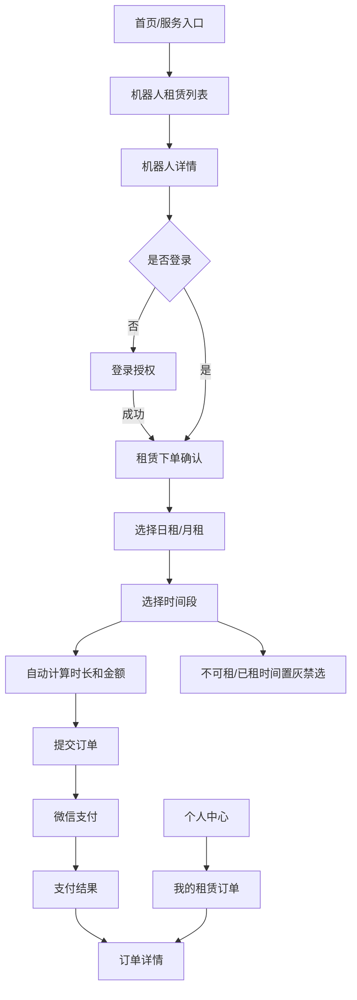
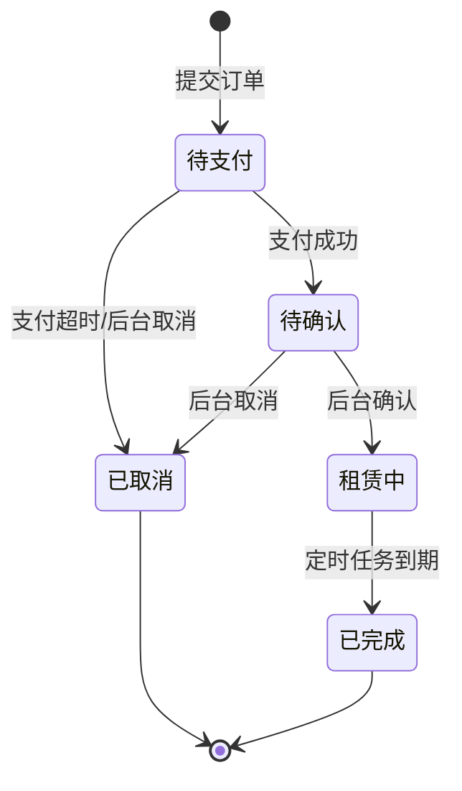

# 机器人租赁 — 微信小程序功能设计文档

## 1. 模块：机器人租赁（微信小程序）

### 1.1 基础信息

| 项目 | 内容 |
| --- | --- |
| 模块名称 | 机器人租赁 — 微信小程序 |
| 端口类型 | 微信小程序 |
| 目标用户 | 小程序登录客户 |
| 业务场景 | 客户在小程序查看平台配置的机器人，选择日租或月租及对应时间段，系统自动计算租赁时长和金额，客户在线支付并查看订单。 |
| 上游入口 | 小程序首页金刚区/服务入口「机器人租赁」、个人中心「我的租赁订单」 |
| 下游去向 | 微信支付、租赁订单详情、我的订单、客服咨询 |
| 设计依据 | `07_机器人租赁_后台管理端.md`、`DESIGN/微信小程序页面结构约束规范.md`、`DESIGN/DESIGN_ARCO.md` |
| 关联模块 | 后台机器人租赁、微信支付、订单中心、客户管理、统一售后处理、客服 |

### 1.2 功能目标

- 客户可查看后台已配置、已启用、可展示的机器人列表。
- 客户可进入详情查看机器人图片、简介、适用场景、参数和日租/月租价格。
- 客户可选择日租或月租方式下单，并选择对应时间段。
- 客户选择时间时，系统对后台不可租赁配置和已租订单占用时间做相同禁选处理。
- 系统根据租赁方式自动计算租赁时长和租赁金额。
- 客户可通过微信支付完成支付，并在小程序查看订单列表和订单详情。
- 待支付订单 10 分钟内可继续支付；待支付、待确认订单可由客户取消，已支付待确认订单取消后进入平台统一售后处理流程。
- 支持机器人下架、价格变化、支付取消、支付失败等异常场景的提示和处理。

### 1.3 范围与边界

#### 1.3.1 本期包含

- 机器人列表：
  - 展示后台配置的机器人信息。
  - 支持查看机器人详情。
  - 展示日租价、月租价、适用场景、封面图。
- 机器人详情：
  - 展示轮播图、名称、价格、简介、参数、租赁说明。
  - 支持进入下单确认页。
- 下单确认：
  - 选择租赁方式：日租、月租。
  - 日租选择开始日期和结束日期。
  - 月租选择开始月份和结束月份，按整月租赁。
  - 选择时间时禁选后台不可租赁时间段和已租时间段。
  - 自动计算租赁时长和订单金额。
  - 提交订单并调起微信支付。
- 订单查看：
  - 我的租赁订单列表。
  - 订单详情。
  - 展示订单状态、租赁时间、金额、支付信息和后台确认结果。

#### 1.3.2 本期不包含

- 不支持客户端申请退款、续租、提前归还；待支付、待确认订单支持取消，已支付订单取消后的退款由平台统一售后处理。
- 不支持押金、配送费、安装费、优惠券、积分抵扣。
- 不支持在线签合同、发票申请、物流跟踪、维保报修。
- 不支持客户选择具体机器人库存数量或查看可租排期；本期由后台人工确认订单是否可履约。
- 不支持除微信支付以外的支付方式。

#### 1.3.3 边界说明

- **与后台配置**：客户端只展示后台启用且展示状态为展示的机器人；下单前实时校验机器人状态和价格。
- **与可租时间**：客户端读取后台不可租赁配置和已租订单占用时间，并在日期/月分选择器中统一置灰禁选。
- **与支付模块**：小程序创建租赁订单后调起微信支付；支付结果以服务端订单状态为准。
- **与订单管理**：客户支付成功后订单进入待确认，后台确认后订单进入租赁中；到期后由定时任务完成。
- **与售后/客服**：客户可取消待支付、待确认订单；待确认订单如已支付，取消后进入统一售后处理流程，客服负责后续解释和处理。

### 1.4 用户角色与权限

| 角色 | 使用场景 | 可见范围 | 可操作功能 | 权限限制 |
| --- | --- | --- | --- | --- |
| 登录客户 | 浏览机器人、下单、支付、查看订单 | 本人可见机器人和本人订单 | 查看列表、查看详情、选择租赁方式和时间、支付、查看订单 | 需登录后下单和查看订单 |
| 未登录用户 | 从入口访问机器人租赁 | 可浏览公开机器人列表和详情 | 查看列表/详情 | 下单和查看订单需登录 |
| 后台客服 | 处理客户咨询 | 不在客户端操作 | 客服咨询 | 不在小程序端操作 |

补充说明：

- 未登录用户允许浏览机器人列表和详情；点击立即租赁、提交订单或查看我的订单时再引导登录。
- 客户只能查看本人订单，不可查看他人订单。

### 1.5 用户场景与前置条件

| 场景 | 触发条件 | 前置条件 | 用户目标 | 系统结果 |
| --- | --- | --- | --- | --- |
| 浏览机器人 | 用户点击机器人租赁入口 | 后台存在可展示机器人 | 了解可租机器人 | 列表展示机器人卡片 |
| 查看详情 | 用户点击机器人卡片 | 机器人仍处于可展示状态 | 查看介绍、价格和参数 | 打开机器人详情 |
| 日租下单 | 用户在详情点击立即租赁 | 机器人配置日租价 | 选择日期范围并支付 | 创建日租订单并支付 |
| 月租下单 | 用户选择月租 | 机器人配置月租价 | 选择月份范围并支付 | 创建月租订单并支付 |
| 支付成功 | 用户完成微信支付 | 订单创建成功 | 完成订单支付 | 订单进入待确认，展示支付结果 |
| 取消订单 | 用户取消待支付或待确认订单 | 订单状态允许取消 | 终止订单 | 订单变为已取消，已支付订单进入统一售后处理 |
| 查看订单 | 用户进入我的租赁订单 | 用户已登录 | 查看订单状态 | 展示本人订单列表和详情 |
| 价格或状态变化 | 下单前后台改价/停用 | 本地页面仍有旧数据 | 避免错误下单 | 服务端阻断或重新计价 |
| 时间段不可租 | 用户选择租赁日期/月分 | 后台配置不可租或已有订单占用 | 避免重复占用 | 不可租时间置灰禁选 |

### 1.6 信息架构与页面清单

#### 1.6.1 页面/弹窗/组件清单

| 编号 | 类型 | 名称 | 页面标识 | 主要用途 | 入口 | 出口 |
| --- | --- | --- | --- | --- | --- | --- |
| P01 | 页面 | 机器人租赁列表 | page-robot-rental-list | 展示可租赁机器人列表 | 首页/服务入口 | P02 详情 |
| P02 | 页面 | 机器人详情 | page-robot-detail | 展示机器人介绍、价格、参数和租赁入口 | P01 卡片 | P03 下单确认 |
| P03 | 页面 | 租赁下单确认 | page-rental-confirm | 选择租赁方式、时间段，计算金额并支付 | P02「立即租赁」 | 微信支付、P04 支付结果 |
| P04 | 页面 | 支付结果 | page-rental-pay-result | 展示支付成功、处理中、失败或取消结果 | 微信支付返回 | P06 订单详情、P01 列表 |
| P05 | 页面 | 我的租赁订单 | page-rental-order-list | 查看本人机器人租赁订单，并对待支付/待确认订单取消 | 个人中心/支付结果 | P06 订单详情 |
| P06 | 页面 | 租赁订单详情 | page-rental-order-detail | 查看订单状态、租赁信息、金额、支付信息和售后处理状态 | P05 行点击/P04 查看订单 | 取消订单、继续支付、联系客服 |
| M01 | 弹窗 | 租赁说明 | modal-rental-rule | 展示计价规则、后台确认规则、取消退款说明 | P02/P03 说明入口 | 关闭返回 |
| C01 | 组件 | 机器人卡片 | component-robot-card | 展示封面、名称、价格和场景 | P01 列表 | 点击进入详情 |
| C02 | 组件 | 价格与时间选择器 | component-rental-period-picker | 选择日租/月租和时间范围 | P03 表单区 | 更新计价结果 |

#### 1.6.2 页面流转

流转说明：

- P01 只展示后台可展示、已启用的机器人。
- 从 P02 进入 P03 前需校验登录态；未登录时引导登录，登录成功后继续下单。
- P03 进入时需重新拉取机器人最新价格、状态、不可租赁时间和已租时间。
- 支付返回后，客户端需查询服务端订单状态，不仅依赖本地微信支付回调。

### 1.7 页面结构与交互设计

#### 1.7.1 P01 机器人租赁列表

页面定位：

- 页面目标：帮助客户快速了解可租赁机器人，并进入详情。
- 页面类型：移动端列表页。
- 适用角色：客户。

页面结构：

- 顶部导航：标题「机器人租赁」，左侧返回或首页路径，右侧避让微信胶囊。
- 内容区：机器人卡片列表。
- 卡片信息：封面图、机器人名称、适用场景、日租价、月租价、简介摘要。
- 底部/空态：无数据时展示「暂无可租赁机器人」。

关键交互：

- 进入页面默认加载可租赁机器人，按后台排序值和更新时间排序。
- 点击机器人卡片进入 P02。
- 下拉刷新重新获取后台配置。
- 若某机器人只有日租价，则卡片仅展示日租价；只有月租价则仅展示月租价；两者都有则都展示。

状态覆盖：

- 默认态：展示机器人列表。
- 加载态：展示骨架屏。
- 空态：暂无可租赁机器人。
- 错误态：展示错误提示和重试按钮。

#### 1.7.2 P02 机器人详情

页面定位：

- 页面目标：展示机器人完整介绍，并引导客户发起租赁。
- 页面类型：详情页。

页面结构：

- 顶部轮播：展示封面图和轮播图。
- 基础信息：机器人名称、适用场景、日租价、月租价。
- 机器人介绍：简介、能力说明、使用场景。
- 参数信息：品牌/型号、尺寸、重量、续航或服务能力等。
- 租赁说明：计价规则、支付后需后台确认、取消退款说明。
- 底部操作：固定按钮「立即租赁」。

关键交互：

- 进入详情时校验机器人是否仍可展示；不可展示时提示「该机器人暂不可租赁」。
- 点击「租赁说明」打开 M01。
- 点击「立即租赁」：
  - 未登录时引导登录。
  - 机器人可租赁时进入 P03。
  - 机器人已停用或无价格时提示不可租赁。

#### 1.7.3 P03 租赁下单确认

页面定位：

- 页面目标：让客户选择租赁方式和时间段，确认金额并支付。
- 页面类型：移动端表单/确认页。

页面结构：

- 顶部导航：标题「确认租赁」。
- 机器人摘要：封面图、名称、适用场景。
- 租赁方式：日租、月租 Tab 或单选卡片。
- 时间选择：
  - 日租：开始日期、结束日期。
  - 月租：开始月份、结束月份。
- 计价结果：租赁时长、单价、订单金额。
- 说明区：支付后订单需后台确认；如需取消或退款请联系客服。
- 底部支付栏：订单金额、按钮「立即支付」。

关键交互：

- 若机器人只配置日租价，则默认选中日租且隐藏或禁用月租。
- 若机器人只配置月租价，则默认选中月租且隐藏或禁用日租。
- 若两种价格都有，则默认选中日租或按后台/产品默认策略选中日租。
- 日租日期选择：
  - 开始日期不可早于当天。
  - 结束日期不可早于开始日期。
  - 后台不可租赁日期和已租订单占用日期置灰禁选。
  - 选择完成后自动计算天数和金额。
- 月租月份选择：
  - 开始月份不可早于当前月份。
  - 结束月份不可早于开始月份。
  - 后台不可租赁月份和已租订单占用月份置灰禁选。
  - 按整月计算，包含开始月和结束月。
- 点击「立即支付」前，服务端再次校验机器人状态、价格、租赁方式和时间范围。
- 创建订单成功后调起微信支付。

状态覆盖：

- 默认态：展示可选租赁方式和默认未选择时间。
- 禁用态：未选择完整时间段时，「立即支付」置灰。
- 价格变化态：服务端返回价格变化时，提示「价格已更新，请确认最新金额后重新提交」并刷新金额。
- 下架态：服务端返回不可租赁时，提示并返回详情或列表。

#### 1.7.4 P04 支付结果

页面定位：

- 页面目标：反馈支付结果，并引导客户查看订单。
- 页面类型：结果页。

页面结构：

- 结果图标和标题：支付成功、支付处理中、支付失败、支付已取消。
- 订单摘要：机器人名称、租赁方式、租赁时间、支付金额。
- 操作按钮：查看订单、返回列表。

关键交互：

- 支付成功：展示「支付成功，等待平台确认」，按钮「查看订单」。
- 支付处理中：展示「支付结果确认中」，提供刷新订单状态。
- 支付失败/取消：展示失败原因，按钮「重新支付」或「返回详情」按订单状态展示。
- 进入页面时查询服务端订单状态，避免本地状态不一致。
- 待支付订单支付有效期为 10 分钟，超时后不可继续支付。

#### 1.7.5 P05 我的租赁订单

页面定位：

- 页面目标：客户查看本人机器人租赁订单。
- 页面类型：移动端列表页。

页面结构：

- 顶部导航：标题「我的租赁订单」。
- 筛选 Tab：全部、待支付、待确认、租赁中、已取消、已完成。
- 订单卡片：机器人名称、封面图、订单状态、租赁方式、租赁时间段、订单金额、下单时间。
- 空态：暂无订单。

关键交互：

- 进入页面默认展示全部订单，按下单时间倒序。
- 点击订单卡片进入 P06。
- 下拉刷新、上拉加载更多。
- 待支付订单 10 分钟内展示「继续支付」和「取消订单」入口，超时后按服务端状态展示已取消或已关闭。
- 待确认订单展示「取消订单」入口；取消后进入已取消，若已支付则进入统一售后处理流程。

#### 1.7.6 P06 租赁订单详情

页面定位：

- 页面目标：查看订单完整信息和平台确认状态。
- 页面类型：详情页。

页面结构：

- 状态区：订单状态和提示文案。
- 机器人信息：封面、名称、适用场景。
- 租赁信息：租赁方式、开始时间、结束时间、租赁时长。
- 金额信息：单价、租赁时长、订单金额、实付金额。
- 支付信息：支付方式、支付时间、支付单号。
- 订单信息：订单编号、下单时间、后台确认时间或取消原因。
- 操作区：联系客服、继续支付（仅待支付且未超时）、取消订单（仅待支付/待确认）。

状态文案建议：

- 待支付：`请在 10 分钟内完成支付，超时订单将自动关闭。`
- 待确认：`已支付成功，平台正在确认租赁安排。`
- 租赁中：`平台已确认租赁订单，机器人正在租赁中。`
- 已取消：`订单已取消，具体原因请查看取消说明或联系客服。`
- 已完成：`本次机器人租赁服务已完成。`

### 1.8 字段、控件与数据口径

#### 1.8.1 机器人列表/详情字段

| 字段名称 | 字段标识 | 字段类型 | 展示规则 | 空值规则 | 数据来源 | 权限规则 |
| --- | --- | --- | --- | --- | --- | --- |
| 机器人 ID | robot_id | 文本 | 页面不直接展示 | -- | 后台配置 | 系统使用 |
| 机器人名称 | robot_name | 文本 | 列表和详情主标题 | -- | 后台配置 | 全部可见 |
| 封面图 | cover_image | 图片 | 列表卡片展示 | 默认占位图 | 后台配置 | 全部可见 |
| 轮播图 | gallery_images | 图片组 | 详情顶部轮播 | 无图时展示封面图 | 后台配置 | 全部可见 |
| 适用场景 | scenario | 标签 | 列表/详情展示 | 不展示 | 后台配置 | 全部可见 |
| 简介 | description | 文本 | 详情展示 | -- | 后台配置 | 全部可见 |
| 参数信息 | specs | 文本/键值 | 详情展示 | 不展示该项 | 后台配置 | 全部可见 |
| 日租价 | daily_price | 金额 | `¥x.xx/日` | 未配置则不展示日租入口 | 后台配置 | 全部可见 |
| 月租价 | monthly_price | 金额 | `¥x.xx/月` | 未配置则不展示月租入口 | 后台配置 | 全部可见 |

#### 1.8.2 下单字段

| 字段名称 | 字段标识 | 控件类型 | 是否必填 | 默认值 | 可选项/范围 | 校验规则 | 联动规则 |
| --- | --- | --- | --- | --- | --- | --- | --- |
| 租赁方式 | rent_type | 单选/Tab | 是 | 日租优先 | 日租/月租 | 当前机器人必须配置对应价格 | 决定时间选择控件和计价公式 |
| 日租开始日期 | daily_start_date | 日期选择 | 日租必填 | 空 | 今天及以后 | 不可早于今天 | 影响天数和金额 |
| 日租结束日期 | daily_end_date | 日期选择 | 日租必填 | 空 | 开始日期及以后 | 不可早于开始日期 | 影响天数和金额 |
| 月租开始月份 | monthly_start_month | 月份选择 | 月租必填 | 空 | 当前月及以后 | 不可早于当前月 | 影响月数和金额 |
| 月租结束月份 | monthly_end_month | 月份选择 | 月租必填 | 空 | 开始月份及以后 | 不可早于开始月份 | 影响月数和金额 |
| 禁选时间段 | disabled_periods | 日期/月分禁用数据 | 否 | 空 | 后台不可租配置、待确认/租赁中订单占用 | 不允许选中禁用日期/月分 | 影响时间选择器 |
| 租赁时长 | duration | 只读文本 | 是 | 自动计算 | 天/月 | 根据时间段计算 | 影响订单金额 |
| 订单金额 | total_amount | 只读金额 | 是 | 自动计算 | 大于 0 | 服务端最终校验 | 支付金额来源 |

#### 1.8.3 订单列表字段

| 字段名称 | 字段标识 | 字段类型 | 展示规则 | 空值规则 | 数据来源 | 权限规则 |
| --- | --- | --- | --- | --- | --- | --- |
| 订单编号 | order_no | 文本 | 详情展示，可复制 | -- | 系统生成 | 本人可见 |
| 机器人名称 | robot_name_snapshot | 文本 | 下单时快照 | -- | 订单快照 | 本人可见 |
| 订单状态 | order_status | 状态 | 卡片右上角 | 待支付/待确认/租赁中/已取消/已完成 | 订单状态机 | 本人可见 |
| 租赁方式 | rent_type | 枚举 | 日租/月租 | -- | 订单数据 | 本人可见 |
| 租赁时间段 | rent_period | 文本 | 日期或月份范围 | -- | 订单数据 | 本人可见 |
| 租赁时长 | duration | 数字 | `x 天` 或 `x 个月` | -- | 系统计算 | 本人可见 |
| 订单金额 | total_amount | 金额 | `¥x.xx` | -- | 订单数据 | 本人可见 |
| 支付状态 | pay_status | 状态 | 详情展示 | -- | 支付模块 | 本人可见 |
| 支付有效期 | pay_expire_at | 日期时间 | 待支付订单展示倒计时 | 非待支付不展示 | 订单数据 | 本人可见 |
| 售后处理状态 | aftersale_status | 状态 | 已支付取消后展示 | 无则不展示 | 统一售后模块 | 本人可见 |
| 下单时间 | created_at | 日期时间 | `yyyy-MM-dd HH:mm` | -- | 系统生成 | 本人可见 |

### 1.9 核心功能说明

#### 1.9.1 查看机器人列表和详情

- 客户从首页或服务入口进入 P01。
- 系统查询后台已启用且展示状态为展示的机器人。
- 客户点击卡片进入 P02。
- P02 进入时再次校验机器人状态；若机器人已下架，提示「该机器人暂不可租赁」。
- 未登录用户允许浏览 P01 和 P02，点击立即租赁时再引导登录。

#### 1.9.2 日租下单与计价

操作流程：

1. 客户在 P03 选择「日租」。
2. 客户选择开始日期和结束日期。
3. 系统自动计算租赁天数。
4. 系统展示日租单价、租赁天数和订单金额。
5. 客户点击「立即支付」。
6. 服务端校验并创建订单，客户端调起微信支付。

业务规则：

- 日租开始日期不可早于当天。
- 日租结束日期不可早于开始日期。
- 后台不可租赁日期、待确认订单和租赁中订单占用日期不可选。
- 日租时长包含开始日期和结束日期。
- 计算公式：`租赁天数 = 结束日期 - 开始日期 + 1`，`订单金额 = 日租价 × 租赁天数`。
- 示例：5 月 1 日至 5 月 3 日，租赁天数为 3 天。

#### 1.9.3 月租下单与计价

操作流程：

1. 客户在 P03 选择「月租」。
2. 客户选择开始月份和结束月份。
3. 系统自动计算租赁月数。
4. 系统展示月租单价、租赁月数和订单金额。
5. 客户点击「立即支付」。
6. 服务端校验并创建订单，客户端调起微信支付。

业务规则：

- 月租按整月租赁，不选择具体日。
- 开始月份不可早于当前月份。
- 结束月份不可早于开始月份。
- 后台不可租赁月份、待确认订单和租赁中订单占用月份不可选。
- 月租时长包含开始月份和结束月份。
- 计算公式：`租赁月数 = 结束月份 - 开始月份 + 1`，`订单金额 = 月租价 × 租赁月数`。
- 示例：2026 年 5 月至 2026 年 7 月，租赁月数为 3 个月。

#### 1.9.4 在线支付

- 点击「立即支付」前，服务端需重新校验机器人状态、租赁方式、价格、时间段和订单金额。
- 校验成功后创建订单并返回支付参数。
- 待支付订单有效期为 10 分钟，有效期内允许继续支付，超时后自动关闭。
- 客户完成微信支付后进入 P04。
- 支付成功后订单进入待确认，等待后台确认。
- 支付失败或取消时，订单保持待支付或关闭状态，具体以服务端订单状态为准。

#### 1.9.5 查看订单

- 客户可从个人中心进入 P05，也可从支付结果进入 P06。
- P05 展示本人订单，支持按状态 Tab 筛选。
- P06 展示订单状态、租赁信息、金额、支付信息和后台处理结果。
- 待支付、待确认订单可取消；待确认订单已支付，取消后进入平台统一售后处理流程。
- 已取消订单需展示取消原因和售后处理状态；待确认订单需提示平台确认中。

#### 1.9.6 取消订单

- 入口位置：P05 订单卡片、P06 订单详情。
- 展示条件：订单状态为待支付或待确认。
- 待支付订单取消后直接关闭订单，不触发售后。
- 待确认订单已支付，取消后进入已取消，并进入平台统一售后处理流程。
- 取消成功后刷新订单列表和详情状态。

### 1.10 状态机与状态流转

#### 1.10.1 订单状态定义

| 状态 | 状态标识 | 状态含义 | 客户可见操作 | 不可执行操作 |
| --- | --- | --- | --- | --- |
| 待支付 | pending_payment | 订单已创建但未支付 | 查看、继续支付（10 分钟内）、取消订单 | 查看确认结果 |
| 待确认 | pending_confirm | 已支付，等待后台确认 | 查看、取消订单、联系客服 | 再次支付 |
| 租赁中 | renting | 后台已确认，机器人处于租赁中 | 查看、联系客服 | 客户端取消 |
| 已取消 | cancelled | 订单已取消 | 查看、联系客服 | 支付、确认 |
| 已完成 | completed | 租赁服务已完成 | 查看 | 支付、取消 |

#### 1.10.2 状态流转

### 1.11 异常、边界与降级处理

| 异常场景 | 触发条件 | 页面表现 | 系统处理 | 用户可操作 |
| --- | --- | --- | --- | --- |
| 未登录下单 | 点击立即租赁或提交订单 | 弹出登录引导 | 登录成功后继续流程 | 登录/取消 |
| 无可租机器人 | 后台无展示机器人 | 空态「暂无可租赁机器人」 | 不展示下单入口 | 下拉刷新 |
| 机器人下架 | 进入详情或提交订单时已停用 | 提示暂不可租赁 | 阻断下单 | 返回列表 |
| 未选择时间 | 点击立即支付时缺少时间 | 按钮置灰或字段提示 | 阻断提交 | 补全时间 |
| 日期/月份非法 | 结束早于开始 | 字段错误提示 | 阻断提交 | 重新选择 |
| 时间段不可租 | 选中后台不可租或已租时间 | 日期/月分置灰，不允许选中 | 服务端同步校验 | 选择其他时间 |
| 价格变化 | 提交订单时后台改价 | 弹窗提示价格已更新 | 刷新最新价格 | 确认后重新提交 |
| 支付超时 | 待支付超过 10 分钟 | 订单展示已关闭/已取消 | 自动关闭订单 | 重新下单 |
| 用户取消订单 | 待支付或待确认点击取消 | 二次确认弹窗 | 更新订单状态 | 确认/返回 |
| 支付取消 | 用户取消微信支付 | 结果页展示已取消或待支付 | 查询服务端订单状态 | 继续支付/返回 |
| 支付失败 | 微信支付失败 | 展示失败原因 | 保留订单状态 | 重试或联系客服 |
| 网络异常 | 接口超时或失败 | 错误态和重试按钮 | 不使用旧数据创建订单 | 重试 |

### 1.12 模块联动与数据影响

| 关联模块 | 联动方向 | 联动场景 | 传递数据 | 影响结果 |
| --- | --- | --- | --- | --- |
| 后台机器人租赁 | 后台影响客户端 | 机器人上下架、改价、改信息、配置不可租时间 | robotId、价格、状态、展示信息、不可租时间段 | 影响列表、详情、下单和时间禁选 |
| 微信支付 | 客户端影响支付 | 创建订单后支付 | orderNo、amount、openid | 支付成功后订单待确认 |
| 订单管理 | 客户端影响后台 | 客户下单、支付成功 | 订单、租赁时间、金额 | 后台可查询和确认 |
| 统一售后处理 | 客户端影响售后 | 已支付待确认订单取消 | orderId、取消原因、支付金额 | 售后流程处理退款 |
| 客户管理 | 客户影响订单 | 登录客户下单 | customerId、手机号 | 订单归属本人 |

### 1.13 数据模型与接口建议

#### 1.13.1 核心数据对象

| 对象名称 | 对象说明 | 关键字段 | 备注 |
| --- | --- | --- | --- |
| RobotView | 客户端机器人展示对象 | robotId、robotName、coverImage、scenario、dailyPrice、monthlyPrice、enabledStatus | 来源于后台配置 |
| RentalOrderCreateRequest | 创建订单请求 | robotId、rentType、startDate/startMonth、endDate/endMonth | 服务端计算金额 |
| RentalOrderView | 客户端订单对象 | orderId、orderNo、robotSnapshot、rentType、period、duration、totalAmount、payStatus、orderStatus | 本人订单展示 |
| DisabledRentalPeriod | 禁选时间段对象 | robotId、rentType、startDate/startMonth、endDate/endMonth、source | 来源包含不可租配置、待确认订单、租赁中订单 |

#### 1.13.2 接口清单建议

| 接口用途 | 请求方式 | 路径建议 | 入参 | 出参 | 备注 |
| --- | --- | --- | --- | --- | --- |
| 查询机器人列表 | GET | `/mini/robot-rentals/robots` | 分页 | 机器人列表 | 仅返回可展示数据 |
| 查询机器人详情 | GET | `/mini/robot-rentals/robots/{id}` | robotId | 机器人详情 | 下单前也需校验 |
| 试算租赁价格 | POST | `/mini/robot-rentals/quote` | robotId、rentType、时间段 | duration、amount、priceVersion | 可选，前后端一致 |
| 查询禁选时间段 | GET | `/mini/robot-rentals/robots/{id}/disabled-periods` | robotId、rentType、时间范围 | 禁选日期/月分 | 下单页使用 |
| 创建租赁订单 | POST | `/mini/robot-rentals/orders` | robotId、rentType、时间段 | orderId、orderNo、payParams | 服务端最终计价 |
| 查询订单列表 | GET | `/mini/robot-rentals/orders` | 状态、分页 | 订单列表 | 仅本人订单 |
| 查询订单详情 | GET | `/mini/robot-rentals/orders/{id}` | orderId | 订单详情 | 仅本人订单 |
| 查询支付结果 | GET | `/mini/robot-rentals/orders/{id}/payment-status` | orderId | 支付和订单状态 | 支付返回后调用 |
| 取消订单 | POST | `/mini/robot-rentals/orders/{id}/cancel` | orderId、reason | 最新订单状态 | 待支付/待确认可取消 |

### 1.14 埋点与指标

| 指标/事件 | 触发时机 | 事件参数 | 用途 |
| --- | --- | --- | --- |
| robot_rental_list_view | 进入列表 | userId、source | 统计入口流量 |
| robot_rental_detail_view | 查看详情 | robotId、userId | 评估机器人关注度 |
| robot_rental_rent_click | 点击立即租赁 | robotId、userId | 分析转化 |
| robot_rental_quote_change | 选择方式或时间 | robotId、rentType、duration、amount | 分析租赁偏好 |
| robot_rental_order_submit | 提交订单 | robotId、rentType、amount、result | 统计下单成功率 |
| robot_rental_pay_result | 支付返回 | orderId、payResult、amount | 统计支付转化 |
| robot_rental_order_view | 查看订单 | orderId、status | 分析订单查询需求 |

### 1.15 高保真交互原型生成要求

- 小程序原型需覆盖 P01、P02、P03、P04、P05、P06、M01。
- 原型需体现日租/月租切换、日期/月选择、自动计价、支付结果、订单状态展示。
- 需遵循微信小程序页面结构约束，处理顶部胶囊避让、底部安全区和触控热区。
- 原型中的演示控制应放入原型控制台，不进入业务主界面。

### 1.16 开发实现补充说明

- 前端可本地展示试算结果，但最终金额必须以服务端创建订单返回为准。
- 所有金额建议数据库以分为单位，前端展示为元并保留 2 位小数。
- 订单创建时保存机器人信息和价格快照，防止后续后台改价影响历史订单。
- 日期/月分选择器需要接入禁选时间段接口，对不可租配置、待确认订单、租赁中订单统一置灰。
- 待支付订单支付有效期为 10 分钟，倒计时以服务端返回的 `payExpireAt` 为准。
- 待支付、待确认订单支持取消；待确认订单取消后进入统一售后处理流程。
- 支付回调后客户端需主动查询服务端订单状态，避免微信支付本地回调和服务端状态不一致。
- 订单列表分页加载，默认每页 10 条。
- 小程序需处理安全区、键盘弹起、低版本基础库兼容和弱网重试。

### 1.17 验收标准

| 编号 | 场景 | 前置条件 | 操作步骤 | 预期结果 |
| --- | --- | --- | --- | --- |
| AC01 | 查看列表 | 后台存在启用展示机器人 | 进入机器人租赁列表 | 展示机器人卡片和价格 |
| AC02 | 查看详情 | 列表有机器人 | 点击机器人卡片 | 进入详情并展示图片、简介、价格、参数 |
| AC03 | 日租计价 | 机器人配置日租价 | 选择 5 月 1 日至 5 月 3 日 | 系统计算 3 天，金额为日租价 × 3 |
| AC04 | 月租计价 | 机器人配置月租价 | 选择 5 月至 7 月 | 系统计算 3 个月，金额为月租价 × 3 |
| AC05 | 未选择时间阻断支付 | 未选择完整时间 | 点击立即支付 | 按钮置灰或提示补全时间 |
| AC06 | 支付成功 | 订单创建成功 | 完成微信支付 | 展示支付成功，订单为待确认 |
| AC07 | 后台确认后查看订单 | 后台已确认订单 | 客户进入订单详情 | 订单状态展示租赁中 |
| AC08 | 机器人下架拦截 | 下单前后台停用机器人 | 点击立即支付 | 系统提示暂不可租赁，阻断下单 |
| AC09 | 价格变化拦截 | 下单前后台改价 | 提交订单 | 系统提示价格已更新并刷新最新金额 |
| AC10 | 禁选不可租时间 | 后台配置不可租时间 | 打开下单页选择时间 | 对应日期/月分置灰且不可选 |
| AC11 | 取消待支付订单 | 订单为待支付 | 点击取消订单并确认 | 订单变为已取消，不触发售后 |
| AC12 | 取消待确认订单 | 订单为待确认 | 点击取消订单并确认 | 订单变为已取消，并展示售后处理状态 |

### 1.18 待确认问题

| 编号 | 问题 | 影响范围 | 建议决策人 | 状态 |
| --- | --- | --- | --- | --- |
| Q01 | 未登录用户是否允许浏览机器人列表和详情？ | 允许浏览，进入下单和订单查看时再登录 | 产品/运营 | 已确认 |
| Q02 | 待支付订单是否允许客户继续支付，支付有效期多久？ | 允许，支付有效期 10 分钟，和平台其他功能一致 | 产品/研发 | 已确认 |
| Q03 | 客户端是否需要取消订单或申请退款入口？ | 待支付、待确认可取消；售后退款走平台统一售后处理流程 | 产品/客服/财务 | 已确认 |
| Q04 | 是否需要订阅消息通知客户订单已确认或已取消？ | 不需要 | 产品/运营 | 已确认 |

当前暂无新的待确认问题。

### 1.19 输出前质量检查清单

- [x] 本文档只处理机器人租赁微信小程序端。
- [x] 端口类型已经明确为微信小程序。
- [x] 覆盖列表、详情、下单、计价、支付、订单查看。
- [x] 日租和月租计算口径已明确。
- [x] 异常、状态、联动和验收标准已覆盖。
- [x] 待确认问题已处理，当前暂无新的待确认问题。

### 1.20 变更记录

| 日期 | 版本 | 变更内容 | 变更人 |
| --- | --- | --- | --- |
| 2026-05-14 | v1.0 | 新增机器人租赁微信小程序功能设计文档 | AI 助手 |
| 2026-05-14 | v1.1 | 补充不可租/已租时间禁选、10 分钟支付有效期、待支付/待确认取消和统一售后处理规则 | AI 助手 |
